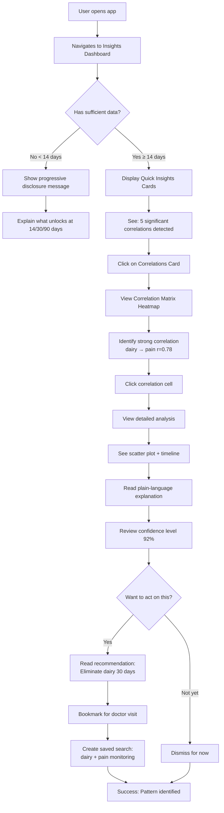
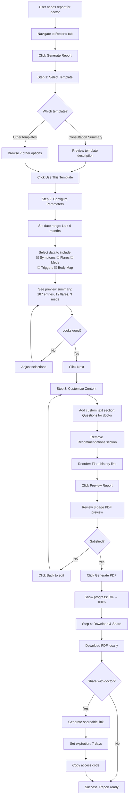
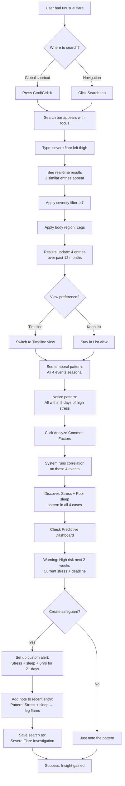

# symptom-tracker UX/UI Specification

_Generated on 2025-10-07 by BMad User_

## Executive Summary

**Project:** Pocket Symptom Tracker - Phase 3 Intelligence Layer
**Platform:** Progressive Web App (Web)
**Project Level:** Level 3 (Full Product)
**Target Release:** Progressive rollout (analytics → search → reports)

**Overview:**

Phase 3 adds the Intelligence Layer to an existing symptom tracking PWA used by people with autoimmune conditions (specifically Hidradenitis Suppurativa). This layer transforms passive data collection into active intelligence through three major feature areas:

1. **Data Analysis & Insights Engine** - Statistical analytics, pattern detection, predictive modeling, and automated recommendations
2. **Advanced Search & Filtering** - Real-time full-text search with faceted filtering across all health data
3. **Professional Report Generation** - Medical-grade reports with charts and multi-format export for healthcare consultations

**UX Challenge:**

The intelligence features must make sophisticated statistical analysis accessible to non-technical users while maintaining the privacy-first, offline-capable architecture established in Phases 1 & 2. Users need to understand complex correlations, trends, and predictions without requiring data science knowledge.

**Key UX Principles from PRD:**
- Progressive intelligence disclosure (features unlock as data matures)
- Plain-language insights (no unexplained statistics)
- Actionable over informational (every insight includes next steps)
- Trust through transparency (always show confidence levels)
- Report-ready by default (sharable visualizations)

---

## 1. UX Goals and Principles

### 1.1 Target User Personas

**Primary Persona: "Sarah - The Pattern Seeker"**
- **Demographics:** 28-45 years old, diagnosed with Hidradenitis Suppurativa, tech-comfortable
- **Goals:**
  - Identify triggers to avoid flare-ups
  - Understand if treatments are working
  - Communicate effectively with dermatologist/rheumatologist
- **Pain Points:**
  - Can't see patterns in daily symptom logs manually
  - Forgets to mention important correlations during doctor visits
  - Trial-and-error with diet/lifestyle changes is exhausting
- **Technical Comfort:** Intermediate - uses health apps, comfortable with graphs/charts but not statistical terminology

**Secondary Persona: "Dr. Martinez - The Healthcare Provider"**
- **Demographics:** Dermatologist treating HS patients
- **Goals:**
  - Quickly understand patient's symptom history
  - Make evidence-based treatment adjustments
  - Document patient progress for insurance/records
- **Pain Points:**
  - Patients struggle to recall symptom details accurately
  - Limited appointment time (15-30 minutes)
  - Need objective data to justify treatment changes
- **Technical Comfort:** High - reviews medical charts daily, values clear data visualization

### 1.2 Usability Goals

1. **Learnability** - New intelligence features should be discoverable and self-explanatory within 5 minutes of exploration, with progressive disclosure preventing overwhelm

2. **Efficiency for Repeat Use** - Power users should be able to:
   - Generate a consultation report in < 2 minutes
   - Find specific historical entries in < 10 seconds via search
   - Review key insights at a glance from dashboard

3. **Error Prevention & Recovery** -
   - No destructive actions without confirmation
   - Auto-save for report drafts and search queries
   - Clear undo/redo for filter configurations
   - Graceful degradation when insufficient data exists

4. **Accessibility** - WCAG 2.1 AA compliance minimum for all intelligence features, with special attention to:
   - Screen reader support for charts (data tables + alt descriptions)
   - Keyboard navigation for dashboards and report builder
   - High contrast mode for correlation matrices
   - Text alternatives for all visualizations

5. **Trust & Confidence** - Users must trust the intelligence system by:
   - Always showing confidence levels and sample sizes
   - Explaining why insufficient data prevents analysis
   - Providing plain-language interpretations of statistics
   - Clear attribution of insights to data sources

### 1.3 Design Principles

1. **Progressive Intelligence Disclosure** - Reveal advanced analytics progressively based on data maturity (trend analysis at 14 days, seasonal patterns at 6 months), preventing overwhelm while educating users on capabilities

2. **Plain-Language Insights** - Present all statistical findings with plain-language explanations suitable for non-technical users, with "Show technical details" toggle for advanced users

3. **Actionable Over Informational** - Every insight includes actionable next steps with clear rationale and expected outcomes—never present data without guidance

4. **Trust Through Transparency** - Always show confidence levels, data quality indicators, and sample sizes with visual cues (color-coded badges, uncertainty ranges)

5. **Glanceable Dashboard Design** - Prioritize information hierarchy with quick-scan cards at top, progressive depth through click-to-expand, and shortcuts for deep dives

---

## 2. Information Architecture

### 2.1 Site Map

```
Pocket Symptom Tracker
│
├── Home / Dashboard (Phase 1)
├── Daily Entry (Phase 1)
├── Calendar (Phase 1)
├── Active Flares (Phase 2)
├── Body Map (Phase 2)
│
├── **Insights Dashboard** (Phase 3 - NEW)
│   ├── Quick Insights Cards
│   ├── Trend Analysis
│   ├── Correlation Matrix
│   ├── Pattern Detection
│   ├── Predictive Insights
│   ├── Anomaly Alerts
│   └── Recommendations
│
├── **Search** (Phase 3 - NEW)
│   ├── Search Interface (Global)
│   ├── Advanced Filters
│   ├── Faceted Navigation
│   ├── Saved Searches
│   └── Search Results (List/Timeline/Map views)
│
├── **Reports** (Phase 3 - NEW)
│   ├── Report Templates Library
│   ├── Report Builder Wizard
│   │   ├── Step 1: Template Selection
│   │   ├── Step 2: Configuration
│   │   ├── Step 3: Content Customization
│   │   └── Step 4: Preview & Generate
│   ├── Report History
│   ├── Shared Reports
│   └── Export Options
│
├── Photos (Phase 2)
├── Settings (Phase 1)
└── More Menu (Phase 1)
```

**Hierarchy Rationale:**
- **Insights Dashboard** placed prominently as primary intelligence entry point
- **Search** positioned for quick access (also available via global Cmd/Ctrl+K)
- **Reports** grouped as destination feature (users go here with intent)
- Phase 3 features integrated at same level as Phase 1 & 2 to signal equal importance

### 2.2 Navigation Structure

**Primary Navigation (Bottom Tab Bar):**
```
[Home] [Daily Entry] [Insights] [Search] [More]
```

Phase 3 adds **Insights** and **Search** to primary navigation, replacing less-frequently-used items moved to "More" menu.

**Desktop Adaptation:**
- Horizontal top navigation bar for primary items
- Insights dashboard uses sidebar for analytics categories
- Search results use left sidebar for filters (always visible)

**Secondary Navigation by Feature:**

**1. Insights Dashboard:**
- **Tab Switcher:** Overview | Trends | Correlations | Patterns | Predictions
- **Time Range Selector:** 7d | 30d | 90d | 1y | All (always visible top-right)
- **Widget Configuration:** Gear icon for dashboard customization

**2. Search:**
- **Global Access:** Cmd/Ctrl+K keyboard shortcut from anywhere
- **Filter Panel:** Collapsible sidebar (desktop) / Bottom sheet (mobile)
- **View Mode Switcher:** List | Timeline | Map
- **Saved Searches:** Dropdown accessible from search bar

**3. Reports:**
- **Linear Wizard:** Step 1 → Step 2 → Step 3 → Step 4 (can't skip)
- **Progress Indicator:** Stepper showing current position
- **Back/Next Buttons:** With "Save Draft" option
- **Report History:** Accessible from main Reports tab

**Mobile Navigation Strategy:**
- Bottom tab bar limited to 5 items (prevents overcrowding)
- Search icon in top-right corner (alternative to tab)
- Insights uses horizontal scrolling cards
- Report builder uses vertical stepper (mobile-optimized)
- Filter panels slide up from bottom (not sidebars)

**Breadcrumb Examples:**
```
Home > Insights > Trend Analysis > Symptom Severity Trend
Home > Search Results > Daily Entry (2024-09-15)
Home > Reports > New Report > Consultation Summary > Preview
```

---

## 3. User Flows

### 3.1 User Flow: Pattern Discovery (Trigger Correlation)

**User Goal:** Identify which triggers are causing symptom flare-ups

**Entry Points:**
- Direct navigation to Insights Dashboard
- Notification: "5 new correlations detected"
- From Daily Entry: "View analysis" link

**Flow Diagram:**



**Success Criteria:**
- User understands correlation strength and confidence
- User receives actionable recommendation
- User can bookmark insight for future reference

**Error States:**
- Insufficient data (< 14 days): Show educational message about data requirements
- No significant correlations found: Explain why and suggest longer tracking period
- Calculation error: Graceful fallback with "Try again" option

---

### 3.2 User Flow: Report Generation (Preparing for Doctor Visit)

**User Goal:** Create comprehensive medical report for healthcare provider consultation

**Entry Points:**
- Reports tab from navigation
- From Insights: "Include in report" button
- From Calendar: "Generate report for date range"

**Flow Diagram:**



**Success Criteria:**
- Report generated in < 10 seconds
- Professional medical-grade quality
- Successfully downloaded or shared

**Error States:**
- Insufficient data for report: Show which sections will be empty, offer to continue anyway
- PDF generation timeout: Offer simplified report or retry
- Share link creation failed: Fallback to download-only option

---

### 3.3 User Flow: Search & Investigation (Understanding Unusual Symptom)

**User Goal:** Find and analyze historical occurrences of unusual symptom pattern

**Entry Points:**
- Global search (Cmd/Ctrl+K from anywhere)
- Search tab from navigation
- From Daily Entry: "Find similar" button

**Flow Diagram:**



**Success Criteria:**
- Search results returned in < 500ms
- Relevant filters suggested based on query
- User discovers actionable pattern

**Error States:**
- No results found: Suggest broadening search criteria or checking spelling
- Search index building: Show progress, allow basic search with warning
- Too many results (>1000): Prompt to add filters for refinement

---

## 4. Component Library and Design System

### 4.1 Design System Approach

**Strategy:** Extend existing Tailwind CSS 4 + custom component system from Phases 1 & 2

**Rationale:**
- Maintains visual consistency across all phases
- Leverages existing design tokens and utilities
- Avoids external library dependencies (keeps bundle size optimal)
- Custom components provide full control for health data visualizations

**Phase 3 Extension Areas:**
1. **Data Visualization** - Chart.js wrappers, heatmaps, stat cards
2. **Advanced Inputs** - Multi-filter builder, drag-drop customization
3. **Complex Layouts** - Dashboard grids, wizards, collapsible panels

**Technology Stack:**
- **Base:** Tailwind CSS 4 (existing)
- **Primitives:** Headless UI for accessible interactive components (existing)
- **Charts:** Chart.js 4.5 + react-chartjs-2 (NEW)
- **Icons:** Heroicons (existing, extend with data/analytics icons)
- **Animations:** Tailwind transitions + Framer Motion for complex sequences (NEW)

### 4.2 Core Components

**4.2.1 Data Visualization Components**

**InsightCard**
- **Purpose:** Display individual insight with metric, trend, and CTA
- **Variants:** `default` | `warning` | `success` | `info`
- **States:** `default` | `hover` | `expanded` | `loading`
- **Props:** title, value, trend, confidence, action, onExpand
- **Usage:** Dashboard overview, recommendation lists

**CorrelationMatrix**
- **Purpose:** Interactive heatmap showing variable correlations
- **Variants:** `compact` (mobile) | `expanded` (desktop)
- **States:** `default` | `cell-hover` | `cell-selected` | `loading`
- **Props:** data (correlation coefficients), labels, onCellClick, threshold
- **Usage:** Correlation analysis view
- **Accessibility:** Keyboard navigation, screen reader data table alternative

**TrendChart**
- **Purpose:** Line chart with trend line overlay and confidence intervals
- **Variants:** `symptom` | `medication` | `trigger` | `custom`
- **States:** `default` | `loading` | `no-data` | `error`
- **Props:** data, timeRange, showTrendLine, showConfidenceInterval
- **Usage:** Trend analysis, report visualizations
- **Accessibility:** Data table toggle, alt text descriptions

**ConfidenceBadge**
- **Purpose:** Visual indicator of statistical confidence level
- **Variants:** `very-high` (≥90%) | `high` (70-89%) | `medium` (50-69%) | `low` (<50%)
- **States:** `default` | `hover` (shows tooltip)
- **Props:** confidence (0-100), size (`sm` | `md` | `lg`)
- **Usage:** Throughout analytics features

---

**4.2.2 Search & Filter Components**

**GlobalSearch**
- **Purpose:** Omnipresent search interface with keyboard shortcut
- **Variants:** `inline` (in header) | `modal` (Cmd+K overlay)
- **States:** `closed` | `open` | `searching` | `results` | `no-results`
- **Props:** onSearch, suggestions, recentSearches, placeholder
- **Usage:** Global header, search page
- **Keyboard:** Cmd/Ctrl+K to open, Esc to close, arrow keys to navigate

**FilterBuilder**
- **Purpose:** Construct complex multi-field filters with boolean logic
- **Variants:** `simple` (1-3 filters) | `advanced` (unlimited, with AND/OR)
- **States:** `default` | `editing` | `applied` | `invalid`
- **Props:** availableFields, appliedFilters, onFilterChange
- **Usage:** Search page, report builder

**FilterChip**
- **Purpose:** Removable tag showing active filter
- **Variants:** `removable` | `read-only`
- **States:** `default` | `hover` | `removing`
- **Props:** label, onRemove, disabled
- **Usage:** Above search results, in saved searches

**FacetPanel**
- **Purpose:** Collapsible list of facets with counts
- **Variants:** `sidebar` (desktop) | `bottom-sheet` (mobile)
- **States:** `collapsed` | `expanded` | `loading`
- **Props:** facets (array), onFacetSelect, selectedValues
- **Usage:** Search results sidebar

---

**4.2.3 Report Builder Components**

**WizardStepper**
- **Purpose:** Linear multi-step form with progress indicator
- **Variants:** `horizontal` (desktop) | `vertical` (mobile)
- **States:** Step states: `completed` | `current` | `upcoming` | `error`
- **Props:** steps, currentStep, onStepChange, canSkip
- **Usage:** Report builder, potentially future onboarding flows
- **Keyboard:** Tab to navigate, Enter to proceed

**ReportPreview**
- **Purpose:** PDF preview with zoom/page controls
- **Variants:** `thumbnail` (overview) | `full-page` (detailed)
- **States:** `loading` | `ready` | `error`
- **Props:** pdfData, currentPage, totalPages, zoom
- **Usage:** Report builder step 4

**TemplateCard**
- **Purpose:** Selectable report template with preview
- **Variants:** `grid` (gallery view) | `list` (detailed view)
- **States:** `default` | `hover` | `selected` | `recommended`
- **Props:** template (name, description, preview), onSelect, isRecommended
- **Usage:** Report builder step 1

---

**4.2.4 Dashboard Components**

**DashboardGrid**
- **Purpose:** Responsive grid container for widget placement
- **Variants:** `fixed` (no customization) | `customizable` (drag-drop)
- **States:** `view-mode` | `edit-mode` | `dragging`
- **Props:** widgets, layout, onLayoutChange, editable
- **Usage:** Insights dashboard
- **Accessibility:** Keyboard-accessible reordering in edit mode

**Widget**
- **Purpose:** Container for dashboard content blocks
- **Variants:** `small` (1x1) | `medium` (2x1) | `large` (2x2) | `full-width`
- **States:** `collapsed` | `expanded` | `loading` | `error` | `empty`
- **Props:** title, content, actions, collapsible, removable
- **Usage:** Insights dashboard, potentially home dashboard

**StatCard**
- **Purpose:** Single statistic with icon and optional trend
- **Variants:** `compact` | `detailed`
- **States:** `default` | `hover` | `pulse` (for new insights)
- **Props:** label, value, icon, trend (+/-/=), onClick
- **Usage:** Dashboard quick stats

---

**4.2.5 Shared Utility Components**

**LoadingSkeleton**
- **Purpose:** Content placeholder during data fetch
- **Variants:** `text` | `card` | `chart` | `table`
- **Props:** count, height, width
- **Usage:** All async data loading states

**EmptyState**
- **Purpose:** Friendly message when no content exists
- **Variants:** `no-data` | `no-results` | `error` | `coming-soon`
- **States:** `default` | `with-action`
- **Props:** icon, title, description, action (button)
- **Usage:** Empty search results, insufficient data for analysis

**TooltipInfo**
- **Purpose:** Contextual help explaining features/terms
- **Variants:** `icon-trigger` | `text-trigger` | `always-visible`
- **States:** `hidden` | `visible`
- **Props:** content, placement, trigger
- **Usage:** Statistical term explanations, feature hints

**ProgressIndicator**
- **Purpose:** Show operation progress for long-running tasks
- **Variants:** `linear` (bar) | `circular` (spinner) | `determinate` | `indeterminate`
- **States:** `0-100%` for determinate
- **Props:** progress (0-100), label, indeterminate
- **Usage:** Report generation, analysis computation

---

## 5. Visual Design Foundation

### 5.1 Color Palette

**Strategy:** Extend existing Tailwind color system with intelligence-specific semantic colors

**Primary Colors (Existing from Phases 1 & 2):**
- **Brand Primary:** `purple-600` (#9333ea) - Primary CTA, active states
- **Brand Secondary:** `indigo-600` (#4f46e5) - Secondary actions, links
- **Surface:** `white` / `gray-50` (light mode), `gray-900` / `gray-800` (dark mode)

**Semantic Colors for Phase 3 Intelligence:**

**Insight Severity / Confidence:**
- **Very High (≥90%):** `emerald-500` (#10b981) - Strong correlations, high confidence
- **High (70-89%):** `blue-500` (#3b82f6) - Moderate confidence insights
- **Medium (50-69%):** `amber-500` (#f59e0b) - Caution, needs more data
- **Low (<50%):** `gray-400` (#9ca3af) - Insufficient confidence

**Data Visualization Palette:**
- **Positive Trend:** `emerald-500` → `emerald-700` gradient
- **Negative Trend:** `red-500` → `red-700` gradient
- **Neutral/Stable:** `gray-500` → `gray-700` gradient
- **Heatmap Scale:** `blue-100` → `blue-500` → `red-500` (cold to hot)

**Functional Colors:**
- **Success:** `emerald-600` (#059669) - Completed actions, positive outcomes
- **Warning:** `amber-600` (#d97706) - Attention needed, data quality issues
- **Error:** `red-600` (#dc2626) - Failed operations, invalid inputs
- **Info:** `blue-600` (#2563eb) - Informational messages, tips

### 5.2 Typography

**Font Families:**

**Primary (Existing):**
- **Sans-serif:** `Inter` - UI text, body copy, data labels
- **Monospace:** `JetBrains Mono` - Code snippets, technical details (if needed)

**Usage:**
- Headings: Inter (600-700 weight)
- Body text: Inter (400 weight)
- Data/Stats: Inter (500-600 weight for emphasis)
- Captions: Inter (400 weight, smaller size)

**Type Scale (Tailwind classes):**

| Element | Size | Line Height | Weight | Usage |
|---------|------|-------------|--------|-------|
| H1 | `text-4xl` (36px) | `leading-tight` | `font-bold` | Page titles |
| H2 | `text-3xl` (30px) | `leading-tight` | `font-bold` | Section headers |
| H3 | `text-2xl` (24px) | `leading-snug` | `font-semibold` | Subsection headers, card titles |
| H4 | `text-xl` (20px) | `leading-snug` | `font-semibold` | Component headers |
| Body Large | `text-lg` (18px) | `leading-relaxed` | `font-normal` | Intro paragraphs, key insights |
| Body | `text-base` (16px) | `leading-normal` | `font-normal` | Standard body text |
| Body Small | `text-sm` (14px) | `leading-normal` | `font-normal` | Secondary text, captions |
| Caption | `text-xs` (12px) | `leading-snug` | `font-normal` | Metadata, timestamps |
| Stat Display | `text-3xl` (30px) | `leading-none` | `font-semibold` | Dashboard metrics |

### 5.3 Spacing and Layout

**Grid System:**
- **Base Unit:** 4px (Tailwind's default spacing scale)
- **Container Max Width:** `max-w-7xl` (1280px) for desktop
- **Content Padding:** `px-4` (mobile), `px-6` (tablet), `px-8` (desktop)

**Spacing Scale (Phase 3 components):**
- **Tight:** `gap-2` (8px) - Within widget content, chip spacing
- **Default:** `gap-4` (16px) - Between form fields, card content
- **Comfortable:** `gap-6` (24px) - Between sections within page
- **Loose:** `gap-8` (32px) - Between major page sections
- **Extra Loose:** `gap-12` (48px) - Between distinct content areas

**Dashboard Grid:**
- **Desktop:** 12-column grid with `gap-6`
- **Tablet:** 8-column grid with `gap-4`
- **Mobile:** Single column with `gap-4`

**Widget Sizing:**
- **Small:** 1 column × 1 row (min 280px × 200px)
- **Medium:** 2 columns × 1 row (min 560px × 200px)
- **Large:** 2 columns × 2 rows (min 560px × 400px)
- **Full Width:** 12 columns × flexible height

---

## 6. Responsive Design

### 6.1 Breakpoints

Following Tailwind CSS 4 default breakpoints:

| Name | Min Width | Target Devices | Layout Strategy |
|------|-----------|----------------|-----------------|
| `sm` | 640px | Large phones (landscape) | Single column → 2 columns |
| `md` | 768px | Tablets (portrait) | 2-3 columns, sidebars appear |
| `lg` | 1024px | Tablets (landscape), small laptops | Full multi-column, sidebars fixed |
| `xl` | 1280px | Desktops | Optimal layout, max container width |
| `2xl` | 1536px | Large displays | Same as xl with more whitespace |

**Mobile-First Strategy:** All Phase 3 features designed for mobile first, progressively enhanced for larger screens.

### 6.2 Adaptation Patterns

**Insights Dashboard:**
- **Mobile (<640px):** Horizontal scrolling cards, vertical stacking of widgets
- **Tablet (640px-1024px):** 2-column grid, collapsible sidebar for filters
- **Desktop (≥1024px):** Full dashboard grid (3-4 columns), persistent sidebar

**Search Interface:**
- **Mobile:** Full-screen search modal, filters in bottom sheet, list view default
- **Tablet:** Inline search bar, collapsible filter sidebar, timeline view available
- **Desktop:** Persistent search bar + left sidebar filters, all view modes

**Report Builder Wizard:**
- **Mobile:** Vertical stepper, full-screen steps, preview as separate step
- **Tablet:** Horizontal stepper at top, split preview (50/50)
- **Desktop:** Horizontal stepper, live preview sidebar (70/30 split)

**Charts and Visualizations:**
- **Mobile:** Full-width charts, simplified axis labels, tap for details
- **Tablet:** Charts with full labels, hover for tooltips
- **Desktop:** Interactive charts with zoom, hover, click interactions

**Navigation:**
- **Mobile:** Bottom tab bar (5 items), hamburger in "More" tab
- **Tablet:** Bottom tab bar OR top horizontal nav (based on screen height)
- **Desktop:** Top horizontal navigation, persistent sidebars where applicable

---

## 7. Accessibility

### 7.1 Compliance Target

**Minimum:** WCAG 2.1 Level AA compliance across all Phase 3 features

**Priority Areas for Phase 3:**
- **Perceivable:** All data visualizations have text alternatives
- **Operable:** Full keyboard navigation for dashboards and wizards
- **Understandable:** Plain-language explanations for all statistical terms
- **Robust:** Screen reader compatible with ARIA labels and roles

### 7.2 Key Requirements

**7.2.1 Data Visualization Accessibility**

**Charts:**
- Every chart MUST have a data table toggle (show/hide)
- Alt text describes trend direction, key values, and insight
- Color is NEVER the only indicator (use patterns, labels, icons)
- Screen readers announce: "Chart showing [metric] over [time range]"

**Correlation Matrix:**
- Keyboard navigation: Arrow keys move between cells
- Screen reader table mode: Reads correlation values with variable names
- High contrast mode: Distinct patterns for positive/negative correlations
- Focus indicators clearly visible on active cell

**Confidence Badges:**
- Semantic colors paired with text labels ("High confidence: 92%")
- Icon indicators (checkmark, warning) in addition to color
- Tooltip explanations on hover AND on keyboard focus

**7.2.2 Interactive Component Accessibility**

**Dashboard Widgets:**
- Drag-and-drop: Keyboard alternative (select, move with arrows, place with Enter)
- Expand/collapse: Space bar toggles, Enter activates links
- Loading states: Announced to screen readers ("Loading trend analysis...")

**Search Interface:**
- Cmd/Ctrl+K announced as "Open search"
- Live region updates for search results count
- Filter changes announced: "Applied filter: severity ≥ 7"
- Suggestions navigable with arrow keys, selectable with Enter

**Report Builder Wizard:**
- Step completion announced: "Completed step 1 of 4: Template selection"
- Form validation errors: Associated with fields via aria-describedby
- Progress indicator: aria-valuenow for determinate progress
- Preview zoom: Keyboard shortcuts (+ / - keys)

**7.2.3 Color Contrast Requirements**

All text and interactive elements meet WCAG AA contrast ratios:
- **Normal text (16px+):** Minimum 4.5:1 contrast
- **Large text (24px+ or 18px+ bold):** Minimum 3:1 contrast
- **Interactive elements:** 3:1 contrast against background
- **Focus indicators:** 3:1 contrast, minimum 2px outline

**7.2.4 Keyboard Navigation**

**Global Shortcuts:**
- `Cmd/Ctrl + K`: Open global search
- `Esc`: Close modals, clear search
- `Tab`: Navigate forward through interactive elements
- `Shift + Tab`: Navigate backward
- `/`: Focus search bar (common pattern)

**Component-Specific:**
- **Dashboard:** Arrow keys navigate widgets, Enter opens detail view
- **Matrix:** Arrow keys navigate cells, Enter shows detail
- **Wizard:** Tab moves between form fields, Enter advances step
- **Charts:** Tab focuses chart, Arrow keys navigate data points

**7.2.5 Screen Reader Support**

**ARIA Roles and Labels:**
- `role="main"` for primary content areas
- `role="navigation"` for nav bars
- `role="search"` for search interfaces
- `role="region"` with `aria-label` for dashboard widgets
- `role="status"` for live updates (loading, search results)

**Announcements:**
- Analysis completion: "Analysis complete. 5 correlations found."
- Report generation: "Generating report... 45% complete"
- Search results: "Found 12 results for 'dairy'"
- Errors: "Error: Unable to load trend data. Please try again."

---

## 8. Interaction and Motion

### 8.1 Motion Principles

**Purposeful:** Animations guide attention and communicate state changes, never purely decorative

**Respectful:** Honor user preferences (prefers-reduced-motion), provide instant alternatives

**Performant:** Use GPU-accelerated properties (transform, opacity), avoid layout thrashing

**Consistent:** Same duration and easing for similar interactions across the app

### 8.2 Key Animations

**8.2.1 Transition Durations**

| Interaction | Duration | Easing | Usage |
|-------------|----------|--------|-------|
| Micro (hover, focus) | 150ms | ease-out | Button hover, input focus |
| Quick (show/hide) | 200ms | ease-in-out | Tooltip appearance, dropdown |
| Standard (page transition) | 300ms | ease-in-out | Page navigation, modal open |
| Deliberate (large change) | 500ms | ease-in-out | Dashboard reorder, chart update |

**8.2.2 Specific Animations**

**Data Loading (Skeleton → Content):**
```
Skeleton shimmer: 1.5s infinite linear
Fade-in content: 300ms ease-in
```

**Chart Rendering:**
```
Line draw: 800ms ease-out (path animation)
Bars grow: 400ms ease-out (scale-y from 0)
Fade-in axes: 200ms ease-in (delayed 100ms)
```

**Insight Card Expansion:**
```
Height: 300ms ease-in-out (auto)
Content fade: 200ms ease-in (delayed 100ms)
Icon rotate: 200ms ease-out (chevron flip)
```

**Search Results Appearance:**
```
Fade-in: 200ms ease-out
Stagger: 50ms delay per item (max 5 items)
```

**Report Generation Progress:**
```
Progress bar: Smooth 16.67ms updates (60fps)
Percentage: 200ms ease-out per update
Success checkmark: 400ms spring animation
```

**Modal/Sheet Entry:**
```
Backdrop fade: 200ms ease-out
Content slide/scale: 300ms ease-out
  Mobile (bottom sheet): translateY(-100%)
  Desktop (modal): scale(0.95) → scale(1)
```

**Reduced Motion Fallback:**
- All animations ≤ 50ms or instant
- No slide/scale effects, only fade
- Progress updates in 25% increments instead of smooth

---

## 9. Design Files and Wireframes

### 9.1 Design Files

**Strategy:** Development from specification (no high-fidelity designs required initially)

**Rationale:**
- Existing Tailwind design system provides visual consistency
- Component specifications in Section 4 provide sufficient implementation guidance
- Solo developer can iterate on implementation directly
- High-fidelity designs can be created post-MVP if needed for stakeholder presentations

**Future Design Assets (Optional):**
- Figma file for component library documentation
- Design mockups for marketing/fundraising materials
- User testing prototypes for complex flows (report builder, correlation matrix)

### 9.2 Key Screen Layouts

**Note:** Detailed wireframes not included in this specification. Implementation will follow component specifications and user flows defined in Sections 3-4.

**Screen Layout Priorities (for future wireframing):**

1. **Insights Dashboard** - Most complex layout, requires careful information hierarchy
2. **Correlation Matrix Detail View** - Novel interaction pattern, may benefit from prototype
3. **Report Builder Wizard** - Multi-step flow with live preview needs validation

---

## 10. Next Steps

### 10.1 Immediate Actions

**For Phase 3 Intelligence Layer Implementation:**

1. **✅ UX Specification Complete** - This document provides comprehensive UX guidance

2. **➡️ Resume Solution Architecture Workflow** - Return to solution-architecture workflow to:
   - Design technical architecture for analytics, search, and reports
   - Define data models and component architecture
   - Create tech specs for each epic

3. **Component Development Order (Post-Architecture):**
   - **Epic 1 - Analytics:** Start with foundation components (InsightCard, TrendChart, ConfidenceBadge)
   - **Epic 2 - Search:** Build GlobalSearch and FilterBuilder next
   - **Epic 3 - Reports:** WizardStepper and ReportPreview last (builds on analytics)

4. **Design System Extensions:**
   - Add intelligence-specific color tokens to Tailwind config
   - Create Chart.js theme matching existing design system
   - Document new component patterns in Storybook (if using)

5. **Accessibility Testing Plan:**
   - Screen reader testing with NVDA/JAWS (Epic 1)
   - Keyboard navigation testing (all epics)
   - Color contrast validation (automated + manual)
   - WCAG 2.1 AA audit before production release

### 10.2 Design Handoff Checklist

**Phase 3 UX Specification Status:**

- [x] **All user flows documented** (3 critical paths with Mermaid diagrams)
- [x] **Component inventory complete** (20+ components specified with variants/states)
- [x] **Accessibility requirements defined** (WCAG 2.1 AA targets, keyboard nav, screen reader support)
- [x] **Responsive strategy clear** (Mobile-first, breakpoint adaptations defined)
- [x] **Brand guidelines incorporated** (Extends existing Tailwind system)
- [x] **Performance goals established** (Animation durations, motion principles)

**Ready for Next Phase:**

- [x] **Solution architecture can proceed** - UX spec defines all UI/UX requirements
- [x] **Frontend architecture informed** - Component structure, state management needs clear
- [x] **Story generation can include UX details** - User flows map to acceptance criteria
- [x] **Development can begin** - Sufficient detail for implementation without mockups

**Outstanding Items (Non-Blocking):**

- [ ] High-fidelity mockups (optional, can be created during/after development)
- [ ] Interactive prototypes for user testing (recommended for Epic 1 correlation matrix)
- [ ] Component documentation in Storybook (recommended for handoff to future developers)
- [ ] Design QA review of implemented components (post-development validation)

---

## Appendix

### Related Documents

- PRD: `docs/PRD.md`
- Epics: `docs/epics.md`
- Tech Spec: `docs/tech-spec.md`
- Architecture: `docs/solution-architecture.md`

### Version History

| Date       | Version | Changes               | Author    |
| ---------- | ------- | --------------------- | --------- |
| 2025-10-07 | 1.0     | Initial specification | BMad User |
