# Solution Architecture: Photo Feature Completion

**Project:** Pocket Symptom Tracker - Photo Documentation
**Date:** 2025-10-10
**Author:** Steven (BMad User)
**Project Level:** Level 2 (Feature Enhancement)
**Architecture Style:** Modular Enhancement (extending existing monolith)

---

## Executive Summary

This architecture completes the Photo Documentation feature (~40% → 100%) by adding **photo annotation tools**, **enhanced linking workflows**, and **export/import integration** to the existing photo infrastructure. The solution extends the proven React 19 + Next.js 15 + Dexie 4.2 foundation with Canvas-based annotation editing, optimized for touch-first mobile interaction while maintaining the application's privacy-first, offline-capable architecture.

**What's Being Built:**
- **PhotoAnnotation** component with Canvas API for drawing tools (arrow, circle, rectangle, text, blur)
- **PhotoLinker** modal for visual photo-to-entity linking
- **Auto-linking** mechanism for capture-time photo organization
- **Export/import** extensions for photo backup and migration

**What Already Exists:**
- ✅ PhotoCapture with AES-256-GCM encryption
- ✅ photoRepository with full CRUD operations
- ✅ Photo compression, thumbnail generation, EXIF stripping
- ✅ Database schema (photoAttachments table)
- ✅ Types and interfaces (PhotoAttachment, PhotoMetadata)

**Key Architectural Decisions:**
1. **Canvas-Based Annotations** - HTML5 Canvas API for drawing with JSON overlay storage (non-destructive editing)
2. **Blur as Permanent Operation** - Blur tool modifies base64 image data (irreversible, privacy-guaranteed)
3. **Touch-First Input Handling** - Pointer Events API for unified touch/mouse/stylus support
4. **Auto-Linking via Context Props** - Pass linkContext through PhotoCapture to enable automatic association
5. **Incremental Export** - Extend existing exportService/importService with photo serialization

**Privacy & Performance:**
- All annotation processing client-side (no server dependencies)
- Annotations encrypted with photos (AES-256-GCM)
- Canvas rendering optimized for mobile (<16ms frame time)
- Lazy loading for photo gallery (existing pattern)

---

## 1. Technology Stack and Decisions

### 1.1 Technology Decision Table

| Category | Technology | Version | Justification |
|----------|-----------|---------|---------------|
| **Annotation Canvas** | HTML5 Canvas API | Native | Browser-native, no dependencies, excellent touch support, proven performance for drawing |
| **Input Handling** | Pointer Events API | Native | Unified touch/mouse/stylus events, better than separate touch/mouse handlers |
| **Annotation Storage** | JSON (in Dexie) | Native | Lightweight, serializable, easily versioned, encrypted with photo |
| **Drawing Library** | **None** (custom) | - | Simple shapes (arrow/circle/rect) easily implemented, avoids dependency bloat |
| **Blur Implementation** | Canvas `filter: blur()` | Native | GPU-accelerated, irreversible when applied to base64, no library needed |
| **Text Rendering** | Canvas `fillText()` | Native | Sufficient for annotation labels, no rich-text needed |
| **Color Picker** | Custom component | - | Medical-specific palette (6 colors), simple implementation |
| **Modal Dialogs** | shadcn/ui Dialog | Existing | Consistent with existing app UI, accessible by default |
| **Icons** | Heroicons | 2.2.0 | Existing library, includes drawing tool icons (arrow, circle, etc.) |
| **Undo/Redo** | Custom stack | - | Simple array-based history (10 steps), no library needed |
| **Export Format** | Base64 + JSON | Native | Photos already base64 encoded, annotations as JSON metadata |
| **Import Validation** | Custom validators | - | Extend existing importService validation logic |

**Dependency Impact:** Zero new external dependencies (all native browser APIs + existing libraries)

---

## 2. System Architecture

### 2.1 Component Architecture

```
Photo Feature (Extended)
│
├── 📸 PhotoCapture.tsx (EXISTING - Enhanced)
│   └── + linkContext prop for auto-linking
│
├── 🖼️ PhotoGallery.tsx (NEW)
│   ├── Lazy-loaded grid (IntersectionObserver)
│   ├── PhotoThumbnail components
│   ├── PhotoFilters panel
│   └── Bulk selection mode
│
├── 🔍 PhotoViewer.tsx (NEW)
│   ├── Full-screen display with zoom/pan
│   ├── Metadata panel (date, tags, links)
│   ├── "Annotate" button → opens PhotoAnnotation
│   ├── "Manage Links" button → opens PhotoLinker
│   └── Share/delete controls
│
├── ✏️ PhotoAnnotation.tsx (NEW - CORE)
│   ├── AnnotationCanvas (HTML5 Canvas wrapper)
│   ├── AnnotationToolbar
│   │   ├── Tool buttons (arrow/circle/rect/text/blur)
│   │   ├── ToolConfigPanel (color/width/size/intensity)
│   │   └── History controls (undo/redo/clear)
│   ├── AnnotationsList (shows all annotations)
│   └── Action buttons (save/cancel)
│
├── 🔗 PhotoLinker.tsx (NEW)
│   ├── Photo preview
│   ├── Linkable entities list
│   │   ├── Recent daily entries (30 days)
│   │   ├── Active symptoms
│   │   └── Body regions
│   ├── Multi-select checkboxes
│   └── Save/cancel actions
│
└── 📦 Export/Import Extensions (ENHANCED)
    ├── exportService.ts → exportPhotos()
    └── importService.ts → importPhotos()
```

**Component Hierarchy:**
```
PhotoGallery
  └─> PhotoViewer (modal)
       ├─> PhotoAnnotation (fullscreen modal)
       │    └─> AnnotationCanvas (Canvas element)
       └─> PhotoLinker (modal)
```

### 2.2 Data Flow

**Annotation Creation Flow:**


**Auto-Linking Flow:**


**Blur Operation Flow (Irreversible):**

```mermaid
sequenceDiagram
    participant User
    participant PhotoAnnotation
    participant AnnotationCanvas
    participant photoRepository
    participant Dexie

    User->>AnnotationCanvas: Select blur tool, draw blur region
    User->>PhotoAnnotation: Tap "Save"
    PhotoAnnotation->>User: ⚠️ Warning: "Blur is PERMANENT"
    User->>PhotoAnnotation: Confirm
    PhotoAnnotation->>photoRepository: applyBlurToPhoto(photoId, blurRegions)
    photoRepository->>photoRepository: 1. Decrypt original photo
    photoRepository->>photoRepository: 2. Load into Canvas
    photoRepository->>photoRepository: 3. Apply blur filter to regions
    photoRepository->>photoRepository: 4. Export canvas to base64
    photoRepository->>photoRepository: 5. Re-encrypt modified photo
    photoRepository->>Dexie: Replace original with blurred version
    photoRepository->>Dexie: Remove blur annotations (now permanent)
    Dexie-->>photoRepository: Updated
    photoRepository-->>PhotoAnnotation: Success
```


---

## 3. Data Architecture

### 3.1 Data Models

#### PhotoAttachment (Extended - Existing + New Fields)

```typescript
interface PhotoAttachment {
  // Existing fields (Phase 2 implementation)
  id?: string;
  encryptedData: string;          // Base64 AES-256-GCM encrypted photo
  encryptedThumbnail: string;     // Base64 encrypted thumbnail (150x150)
  iv: string;                     // Initialization vector for encryption
  capturedAt: Date;
  fileSize: number;
  mimeType: string;
  width: number;
  height: number;
  tags?: string[];
  bodyRegion?: string;
  
  // NEW: Annotation support
  annotations?: PhotoAnnotation[]; // JSON array of annotations
  hasBlur: boolean;                // Flag if blur was applied (irreversible)
  
  // NEW: Enhanced linking
  links: PhotoLink[];              // Array of entity links
  
  // Existing metadata
  createdAt: Date;
  updatedAt: Date;
}
```

#### PhotoAnnotation (New)

```typescript
interface PhotoAnnotation {
  id: string;                      // UUID for annotation
  type: 'arrow' | 'circle' | 'rectangle' | 'text' | 'blur';
  color: string;                   // Hex color code
  coordinates: AnnotationCoordinates; // Position/size data
  text?: string;                   // For text annotations
  lineWidth?: number;              // For shapes (1-5)
  fontSize?: number;               // For text (14/18/24)
  blurIntensity?: number;          // For blur (5/10/20px)
  createdAt: Date;
  order: number;                   // Z-index for layering
}

interface AnnotationCoordinates {
  // For arrow
  startX?: number;
  startY?: number;
  endX?: number;
  endY?: number;
  
  // For circle
  centerX?: number;
  centerY?: number;
  radius?: number;
  
  // For rectangle
  x?: number;
  y?: number;
  width?: number;
  height?: number;
  
  // Coordinates are percentages (0-100) for responsive scaling
}
```

#### PhotoLink (New)

```typescript
interface PhotoLink {
  type: 'dailyEntry' | 'symptom' | 'bodyRegion' | 'flare';
  entityId: string;                // ID of linked entity
  linkedAt: Date;
  linkSource: 'auto' | 'manual';   // How link was created
}
```

### 3.2 Database Schema Changes

**Existing Schema (No Changes):**
```typescript
// From Phase 2 - already in production
photoAttachments: '++id, capturedAt, [capturedAt+bodyRegion], tags'
```

**Annotation Storage:**
- Annotations stored as JSON array in `annotations` field
- No new table needed (annotations always belong to a photo)
- Encrypted along with photo data

**Link Storage:**
- Links stored as JSON array in `links` field
- Indexed by `capturedAt` for efficient date queries
- Compound index `[capturedAt+bodyRegion]` remains useful

**Migration:**
```typescript
// Database version bump (v7 → v8)
db.version(8).stores({
  photoAttachments: '++id, capturedAt, [capturedAt+bodyRegion], tags'
  // No schema change, but add fields to existing records
}).upgrade(tx => {
  return tx.photoAttachments.toCollection().modify(photo => {
    photo.annotations = photo.annotations || [];
    photo.hasBlur = photo.hasBlur || false;
    photo.links = photo.links || [];
  });
});
```

---

## 4. Component Specifications

### 4.1 PhotoAnnotation Component

**Purpose:** Full-screen modal for annotating photos with drawing tools

**Props:**
```typescript
interface PhotoAnnotationProps {
  photo: PhotoAttachment;
  isOpen: boolean;
  onClose: () => void;
  onSave: (annotations: PhotoAnnotation[]) => Promise<void>;
}
```

**Internal State:**
```typescript
interface AnnotationState {
  selectedTool: AnnotationTool | null;
  toolConfig: ToolConfig;
  annotations: PhotoAnnotation[];
  history: PhotoAnnotation[][]; // Undo stack
  historyIndex: number;          // Current position in history
  isDrawing: boolean;
  currentAnnotation: PhotoAnnotation | null;
}

type AnnotationTool = 'arrow' | 'circle' | 'rectangle' | 'text' | 'blur';

interface ToolConfig {
  color: string;      // Hex color
  lineWidth: number;  // 1-5
  fontSize: number;   // 14/18/24
  blurIntensity: number; // 5/10/20
}
```

**Rendering Logic:**
```typescript
// Canvas rendering (simplified)
const renderAnnotations = (
  ctx: CanvasRenderingContext2D,
  annotations: PhotoAnnotation[]
) => {
  annotations.forEach(annotation => {
    ctx.strokeStyle = annotation.color;
    ctx.lineWidth = annotation.lineWidth || 2;
    
    switch (annotation.type) {
      case 'arrow':
        drawArrow(ctx, annotation.coordinates);
        break;
      case 'circle':
        drawCircle(ctx, annotation.coordinates);
        break;
      case 'rectangle':
        drawRectangle(ctx, annotation.coordinates);
        break;
      case 'text':
        ctx.font = `${annotation.fontSize}px sans-serif`;
        ctx.fillText(annotation.text!, annotation.coordinates.x!, annotation.coordinates.y!);
        break;
      case 'blur':
        // Blur renders differently (shows outline in edit mode, applied permanently on save)
        ctx.setLineDash([5, 5]);
        drawRectangle(ctx, annotation.coordinates);
        ctx.setLineDash([]);
        break;
    }
  });
};
```

**Pointer Event Handling:**
```typescript
const handlePointerDown = (e: PointerEvent) => {
  const rect = canvasRef.current!.getBoundingClientRect();
  const x = ((e.clientX - rect.left) / rect.width) * 100; // Percentage
  const y = ((e.clientY - rect.top) / rect.height) * 100;
  
  setIsDrawing(true);
  setCurrentAnnotation({
    id: uuid(),
    type: selectedTool!,
    color: toolConfig.color,
    coordinates: { startX: x, startY: y },
    createdAt: new Date(),
    order: annotations.length
  });
};

const handlePointerMove = (e: PointerEvent) => {
  if (!isDrawing || !currentAnnotation) return;
  
  const rect = canvasRef.current!.getBoundingClientRect();
  const x = ((e.clientX - rect.left) / rect.width) * 100;
  const y = ((e.clientY - rect.top) / rect.height) * 100;
  
  setCurrentAnnotation({
    ...currentAnnotation,
    coordinates: {
      ...currentAnnotation.coordinates,
      endX: x,
      endY: y
    }
  });
  
  // Re-render canvas with preview
  renderCanvas();
};

const handlePointerUp = () => {
  if (!currentAnnotation) return;
  
  // Add to annotations and history
  const newAnnotations = [...annotations, currentAnnotation];
  setAnnotations(newAnnotations);
  addToHistory(newAnnotations);
  
  setIsDrawing(false);
  setCurrentAnnotation(null);
};
```

**Undo/Redo Implementation:**
```typescript
const addToHistory = (annotations: PhotoAnnotation[]) => {
  // Slice history at current index, add new state
  const newHistory = history.slice(0, historyIndex + 1);
  newHistory.push(annotations);
  
  // Keep max 10 states
  if (newHistory.length > 10) {
    newHistory.shift();
  }
  
  setHistory(newHistory);
  setHistoryIndex(newHistory.length - 1);
};

const undo = () => {
  if (historyIndex > 0) {
    setHistoryIndex(historyIndex - 1);
    setAnnotations(history[historyIndex - 1]);
  }
};

const redo = () => {
  if (historyIndex < history.length - 1) {
    setHistoryIndex(historyIndex + 1);
    setAnnotations(history[historyIndex + 1]);
  }
};
```

**Blur Application (Permanent):**
```typescript
const applyBlur = async (
  photo: PhotoAttachment,
  blurAnnotations: PhotoAnnotation[]
) => {
  // Decrypt original photo
  const decryptedBlob = await photoEncryption.decryptPhoto(
    photo.encryptedData,
    photo.iv
  );
  
  // Load into canvas
  const img = await loadImage(decryptedBlob);
  const canvas = document.createElement('canvas');
  canvas.width = img.width;
  canvas.height = img.height;
  const ctx = canvas.getContext('2d')!;
  ctx.drawImage(img, 0, 0);
  
  // Apply blur to each region
  blurAnnotations.forEach(blur => {
    const { x, y, width, height } = blur.coordinates;
    
    // Convert percentages to pixels
    const px = (x / 100) * canvas.width;
    const py = (y / 100) * canvas.height;
    const pw = (width / 100) * canvas.width;
    const ph = (height / 100) * canvas.height;
    
    // Extract region, apply blur, draw back
    const imageData = ctx.getImageData(px, py, pw, ph);
    applyGaussianBlur(imageData, blur.blurIntensity);
    ctx.putImageData(imageData, px, py);
  });
  
  // Export to base64
  const blurredBase64 = canvas.toDataURL('image/jpeg', 0.9);
  
  // Re-encrypt
  const { encrypted, iv } = await photoEncryption.encryptPhoto(blurredBase64);
  
  // Update photo record (REPLACE original)
  await photoRepository.update(photo.id!, {
    encryptedData: encrypted,
    iv: iv,
    hasBlur: true,
    annotations: photo.annotations.filter(a => a.type !== 'blur'), // Remove blur annotations
    updatedAt: new Date()
  });
};
```

### 4.2 PhotoLinker Component

**Purpose:** Modal for linking photos to daily entries, symptoms, body regions

**Props:**
```typescript
interface PhotoLinkerProps {
  photo: PhotoAttachment;
  isOpen: boolean;
  onClose: () => void;
  onSave: (links: PhotoLink[]) => Promise<void>;
}
```

**Data Loading:**
```typescript
const useLinkableEntities = () => {
  const [entities, setEntities] = useState<LinkableEntities>({
    dailyEntries: [],
    symptoms: [],
    bodyRegions: []
  });
  
  useEffect(() => {
    const loadEntities = async () => {
      // Load recent daily entries (30 days)
      const entries = await dailyEntryRepository.getRecentEntries(30);
      
      // Load active symptoms
      const symptoms = await symptomRepository.getActiveSymptoms();
      
      // Load body regions with data
      const regions = await bodyMapLocationRepository.getActiveRegions();
      
      setEntities({ dailyEntries: entries, symptoms, bodyRegions: regions });
    };
    
    loadEntities();
  }, []);
  
  return entities;
};
```

**Multi-Select State:**
```typescript
const [selectedLinks, setSelectedLinks] = useState<Set<string>>(new Set());

const toggleLink = (type: string, id: string) => {
  const key = `${type}:${id}`;
  setSelectedLinks(prev => {
    const next = new Set(prev);
    if (next.has(key)) {
      next.delete(key);
    } else {
      next.add(key);
    }
    return next;
  });
};
```

### 4.3 Auto-Linking Implementation

**PhotoCapture Enhancement:**
```typescript
interface PhotoCaptureProps {
  // Existing props
  onComplete: (photoIds: string[]) => void;
  
  // NEW: Auto-linking context
  linkContext?: {
    type: 'dailyEntry' | 'symptom' | 'bodyRegion';
    entityId: string;
  };
}

// Inside PhotoCapture
const handlePhotoSave = async (file: File) => {
  const photoId = await photoRepository.savePhoto(file, {
    // Existing metadata
    capturedAt: new Date(),
    tags: selectedTags,
    bodyRegion: selectedBodyRegion,
    
    // NEW: Auto-link if context provided
    links: linkContext ? [{
      type: linkContext.type,
      entityId: linkContext.entityId,
      linkedAt: new Date(),
      linkSource: 'auto'
    }] : []
  });
  
  return photoId;
};
```

**Usage in Daily Entry:**
```typescript
// In DailyEntryForm.tsx
<PhotoSection>
  <PhotoCapture
    linkContext={{
      type: 'dailyEntry',
      entityId: currentEntry.id
    }}
    onComplete={(photoIds) => {
      // Photos are already linked, just update UI
      setEntryPhotos(prev => [...prev, ...photoIds]);
    }}
  />
</PhotoSection>
```

---

## 5. API Contracts

### 5.1 Repository Methods (photoRepository Extensions)

```typescript
class PhotoRepository {
  // Existing methods (Phase 2)
  async savePhoto(file: File, metadata: Partial<PhotoAttachment>): Promise<string>
  async getPhoto(id: string): Promise<PhotoAttachment | undefined>
  async deletePhoto(id: string): Promise<void>
  async searchPhotos(filter: PhotoFilter): Promise<PhotoAttachment[]>
  
  // NEW: Annotation methods
  async updateAnnotations(
    photoId: string,
    annotations: PhotoAnnotation[]
  ): Promise<void> {
    const photo = await this.getPhoto(photoId);
    if (!photo) throw new Error('Photo not found');
    
    await db.photoAttachments.update(photoId, {
      annotations,
      updatedAt: new Date()
    });
  }
  
  async applyBlur(
    photoId: string,
    blurAnnotations: PhotoAnnotation[]
  ): Promise<void> {
    // Implementation shown in section 4.1
    // Modifies base64 data permanently
  }
  
  // NEW: Linking methods
  async updateLinks(
    photoId: string,
    links: PhotoLink[]
  ): Promise<void> {
    await db.photoAttachments.update(photoId, {
      links,
      updatedAt: new Date()
    });
  }
  
  async addLink(
    photoId: string,
    link: PhotoLink
  ): Promise<void> {
    const photo = await this.getPhoto(photoId);
    if (!photo) throw new Error('Photo not found');
    
    const updatedLinks = [...photo.links, link];
    await this.updateLinks(photoId, updatedLinks);
  }
  
  async removeLink(
    photoId: string,
    linkType: string,
    entityId: string
  ): Promise<void> {
    const photo = await this.getPhoto(photoId);
    if (!photo) throw new Error('Photo not found');
    
    const updatedLinks = photo.links.filter(
      l => !(l.type === linkType && l.entityId === entityId)
    );
    await this.updateLinks(photoId, updatedLinks);
  }
  
  async getPhotosForEntity(
    entityType: string,
    entityId: string
  ): Promise<PhotoAttachment[]> {
    const allPhotos = await db.photoAttachments.toArray();
    return allPhotos.filter(photo =>
      photo.links.some(link =>
        link.type === entityType && link.entityId === entityId
      )
    );
  }
}
```

### 5.2 Export/Import Service Extensions

```typescript
// exportService.ts extensions
class ExportService {
  // Existing method
  async exportAllData(): Promise<ExportData>
  
  // NEW: Photo export
  async exportPhotos(options: PhotoExportOptions): Promise<PhotoExportData> {
    const photos = await photoRepository.searchPhotos(options.filter);
    
    return {
      photos: photos.map(photo => ({
        id: photo.id,
        encryptedData: options.includeImages ? photo.encryptedData : null,
        encryptedThumbnail: options.includeThumbnails ? photo.encryptedThumbnail : null,
        iv: photo.iv,
        capturedAt: photo.capturedAt.toISOString(),
        annotations: photo.annotations,
        links: photo.links,
        tags: photo.tags,
        bodyRegion: photo.bodyRegion,
        hasBlur: photo.hasBlur,
        metadata: {
          fileSize: photo.fileSize,
          mimeType: photo.mimeType,
          width: photo.width,
          height: photo.height
        }
      })),
      exportedAt: new Date().toISOString(),
      photoCount: photos.length,
      totalSize: photos.reduce((sum, p) => sum + p.fileSize, 0)
    };
  }
}

interface PhotoExportOptions {
  filter?: PhotoFilter;
  includeImages: boolean;      // Include full-res encrypted images
  includeThumbnails: boolean;  // Include thumbnails
  format: 'json' | 'zip';      // ZIP for binary data
}
```

```typescript
// importService.ts extensions
class ImportService {
  // Existing method
  async importData(data: ExportData): Promise<ImportResult>
  
  // NEW: Photo import
  async importPhotos(data: PhotoExportData): Promise<PhotoImportResult> {
    const results = {
      imported: 0,
      skipped: 0,
      errors: [] as string[]
    };
    
    for (const photoData of data.photos) {
      try {
        // Check if photo already exists (by ID or hash)
        const existing = await photoRepository.getPhoto(photoData.id);
        if (existing) {
          results.skipped++;
          continue;
        }
        
        // Re-encrypt with new device key (if encryption key changed)
        const reEncryptedData = await this.reEncryptPhoto(
          photoData.encryptedData,
          photoData.iv
        );
        
        // Import photo
        await db.photoAttachments.add({
          id: photoData.id,
          encryptedData: reEncryptedData.encrypted,
          encryptedThumbnail: photoData.encryptedThumbnail,
          iv: reEncryptedData.iv,
          capturedAt: new Date(photoData.capturedAt),
          annotations: photoData.annotations || [],
          links: photoData.links || [],
          tags: photoData.tags || [],
          bodyRegion: photoData.bodyRegion,
          hasBlur: photoData.hasBlur || false,
          fileSize: photoData.metadata.fileSize,
          mimeType: photoData.metadata.mimeType,
          width: photoData.metadata.width,
          height: photoData.metadata.height,
          createdAt: new Date(photoData.capturedAt),
          updatedAt: new Date()
        });
        
        results.imported++;
      } catch (error) {
        results.errors.push(`Photo ${photoData.id}: ${error.message}`);
      }
    }
    
    return results;
  }
  
  private async reEncryptPhoto(
    oldEncryptedData: string,
    oldIv: string
  ): Promise<{ encrypted: string; iv: string }> {
    // Decrypt with old key, re-encrypt with new key
    // (Uses photoEncryption.decryptPhoto + encryptPhoto)
  }
}
```

---

## 6. Cross-Cutting Concerns

### 6.1 Performance Optimization

**Canvas Rendering:**
- Use `requestAnimationFrame` for smooth drawing
- Debounce pointer move events (max 60fps)
- Offscreen canvas for complex operations
- Clear and redraw only dirty regions when possible

**Photo Loading:**
- Lazy load photos in gallery (IntersectionObserver)
- Load thumbnails first, full-res on demand
- Cache decrypted photos in memory (LRU cache, max 10)
- Progressive loading for large photos

**Annotation Storage:**
- Compress JSON annotations (gzip if >1KB)
- Store coordinates as percentages (smaller payload)
- Batch annotation updates (save on blur, not every change)

**Blur Performance:**
- Use Web Workers for blur computation (off main thread)
- Apply blur at reduced resolution, scale up (faster)
- Show progress indicator for large blur regions

### 6.2 Privacy & Security

**Annotation Privacy:**
- Annotations encrypted with photo (same key)
- No annotation metadata in plaintext
- Blur is irreversible (cannot recover original pixels)
- Clear warning before blur application

**Export Privacy:**
- Option to exclude images (export metadata only)
- Option to decrypt for portability (warn user)
- Annotations included in export (user choice)
- No cloud upload (local export only)

**Link Privacy:**
- Links stored locally (no external IDs)
- Links encrypted with photo data
- Link deletion is permanent

### 6.3 Error Handling

**Canvas Errors:**
```typescript
try {
  renderAnnotations(ctx, annotations);
} catch (error) {
  console.error('Canvas render error:', error);
  // Fallback: show static photo without annotations
  showErrorToast('Failed to render annotations. Showing original photo.');
}
```

**Blur Errors:**
```typescript
try {
  await applyBlur(photo, blurAnnotations);
} catch (error) {
  console.error('Blur application error:', error);
  // Rollback: restore original photo from backup
  await restorePhotoBackup(photo.id);
  showErrorToast('Blur failed. Original photo restored.');
}
```

**Export/Import Errors:**
- Validate file format before import
- Check available storage before export
- Show progress for large exports
- Allow partial import (skip errors, continue)

### 6.4 Accessibility

**Keyboard Navigation:**
- Tab through tool buttons
- Arrow keys to select tools
- Ctrl+Z/Y for undo/redo
- Esc to close modals
- Enter to confirm actions

**Screen Reader Support:**
```typescript
<canvas
  role="img"
  aria-label={`Photo with ${annotations.length} annotations`}
/>

<button
  aria-label="Arrow tool - Draw directional arrows"
  aria-pressed={selectedTool === 'arrow'}
>
  <ArrowIcon aria-hidden="true" />
</button>
```

**Touch Accessibility:**
- Minimum 44x44px touch targets
- Clear focus indicators
- Haptic feedback for tool selection (mobile)
- Voice-over support for all controls

---

## 7. Architecture Decision Records (ADRs)

### ADR-001: Canvas API for Annotation Rendering

**Status:** Accepted
**Date:** 2025-10-10
**Decision Makers:** Steven (solo developer)

**Context:**
Need to render annotation overlays (arrows, circles, text, blur) on photos in a way that works on mobile, supports touch input, and maintains privacy (local-only processing).

**Considered Options:**
1. **HTML5 Canvas API** - Native browser API for drawing
2. **SVG overlays** - SVG elements positioned over photo
3. **Third-party library** (Fabric.js, Konva.js) - Full-featured drawing library

**Decision:** Use **HTML5 Canvas API** (Option 1)

**Rationale:**
- **Zero dependencies** - Native browser API, no bundle size increase
- **Touch support** - Excellent touch/mouse/stylus support via Pointer Events
- **Performance** - GPU-accelerated, handles 60fps drawing smoothly
- **Privacy** - All processing local, no external APIs
- **Blur capability** - Canvas filter API for gaussian blur
- **Simplicity** - Simple shapes (arrow/circle/rect) don't need full drawing library

**Consequences:**
- ✅ No external dependencies to maintain
- ✅ Excellent mobile performance
- ✅ Full control over rendering pipeline
- ❌ Must implement drawing logic (arrows, etc.) manually
- ❌ No built-in undo/redo (must implement)
- ⚠️ Canvas content not accessible to screen readers (mitigated with aria-label)

**Implementation:**
- AnnotationCanvas component wraps Canvas element
- Custom drawing functions for each annotation type
- Pointer Events for unified touch/mouse handling
- Manual undo/redo stack (10 states)

---

### ADR-002: Blur as Permanent Operation

**Status:** Accepted
**Date:** 2025-10-10
**Decision Makers:** Steven (solo developer)

**Context:**
Users need to blur sensitive portions of photos (faces, tattoos) before sharing. Need to decide if blur is reversible (overlay) or permanent (modifies photo).

**Considered Options:**
1. **Permanent blur** - Modify base64 image data, irreversible
2. **Reversible blur** - Store blur as annotation overlay, can be removed
3. **Hybrid** - Reversible in editor, permanent on export

**Decision:** Use **Permanent blur** (Option 1)

**Rationale:**
- **Privacy guarantee** - Once blurred, original pixels cannot be recovered (even if device compromised)
- **User expectation** - Users expect blur to be permanent for privacy
- **Simplicity** - No need to track blur state separately from photo
- **Export safety** - Exported photos are safe to share (blur already applied)
- **Medical context** - Users blur PHI (faces) before sending to doctors - must be permanent

**Consequences:**
- ✅ Strong privacy guarantee (irreversible)
- ✅ Simpler export logic (blur already applied)
- ✅ User confidence (clear permanence warning)
- ❌ Cannot undo blur if user makes mistake
- ⚠️ Requires backup strategy (original photo lost)

**Implementation:**
- Blur tool shows prominent warning: "⚠️ Blur is PERMANENT"
- Confirmation dialog required before applying
- Checkbox: "I understand this is irreversible"
- Blur modifies base64 data directly
- `hasBlur: true` flag prevents accidental re-blur

**Mitigation:**
- Preview blur before applying (show blur outline in editor)
- Allow adjusting blur intensity before final apply
- Recommend testing on test photos first

---

### ADR-003: Auto-Linking via Context Props

**Status:** Accepted
**Date:** 2025-10-10
**Decision Makers:** Steven (solo developer)

**Context:**
When users capture photos during daily entry creation, photos should automatically link to that entry without manual selection. Need mechanism to pass context to PhotoCapture.

**Considered Options:**
1. **Context props** - Pass linkContext prop to PhotoCapture
2. **Global state** - Store current entry in React Context
3. **URL parameters** - Pass entry ID in route params
4. **Post-capture linking** - Capture first, link after via modal

**Decision:** Use **Context props** (Option 1)

**Rationale:**
- **Explicit** - Clear data flow (parent passes context to child)
- **Type-safe** - TypeScript enforces correct prop usage
- **Flexible** - Works for daily entries, symptoms, body regions, etc.
- **No global state** - Avoids global state pollution
- **Testable** - Easy to test with different link contexts
- **Backward compatible** - Optional prop (existing captures work without it)

**Consequences:**
- ✅ Clear, explicit data flow
- ✅ Type-safe with TypeScript
- ✅ Flexible for different entity types
- ❌ Parent must pass context (coupling)
- ⚠️ Requires prop drilling if deeply nested

**Implementation:**
```typescript
interface PhotoCaptureProps {
  linkContext?: {
    type: 'dailyEntry' | 'symptom' | 'bodyRegion';
    entityId: string;
  };
}

// In DailyEntryForm
<PhotoCapture
  linkContext={{ type: 'dailyEntry', entityId: entry.id }}
  onComplete={(photoIds) => updateEntryPhotos(photoIds)}
/>
```

**Alternative Considered:**
- Global state (Redux/Zustand) rejected - overkill for simple context passing
- URL params rejected - photos can be captured from multiple locations

---

### ADR-004: JSON Annotation Storage (Non-Destructive)

**Status:** Accepted
**Date:** 2025-10-10
**Decision Makers:** Steven (solo developer)

**Context:**
Annotations (arrows, circles, text) need to be stored persistently. Need to decide storage format and whether to modify original photo.

**Considered Options:**
1. **JSON overlay** - Store annotations as JSON, render on top of photo
2. **Baked-in rendering** - Render annotations onto photo base64 data
3. **Separate annotation images** - Store annotations as PNG overlays

**Decision:** Use **JSON overlay** (Option 1)

**Rationale:**
- **Non-destructive** - Original photo never modified (except blur)
- **Editable** - Can edit/delete annotations after saving
- **Efficient** - JSON is small (<5KB per photo)
- **Flexible** - Can change rendering logic without re-annotating
- **Versioned** - Can evolve annotation schema over time
- **Export-friendly** - JSON easily serialized for export

**Consequences:**
- ✅ Original photo preserved (can remove annotations)
- ✅ Small storage footprint (JSON is tiny)
- ✅ Flexible rendering (can improve visual quality later)
- ✅ Easy undo/redo (just swap JSON arrays)
- ❌ Must render annotations on every photo view (performance cost)
- ⚠️ Annotations encrypted with photo (must decrypt to render)

**Implementation:**
```typescript
interface PhotoAttachment {
  encryptedData: string;       // Original photo (never modified)
  annotations: PhotoAnnotation[]; // JSON array (encrypted)
}

// Render on view
const renderPhoto = async (photo: PhotoAttachment) => {
  const decrypted = await decrypt(photo.encryptedData);
  const canvas = loadImage(decrypted);
  renderAnnotations(canvas.getContext('2d'), photo.annotations);
};
```

**Storage Format:**
```json
{
  "annotations": [
    {
      "id": "uuid-1",
      "type": "arrow",
      "color": "#E53E3E",
      "coordinates": {
        "startX": 25.5,
        "startY": 30.2,
        "endX": 45.8,
        "endY": 50.1
      },
      "lineWidth": 3,
      "createdAt": "2025-10-10T10:30:00Z",
      "order": 0
    }
  ]
}
```

---

## 8. Implementation Guidance

### 8.1 Development Phases

**Phase 1: PhotoGallery + PhotoViewer (Week 1)**
- Build PhotoGallery with lazy loading
- Build PhotoViewer with zoom/pan
- Wire up to existing photoRepository
- Add metadata panel showing links

**Phase 2: PhotoAnnotation (Week 2-3)**
- Build AnnotationCanvas with Canvas API
- Implement arrow/circle/rectangle drawing
- Add undo/redo stack
- Implement text tool
- Add blur tool with warning

**Phase 3: PhotoLinker + Auto-Linking (Week 3)**
- Build PhotoLinker modal
- Implement multi-select linking
- Add linkContext prop to PhotoCapture
- Wire up auto-linking in DailyEntryForm

**Phase 4: Export/Import (Week 4)**
- Extend exportService for photos
- Extend importService for photos
- Add photo export options to settings
- Test full backup/restore workflow

**Phase 5: Polish & Testing (Week 4)**
- Performance optimization
- Accessibility audit
- Cross-browser testing
- Mobile device testing
- User acceptance testing

### 8.2 Testing Strategy

**Unit Tests:**
- photoRepository annotation methods
- Annotation coordinate calculations
- Blur algorithm correctness
- Export/import serialization

**Integration Tests:**
- PhotoAnnotation save → photoRepository → Dexie
- Auto-linking flow (DailyEntryForm → PhotoCapture → photoRepository)
- Export → Import round-trip (annotations preserved)
- Link management (add/remove links)

**E2E Tests (Playwright):**
- User journey: Annotate photo for doctor visit
- User journey: Auto-link photos during daily entry
- User journey: Blur face and export
- User journey: Import backup with photos

**Performance Tests:**
- Canvas rendering at 60fps (pointer events)
- Photo gallery lazy loading (100+ photos)
- Annotation save latency (<200ms)
- Export time for 100 photos (<5 seconds)

### 8.3 Rollout Plan

**Alpha (Internal Testing):**
- Deploy to staging environment
- Test on personal device (dogfooding)
- Validate annotation workflow
- Test export/import with real data

**Beta (Limited Release):**
- Release to opt-in beta users
- Collect feedback on annotation tools
- Monitor performance metrics
- Fix critical bugs

**Production:**
- Gradual rollout (10% → 50% → 100%)
- Monitor error rates
- Collect user feedback
- Iterate based on usage patterns

---

## 9. Success Criteria

**Functional Completeness:**
- ✅ Users can annotate photos with 5 tools (arrow, circle, rectangle, text, blur)
- ✅ Users can link photos to daily entries automatically and manually
- ✅ Users can export/import photos with annotations and links
- ✅ All annotations are non-destructive (except blur)
- ✅ Blur is irreversible with clear warning

**Performance:**
- ✅ Annotation rendering <16ms frame time (60fps)
- ✅ Photo viewer loads <500ms
- ✅ Annotation save <200ms
- ✅ Export 100 photos <5 seconds

**Privacy:**
- ✅ All processing client-side (no server calls)
- ✅ Annotations encrypted with photos
- ✅ Blur is truly irreversible
- ✅ No data leaves device

**Usability:**
- ✅ Touch targets ≥44px (WCAG AAA)
- ✅ Keyboard navigation works for all features
- ✅ Screen reader support (ARIA labels)
- ✅ Annotation workflow <30 seconds (user testing)

**Reliability:**
- ✅ Zero data loss (photos always recoverable from backup)
- ✅ Export/import round-trip preserves all data
- ✅ Error handling for all failure modes
- ✅ Graceful degradation (photos work without annotations)

---

## 10. Next Steps

1. **Review Architecture** - Validate technical decisions with stakeholders (solo dev = self-review)
2. **Create Component Stubs** - Set up component files and TypeScript interfaces
3. **Implement PhotoGallery** - Start with gallery to enable testing of PhotoViewer
4. **Build PhotoAnnotation** - Core annotation functionality (most complex)
5. **Add PhotoLinker** - Linking UI (simpler than annotation)
6. **Extend Export/Import** - Final integration piece
7. **Test & Polish** - E2E testing, performance tuning, accessibility audit
8. **Deploy** - Gradual rollout to production

**Estimated Timeline:** 4 weeks (solo developer, part-time)
**Risk Level:** Medium (Canvas API new to project, blur is irreversible)
**Blockers:** None (all dependencies already in project)

---

## Appendix

### Related Documents
- **PRD:** `docs/photos-feature-completion-prd.md`
- **UX Spec:** `docs/ux-spec.md`
- **Tech Spec Epic 1:** `docs/tech-spec-photo-epic-1.md`
- **Tech Spec Epic 2:** `docs/tech-spec-photo-epic-2.md`
- **Epics:** `docs/photos-feature-epics.md`
- **Implementation Status:** `IMPLEMENTATION_STATUS.md` (Section 8)

### Code References
- **Existing Photo Components:** `src/components/photos/PhotoCapture.tsx`
- **Photo Repository:** `src/lib/repositories/photoRepository.ts`
- **Photo Encryption:** `src/lib/utils/photoEncryption.ts`
- **Photo Types:** `src/lib/types/photo.ts`
- **Database Schema:** `src/lib/db/schema.ts`

### External References
- **Canvas API:** https://developer.mozilla.org/en-US/docs/Web/API/Canvas_API
- **Pointer Events:** https://developer.mozilla.org/en-US/docs/Web/API/Pointer_events
- **Web Crypto API:** https://developer.mozilla.org/en-US/docs/Web/API/Web_Crypto_API
- **Dexie Documentation:** https://dexie.org/

---

**Status:** ✅ Architecture Complete - Ready for Implementation
**Version:** 1.0
**Last Updated:** 2025-10-10
