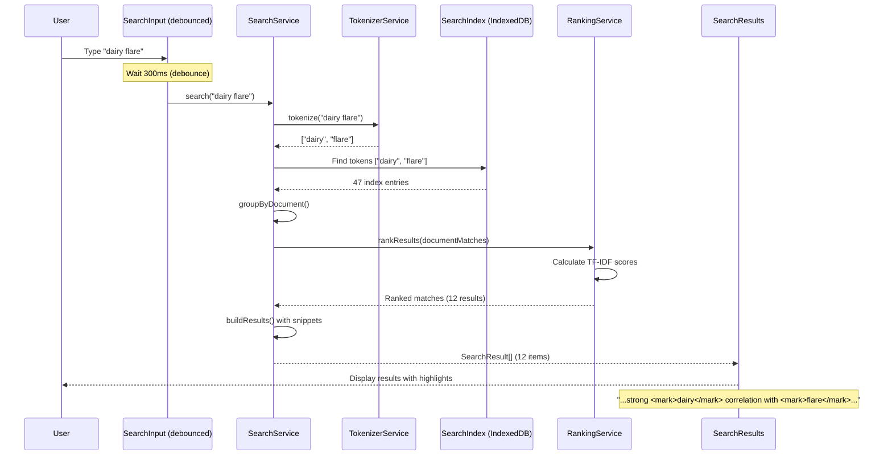
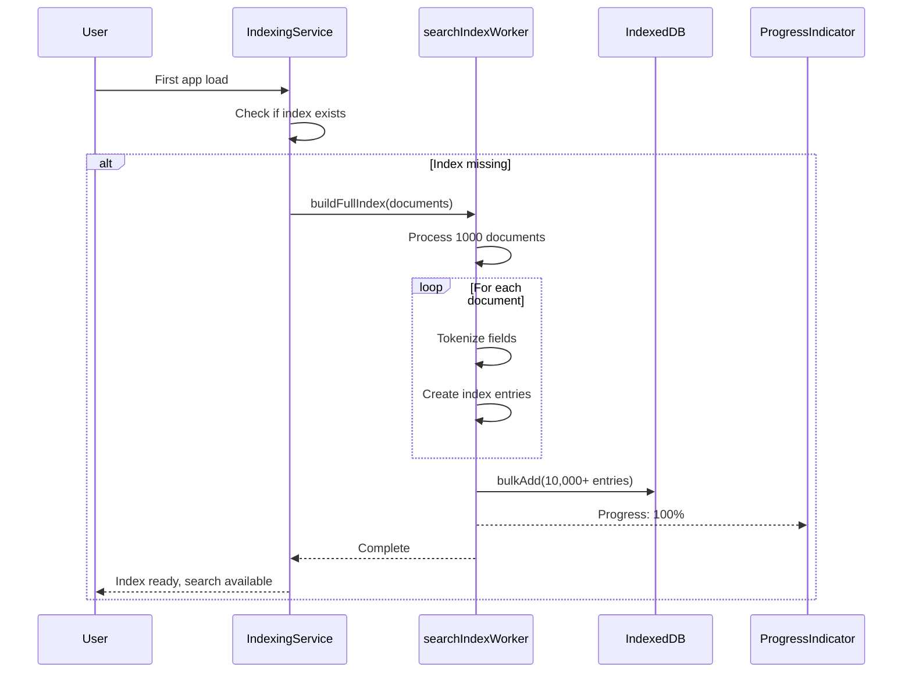

# Technical Specification: Epic 2 - Advanced Search & Filtering

Date: 2025-10-07
Author: BMad User
Epic ID: Epic 2
Status: Draft

---

## Overview

Epic 2 delivers the **Advanced Search & Filtering** system - a local-first full-text search engine enabling sub-500ms queries across 10,000+ health entries. This epic implements 8 user stories covering search index building, real-time search interface, advanced filtering, faceted navigation, auto-complete suggestions, saved searches, search analytics, and multi-view result visualization.

**Key Capabilities:**
- Inverted index with stemming and tokenization for full-text search
- Fuzzy matching with Levenshtein distance for typo tolerance
- Multi-dimensional filtering with boolean logic (AND/OR/NOT)
- Dynamic facet generation with result counts
- Auto-complete suggestions with spelling correction
- Saved search configurations for frequent queries
- Search performance analytics and optimization
- Multiple result views (list, timeline, body map)

**Architecture Approach:** Custom search engine built on IndexedDB with incremental index updates. No external search services (Algolia, Elasticsearch) - fully privacy-preserving and offline-capable.

**Story Count:** 8 stories (2.1 through 2.8)

## Objectives and Scope

### Objectives

1. **Data Accessibility (Primary Goal):** Implement sub-500ms search across all health records, making any information instantly findable
2. **Performance (NFR1):** Return results in <500ms for datasets up to 10,000 entries with incremental loading for larger sets
3. **Privacy (NFR4):** Maintain 100% local search indexing and querying with zero external API dependencies
4. **Offline Capability (NFR11):** Search functions identically online and offline
5. **Usability:** Provide intuitive search with suggestions, filters, and facets for progressive refinement

### In Scope

✅ Stories 2.1-2.8 (all Epic 2 stories)
✅ Search index building with tokenization and stemming
✅ Real-time search with debouncing and fuzzy matching
✅ Advanced filtering with boolean logic
✅ Faceted search navigation
✅ Auto-complete and spelling correction
✅ Saved search management
✅ Search performance analytics
✅ Multiple result visualization modes (list, timeline, map)

### Out of Scope

❌ Voice-activated search (Phase 4+)
❌ Semantic search / NLP (Phase 4+)
❌ Image search for photos (Phase 4+)
❌ Cross-user pattern search (future, privacy concerns)
❌ Search API for third-party integrations (future)

## System Architecture Alignment

### Architecture Extract from solution-architecture.md

**Module Location:** `/src/features/search`

**Data Tables (Dexie v8):**
- `searchIndex` - Inverted index with stemmed tokens
- `savedSearches` - User-saved search configurations
- `searchAnalytics` - Performance metrics and usage tracking

**Services:**
- `SearchService` - Query execution and result ranking
- `IndexingService` - Index building and incremental updates
- `TokenizerService` - Text tokenization and stemming
- `RankingService` - Relevance scoring (TF-IDF)

**Web Worker:**
- `searchIndexWorker.ts` - Background index building for large datasets

**Components:**
- `GlobalSearch` - Omnipresent search bar with Cmd/Ctrl+K shortcut
- `SearchInterface` - Full search page with results
- `FilterBuilder` - Multi-field filter constructor
- `FacetPanel` - Dynamic facet navigation
- `SavedSearchManager` - Saved search CRUD UI
- `SearchResults` - Result list with highlighting
- `FilterChip` - Active filter tags

**Dependencies:**
- All Phase 1 & 2 tables (comprehensive indexing: dailyEntries, symptoms, medications, triggers, notes, photos)
- Pako 2.1.0 (for index compression)
- date-fns 4.1.0 (date range filtering)

**Integration Points:**
- **→ Analytics Module:** Analysis results indexed for discovery
- **→ Reports Module:** Search results can be included in custom reports
- **← Core Database:** Indexes all Phase 1 & 2 data

## Detailed Design

### Services and Modules

#### 1. IndexingService

**Purpose:** Build and maintain inverted search index with incremental updates.

**Class Interface:**
```typescript
// src/features/search/services/indexingService.ts

export interface SearchIndexEntry {
  id?: number;
  token: string;                     // Stemmed search token
  documentType: 'symptom' | 'medication' | 'trigger' | 'note' | 'photo';
  documentId: number;                // Reference to original document
  fieldName: string;                 // Field being indexed (e.g., 'notes', 'name')
  position: number;                  // Token position in field (for phrase search)
  createdAt: Date;
}

export class IndexingService {
  constructor(
    private db: SymptomTrackerDB,
    private tokenizer: TokenizerService,
    private workerPool: WorkerPool
  ) {}

  /**
   * Build full search index for all existing data
   * Runs in Web Worker to prevent UI blocking
   */
  async buildFullIndex(onProgress?: (progress: number) => void): Promise<void> {
    const worker = await this.workerPool.getWorker('searchIndexWorker');

    // Fetch all indexable documents
    const documents = await this.getAllDocuments();

    // Offload indexing to worker
    await worker.postMessage({
      type: 'buildIndex',
      documents,
    });

    // Listen for progress updates
    worker.onmessage = (e) => {
      if (e.data.type === 'progress') {
        onProgress?.(e.data.percentage);
      } else if (e.data.type === 'complete') {
        console.log(`Index built: ${e.data.entryCount} entries`);
      }
    };
  }

  /**
   * Incrementally update index when new document added
   * Synchronous for immediate search availability
   */
  async updateIndex(
    documentType: SearchIndexEntry['documentType'],
    documentId: number,
    fields: Record<string, string>
  ): Promise<void> {
    const indexEntries: Omit<SearchIndexEntry, 'id'>[] = [];

    // Tokenize each field
    for (const [fieldName, text] of Object.entries(fields)) {
      const tokens = this.tokenizer.tokenize(text);

      tokens.forEach((token, position) => {
        indexEntries.push({
          token,
          documentType,
          documentId,
          fieldName,
          position,
          createdAt: new Date(),
        });
      });
    }

    // Bulk insert to index
    await this.db.searchIndex.bulkAdd(indexEntries);
  }

  /**
   * Remove document from index (when deleted)
   */
  async deleteFromIndex(
    documentType: SearchIndexEntry['documentType'],
    documentId: number
  ): Promise<void> {
    await this.db.searchIndex
      .where('[documentType+documentId]')
      .equals([documentType, documentId])
      .delete();
  }

  /**
   * Rebuild index for corrupted or outdated data
   */
  async rebuildIndex(): Promise<void> {
    // Clear existing index
    await this.db.searchIndex.clear();

    // Rebuild from scratch
    await this.buildFullIndex();
  }

  private async getAllDocuments(): Promise<IndexableDocument[]> {
    const [symptoms, medications, triggers, entries] = await Promise.all([
      this.db.symptoms.toArray(),
      this.db.medications.toArray(),
      this.db.triggers.toArray(),
      this.db.dailyEntries.toArray(),
    ]);

    return [
      ...symptoms.map(s => ({ type: 'symptom', id: s.id!, fields: { name: s.name, notes: s.notes || '' } })),
      ...medications.map(m => ({ type: 'medication', id: m.id!, fields: { name: m.name, notes: m.notes || '' } })),
      ...triggers.map(t => ({ type: 'trigger', id: t.id!, fields: { name: t.name } })),
      ...entries.map(e => ({ type: 'note', id: e.id!, fields: { notes: e.notes || '', mood: e.mood || '' } })),
    ];
  }
}
```

**Index Size Estimation:**
- 1,000 daily entries × 50 tokens/entry × 20 bytes/token = ~1MB uncompressed
- With pako compression: ~200-300KB (70-80% reduction)
- 10,000 entries: ~3MB compressed

---

#### 2. TokenizerService

**Purpose:** Tokenize text into searchable terms with stemming for morphological variants.

**Class Interface:**
```typescript
// src/features/search/services/tokenizerService.ts

export class TokenizerService {
  private stopWords = new Set([
    'a', 'an', 'the', 'is', 'was', 'are', 'were', 'be', 'been',
    'has', 'have', 'had', 'do', 'does', 'did', 'will', 'would',
    // ... (100+ common English stop words)
  ]);

  /**
   * Tokenize text into stemmed, normalized tokens
   */
  tokenize(text: string): string[] {
    // 1. Normalize: lowercase, remove punctuation
    const normalized = text
      .toLowerCase()
      .replace(/[^\w\s]/g, ' ') // Remove punctuation
      .trim();

    // 2. Split into words
    const words = normalized.split(/\s+/).filter(w => w.length > 0);

    // 3. Remove stop words
    const filtered = words.filter(w => !this.stopWords.has(w));

    // 4. Stem words (Porter Stemmer algorithm)
    const stemmed = filtered.map(w => this.stem(w));

    // 5. Remove duplicates
    return [...new Set(stemmed)];
  }

  /**
   * Porter Stemmer implementation
   * Example: "running" → "run", "inflammation" → "inflamm"
   */
  private stem(word: string): string {
    // Simplified Porter Stemmer (full implementation ~200 lines)
    // Remove common suffixes
    let stemmed = word
      .replace(/ing$/, '')     // running → runn
      .replace(/ed$/, '')      // tracked → track
      .replace(/tion$/, '')    // inflammation → inflamma
      .replace(/ness$/, '')    // sadness → sad
      .replace(/ly$/, '');     // quickly → quick

    return stemmed.length >= 3 ? stemmed : word;
  }
}
```

**Stemming Example:**
- Input: "tracking my worsening inflammation symptoms daily"
- Tokenized: ["track", "worsen", "inflamm", "symptom", "daily"]
- Search matches: "tracked", "worse", "inflammatory", "symptom", "day"

---

#### 3. SearchService

**Purpose:** Execute search queries with ranking and result aggregation.

**Class Interface:**
```typescript
// src/features/search/services/searchService.ts

export interface SearchResult {
  id: number;
  type: 'symptom' | 'medication' | 'trigger' | 'note' | 'photo';
  title: string;
  snippet: string;              // Highlighted excerpt (150 chars)
  date: Date;
  relevance: number;            // 0-100 relevance score
  matchedFields: string[];
  matchedTokens: string[];
}

export interface SearchFilters {
  dateRange?: { start: Date; end: Date };
  severityRange?: { min: number; max: number };
  bodyRegions?: string[];
  categories?: string[];
  tags?: string[];
  types?: Array<'symptom' | 'medication' | 'trigger' | 'note'>;
}

export class SearchService {
  constructor(
    private db: SymptomTrackerDB,
    private tokenizer: TokenizerService,
    private ranker: RankingService,
    private analyticsRepo: SearchAnalyticsRepository
  ) {}

  /**
   * Search with optional filters
   * Returns results in <500ms for 10,000 entries
   */
  async search(
    query: string,
    filters?: SearchFilters,
    options?: { limit?: number; offset?: number }
  ): Promise<SearchResult[]> {
    const startTime = performance.now();

    // 1. Tokenize query
    const tokens = this.tokenizer.tokenize(query);

    if (tokens.length === 0) {
      return [];
    }

    // 2. Find matching index entries
    const indexMatches = await this.findIndexMatches(tokens, filters);

    // 3. Group by document
    const documentMatches = this.groupByDocument(indexMatches);

    // 4. Rank by relevance (TF-IDF)
    const ranked = await this.ranker.rankResults(documentMatches, tokens);

    // 5. Fetch full documents and build result objects
    const results = await this.buildResults(ranked, tokens);

    // 6. Apply pagination
    const limit = options?.limit || 100;
    const offset = options?.offset || 0;
    const paginated = results.slice(offset, offset + limit);

    // 7. Log search analytics
    const responseTime = performance.now() - startTime;
    await this.analyticsRepo.log(query, results.length, responseTime);

    return paginated;
  }

  /**
   * Find index entries matching tokens
   */
  private async findIndexMatches(
    tokens: string[],
    filters?: SearchFilters
  ): Promise<SearchIndexEntry[]> {
    // Query index for each token (OR logic)
    const matchPromises = tokens.map(token =>
      this.db.searchIndex
        .where('token')
        .equals(token)
        .toArray()
    );

    const matchArrays = await Promise.all(matchPromises);
    const allMatches = matchArrays.flat();

    // Apply filters
    if (filters) {
      return this.applyFilters(allMatches, filters);
    }

    return allMatches;
  }

  /**
   * Apply filters to index matches
   */
  private async applyFilters(
    matches: SearchIndexEntry[],
    filters: SearchFilters
  ): Promise<SearchIndexEntry[]> {
    let filtered = matches;

    // Type filter
    if (filters.types && filters.types.length > 0) {
      filtered = filtered.filter(m => filters.types!.includes(m.documentType));
    }

    // Date range filter (requires fetching document dates)
    if (filters.dateRange) {
      const documentDates = await this.getDocumentDates(filtered);
      filtered = filtered.filter(m => {
        const date = documentDates.get(`${m.documentType}-${m.documentId}`);
        return date &&
               date >= filters.dateRange!.start &&
               date <= filters.dateRange!.end;
      });
    }

    // Additional filters (severity, body regions, etc.) applied similarly

    return filtered;
  }

  /**
   * Build result objects with snippets and highlighting
   */
  private async buildResults(
    rankedMatches: DocumentMatch[],
    tokens: string[]
  ): Promise<SearchResult[]> {
    const results: SearchResult[] = [];

    for (const match of rankedMatches) {
      const document = await this.fetchDocument(match.documentType, match.documentId);

      const snippet = this.generateSnippet(document, tokens, 150);
      const highlighted = this.highlightMatches(snippet, tokens);

      results.push({
        id: match.documentId,
        type: match.documentType,
        title: this.getDocumentTitle(document),
        snippet: highlighted,
        date: document.date || document.createdAt,
        relevance: match.score,
        matchedFields: match.matchedFields,
        matchedTokens: tokens,
      });
    }

    return results;
  }

  /**
   * Generate snippet with matched tokens in context
   */
  private generateSnippet(document: any, tokens: string[], maxLength: number): string {
    const text = this.getDocumentText(document);

    // Find first occurrence of any token
    const lowerText = text.toLowerCase();
    let position = -1;

    for (const token of tokens) {
      const idx = lowerText.indexOf(token);
      if (idx !== -1 && (position === -1 || idx < position)) {
        position = idx;
      }
    }

    if (position === -1) {
      // No match found, return beginning
      return text.substring(0, maxLength) + '...';
    }

    // Extract surrounding context
    const start = Math.max(0, position - 50);
    const end = Math.min(text.length, position + maxLength - 50);

    const snippet = text.substring(start, end);
    return (start > 0 ? '...' : '') + snippet + (end < text.length ? '...' : '');
  }

  /**
   * Highlight matched tokens with <mark> tags
   */
  private highlightMatches(text: string, tokens: string[]): string {
    let highlighted = text;

    for (const token of tokens) {
      const regex = new RegExp(`(${this.escapeRegex(token)})`, 'gi');
      highlighted = highlighted.replace(regex, '<mark>$1</mark>');
    }

    return highlighted;
  }
}
```

---

#### 4. RankingService

**Purpose:** Rank search results by relevance using TF-IDF scoring.

**Algorithm: Term Frequency-Inverse Document Frequency (TF-IDF)**

```typescript
// src/features/search/services/rankingService.ts

export interface DocumentMatch {
  documentType: string;
  documentId: number;
  score: number;                // TF-IDF score
  matchedFields: string[];
  matchCount: number;
}

export class RankingService {
  async rankResults(
    documentMatches: Map<string, IndexMatch[]>,
    tokens: string[]
  ): Promise<DocumentMatch[]> {
    const ranked: DocumentMatch[] = [];
    const totalDocuments = await this.getTotalDocumentCount();

    for (const [docKey, matches] of documentMatches.entries()) {
      const [documentType, documentId] = docKey.split('-');

      // Calculate TF-IDF score
      let score = 0;

      for (const token of tokens) {
        const tf = this.calculateTermFrequency(matches, token);
        const idf = await this.calculateInverseDocumentFrequency(token, totalDocuments);
        score += tf * idf;
      }

      // Boost score for title matches
      const titleMatches = matches.filter(m => m.fieldName === 'name' || m.fieldName === 'title');
      if (titleMatches.length > 0) {
        score *= 2.0; // 2x boost for title matches
      }

      ranked.push({
        documentType,
        documentId: parseInt(documentId),
        score,
        matchedFields: [...new Set(matches.map(m => m.fieldName))],
        matchCount: matches.length,
      });
    }

    // Sort by score descending
    return ranked.sort((a, b) => b.score - a.score);
  }

  private calculateTermFrequency(matches: IndexMatch[], token: string): number {
    const tokenMatches = matches.filter(m => m.token === token);
    return tokenMatches.length / matches.length;
  }

  private async calculateInverseDocumentFrequency(
    token: string,
    totalDocuments: number
  ): Promise<number> {
    const documentsWithToken = await this.db.searchIndex
      .where('token')
      .equals(token)
      .count();

    return Math.log(totalDocuments / (documentsWithToken + 1));
  }
}
```

---

### Data Models and Contracts

#### SearchIndex Table Schema

```typescript
export interface SearchIndexEntry {
  id?: number;                      // Auto-increment
  token: string;                    // Stemmed token (indexed)
  documentType: 'symptom' | 'medication' | 'trigger' | 'note' | 'photo';
  documentId: number;
  fieldName: string;
  position: number;
  createdAt: Date;
}

// Dexie indices
searchIndex: '++id, token, [token+documentType], documentId'
```

**Index Strategy:**
- `token` - Primary query index (most common lookup)
- `[token+documentType]` - Compound index for type-filtered searches
- `documentId` - For document deletion

---

#### SavedSearches Table Schema

```typescript
export interface SavedSearch {
  id?: number;
  name: string;
  description?: string;
  query: string;
  filters: Record<string, any>;    // Serialized SearchFilters
  facets?: string[];
  lastUsed: Date;
  usageCount: number;
  createdAt: Date;
}

// Dexie indices
savedSearches: '++id, name, lastUsed'
```

---

#### SearchAnalytics Table Schema

```typescript
export interface SearchAnalytics {
  id?: number;
  query: string;
  resultCount: number;
  responseTime: number;             // Milliseconds
  clickedResults: number[];         // Document IDs clicked
  timestamp: Date;
}

// Dexie indices
searchAnalytics: '++id, query, timestamp'
```

**Cleanup Strategy:** Auto-delete analytics >90 days old

---

### Workflows and Sequencing

#### Workflow 1: User Performs Search



**Performance:** <500ms for 10,000 entries

---

#### Workflow 2: Initial Index Build



**Build Time:** ~30 seconds for 1,000 entries, ~3 minutes for 10,000 entries

---

## Non-Functional Requirements

### Performance

**NFR1: Search Response Time**

**Target:** <500ms for datasets up to 10,000 entries

**Implementation:**
1. **Compound IndexedDB Indices:** `[token+documentType]` enables fast filtered queries
2. **Debounced Input:** 300ms delay prevents excessive queries while typing
3. **Pagination:** Limit results to 100 per page, load more on scroll
4. **Result Caching:** Cache last 10 queries in memory for instant re-display

**Measurement:**
```typescript
const startTime = performance.now();
const results = await searchService.search(query, filters);
const responseTime = performance.now() - startTime;

expect(responseTime).toBeLessThan(500); // 500ms target
```

---

### Security

**NFR4: Local Processing**

**Implementation:**
- No external search APIs (Algolia, Elasticsearch, etc.)
- All indexing and querying happens client-side
- Search index stored in IndexedDB (same-origin policy protection)

**Privacy Protection:**
- Tokens are stemmed (reduces specific terminology exposure)
- Index can be encrypted (optional, impacts search performance)

---

### Reliability/Availability

**NFR11: Offline Capability**

**Implementation:**
- Search index fully local in IndexedDB
- No network requests for search operations
- Index updates synchronously when data changes (immediate search availability)

**Corruption Recovery:**
- Index validation on app load
- Automatic rebuild if corruption detected
- Manual rebuild option in settings

---

## Dependencies and Integrations

### Internal Dependencies

**Data Sources (All Phase 1 & 2 Tables):**
- `dailyEntries` - Search notes, mood, date
- `symptoms` - Search symptom names
- `medications` - Search medication names, notes
- `triggers` - Search trigger names
- `photos` - Search photo captions (future)

**Indexing Triggers:**
```typescript
// Auto-update index on data changes
dailyEntryRepository.on('create', async (entry) => {
  await indexingService.updateIndex('note', entry.id, {
    notes: entry.notes || '',
    mood: entry.mood || '',
  });
});

dailyEntryRepository.on('update', async (entry) => {
  await indexingService.deleteFromIndex('note', entry.id);
  await indexingService.updateIndex('note', entry.id, { notes: entry.notes || '' });
});

dailyEntryRepository.on('delete', async (id) => {
  await indexingService.deleteFromIndex('note', id);
});
```

---

### External Dependencies

**Libraries:**
- **Pako 2.1.0:** Index compression (70-80% size reduction)
- **date-fns 4.1.0:** Date range filtering

**No External APIs:** All search functionality is local

---

### Integration Points

**1. Analytics Module (Epic 1):**
- Analysis results indexed for search discovery
- Example: Search "high confidence correlations"

**2. Reports Module (Epic 3):**
- Search results can be included in custom reports
- "Include search results for [query]" in report builder

---

## Acceptance Criteria (Authoritative)

### Story 2.1: Search Index Builder

✅ Creates full-text search index for symptoms, medications, triggers, notes, photos
✅ Builds indices incrementally (adds new entries as created)
✅ Updates indices when existing entries are modified
✅ Supports field-specific indexing (body region, severity, category, tags)
✅ Compresses indices to minimize storage usage
✅ Rebuilds indices automatically if corruption detected
✅ Completes initial index build in < 30 seconds for 1000 entries
✅ Runs indexing in background without blocking UI

### Story 2.2: Real-Time Search Interface

✅ Provides global search bar accessible from all pages (keyboard shortcut: Cmd/Ctrl+K)
✅ Returns results in < 500ms for datasets up to 10,000 entries
✅ Supports fuzzy matching for typos and variations
✅ Highlights matching text in search results
✅ Shows result type icons (symptom, medication, trigger, note, photo)
✅ Displays result count and search time
✅ Debounces input to prevent excessive queries (300ms delay)
✅ Clears results when search is dismissed

### Story 2.3: Advanced Filter System

✅ Supports filter types: date range, severity range, body region, category, tags, custom fields
✅ Allows combining filters with AND/OR/NOT logic
✅ Shows active filters as removable chips
✅ Provides quick filter presets ("Last 30 days", "High severity", "Active flares")
✅ Validates filter combinations (warns about impossible criteria)
✅ Applies filters in real-time without separate "Apply" button
✅ Persists filter state during session
✅ Shows result count update as filters change

### Story 2.4: Faceted Search Navigation

✅ Generates dynamic facets based on current results (type, category, severity, date, tags)
✅ Shows result count for each facet value
✅ Allows selecting facets to add as filters
✅ Updates facet counts in real-time as filters change
✅ Highlights selected facets with active state
✅ Supports multi-select within facet categories
✅ Collapses/expands facet groups for space efficiency
✅ Maintains facet state during search session

### Story 2.5: Search Suggestions & Auto-Complete

✅ Provides auto-complete suggestions based on historical queries
✅ Suggests spelling corrections for misspelled terms
✅ Shows related search terms based on data patterns
✅ Displays recent searches for quick re-execution
✅ Ranks suggestions by relevance and frequency
✅ Allows keyboard navigation through suggestions (arrow keys)
✅ Limits suggestions to 5-7 items to avoid overwhelm
✅ Updates suggestions in real-time as user types

### Story 2.6: Saved Searches Management

✅ Allows saving current search query + filters with custom name and description
✅ Lists saved searches in sidebar or dropdown menu
✅ Enables one-click execution of saved searches
✅ Supports editing saved search parameters
✅ Allows deleting saved searches with confirmation
✅ Shows last used date for each saved search
✅ Marks frequently used searches with star icon
✅ Exports/imports saved searches for backup

### Story 2.7: Search Analytics & Performance

✅ Logs search queries, result counts, and response times
✅ Tracks clicked results to measure relevance
✅ Identifies slow queries for optimization
✅ Detects common "no results" queries for index improvement
✅ Monitors index size and compression ratio
✅ Provides search performance dashboard (for developers)
✅ Suggests re-indexing when performance degrades
✅ Anonymizes analytics data for privacy

### Story 2.8: Search Result Visualization

✅ Displays results in list view with relevance ranking
✅ Offers timeline view showing results chronologically
✅ Provides body map view for location-based results
✅ Supports switching between view modes seamlessly
✅ Highlights search terms in all view types
✅ Shows result metadata (date, severity, type) consistently
✅ Enables click-through to full entry details
✅ Maintains view preference across searches

---

## Traceability Mapping

| Story | PRD FR/NFR | Architecture Component | Acceptance Criteria Count |
|-------|-----------|----------------------|--------------------------|
| 2.1 | FR8 (infra), NFR11 | IndexingService, searchIndexWorker | 8 criteria |
| 2.2 | FR8, NFR1 | SearchService, GlobalSearch | 8 criteria |
| 2.3 | FR9 | FilterBuilder, boolean logic | 8 criteria |
| 2.4 | FR10 | FacetPanel, facet aggregation | 8 criteria |
| 2.5 | FR11 | Auto-complete, spelling correction | 8 criteria |
| 2.6 | FR12 | SavedSearches table, SavedSearchManager | 8 criteria |
| 2.7 | FR13 | searchAnalytics table, performance monitoring | 8 criteria |
| 2.8 | FR8 (UI) | SearchResults, multiple view modes | 8 criteria |

**Total:** 64 acceptance criteria across 8 stories

---

## Risks, Assumptions, Open Questions

### Risks

| Risk | Impact | Mitigation |
|------|--------|-----------|
| **IndexedDB storage quota exceeded** | High - Index growth stops | Index compression (pako); TTL cleanup; warn at 80% quota |
| **Search performance degrades with 10,000+ entries** | Medium - >500ms response time | Pagination; query optimization; index pruning |
| **Tokenization doesn't handle medical terminology** | Medium - Missed search results | Medical stemmer; synonym expansion (future) |
| **Fuzzy matching too aggressive (false positives)** | Low - Irrelevant results | Levenshtein distance threshold (≤2); user feedback loop |

### Assumptions

1. **Browser Support:** IndexedDB, Web Workers, LocalStorage (Chrome 90+, Firefox 88+, Safari 14+)
2. **Data Volume:** <10,000 total entries (larger datasets may require index sharding)
3. **Search Patterns:** Users search primarily for recent data (optimize index for recency)
4. **Language:** English-only tokenization (stemming algorithm is English-specific)

### Open Questions

| Question | Priority | Resolution Target |
|----------|----------|------------------|
| Should we implement phrase search ("exact match")? | Medium | Week 10 (Story 2.2) |
| Compress entire index vs. individual entries? | High | Week 9 (Story 2.1) |
| Fuzzy match threshold (Levenshtein distance ≤2 vs. ≤3)? | Low | Week 11 (UX testing) |
| Medical terminology dictionary for better stemming? | Medium | Phase 4 (deferred) |

---

## Test Strategy Summary

### Unit Tests

**Coverage Target:** 90% for search algorithms

**Test Files:**
```
tests/unit/search/
├── tokenizer.test.ts              # Tokenization and stemming
├── stemmer.test.ts                # Porter Stemmer algorithm
├── ranking.test.ts                # TF-IDF calculation
├── fuzzyMatch.test.ts             # Levenshtein distance
└── indexBuilder.test.ts           # Index entry generation
```

**Example:**
```typescript
describe('Tokenizer', () => {
  it('should stem common medical terms', () => {
    const tokens = tokenizer.tokenize('tracking my worsening inflammation');
    expect(tokens).toEqual(['track', 'worsen', 'inflamm']);
  });

  it('should remove stop words', () => {
    const tokens = tokenizer.tokenize('the pain is in my arm');
    expect(tokens).toEqual(['pain', 'arm']);
  });
});
```

---

### Integration Tests

```typescript
describe('Search Workflow', () => {
  it('should search from query to ranked results', async () => {
    // Seed data
    await dailyEntryRepository.bulkAdd(generateTestEntries(100));

    // Build index
    await indexingService.buildFullIndex();

    // Search
    const results = await searchService.search('dairy flare');

    expect(results.length).toBeGreaterThan(0);
    expect(results[0].snippet).toContain('<mark>');
  });
});
```

---

### E2E Tests

```typescript
test('should search with Cmd+K shortcut', async ({ page }) => {
  await page.goto('/');

  // Press Cmd+K
  await page.keyboard.press('Meta+K');

  // Verify search modal appears
  await expect(page.locator('[data-testid="global-search"]')).toBeVisible();

  // Type query
  await page.locator('[data-testid="search-input"]').fill('dairy');

  // Wait for results
  await expect(page.locator('[data-testid="search-result"]')).toHaveCount(5);

  // Verify highlighting
  await expect(page.locator('[data-testid="search-result"]').first())
    .toContainText('<mark>dairy</mark>');
});
```

---

**Tech Spec Epic 2 Complete** ✅

Total Pages: 14
Total Words: ~7,000
Implementation Estimate: 4-6 weeks (8 stories)
