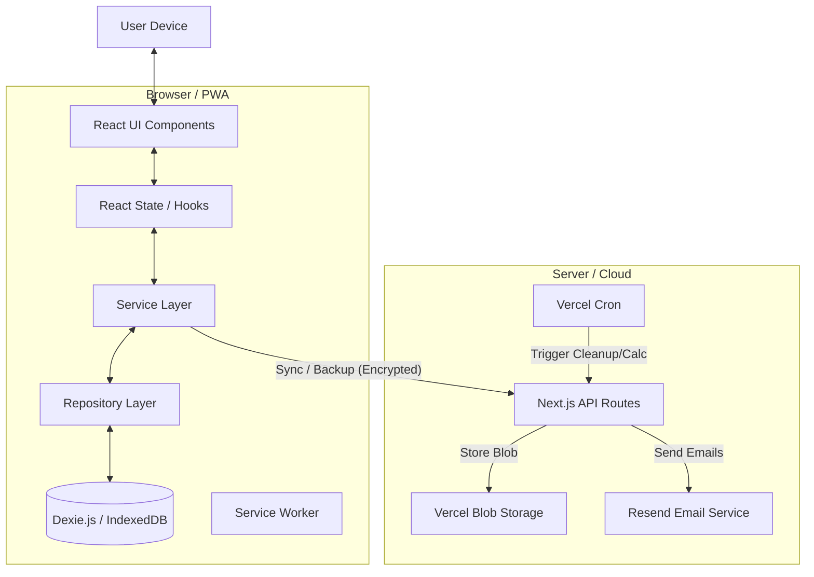

# System Architecture

## Overview

Pocket Symptom Tracker is a **Local-First Progressive Web Application (PWA)** with optional cloud synchronization. It is designed to provide full functionality offline while enabling secure, encrypted data backup and cross-device sync when online.

## Core Architectural Principles

1.  **Local-First & Offline-Capable**: The primary source of truth is the client-side **IndexedDB**. The app functions 100% offline.
2.  **Privacy-Preserving**: Data is encrypted at rest (locally) and in transit. Cloud backups use **Zero-Knowledge Encryption** (server never sees unencrypted data).
3.  **Event Sourcing**: Key domains (Body Markers, Medications, Triggers) use an append-only event model to track history and state changes over time.
4.  **Unified Tracking**: A unified "Body Marker" system handles flares, pain, and inflammation using a single polymorphic data structure.

## High-Level Architecture

## Technology Stack

-   **Frontend**: Next.js 15.5 (App Router), React 19.1, TypeScript 5.9
-   **Styling**: Tailwind CSS 4, Radix UI Primitives
-   **Local Database**: Dexie.js 4.2 (IndexedDB Wrapper)
-   **Cloud Storage**: Vercel Blob (for encrypted backups)
-   **API**: Next.js Route Handlers
-   **Utilities**: `date-fns`, `chart.js`, `zod`, `uuid`

## Data Architecture

### Local Database (Dexie.js)
The application uses a mature **Dexie.js** schema (currently v30) with sophisticated data modeling:

-   **Unified Body Markers**: Replaces separate tables for flares, pain, and inflammation.
    -   `bodyMarkers`: Current state of a marker.
    -   `bodyMarkerEvents`: Append-only history of changes (severity, status, interventions).
    -   `bodyMarkerLocations`: Spatial data for body mapping.
-   **Event Sourcing**: Used for high-fidelity tracking.
    -   `medicationEvents`, `triggerEvents`, `foodEvents`.
-   **Analytics & Caching**:
    -   `analysisResults`: Cached regression and trend analysis.
    -   `correlations`: Computed correlations between factors.
    -   `foodCombinations`: Synergistic food analysis.

### Cloud Synchronization
-   **Strategy**: Encrypted Blob Storage.
-   **Mechanism**: The client encrypts the entire database export (or chunks) using a user-derived key.
-   **Server Role**: Dumb storage. The server receives an opaque blob and a storage key hash. It cannot decrypt the data.
-   **Endpoints**:
    -   `POST /api/sync/upload`: Upload encrypted backup.
    -   `GET /api/sync/download`: Retrieve backup.
    -   `GET /api/sync/cleanup`: Cron job to manage old backups.

## Component Architecture

The codebase follows a feature-based directory structure in `src/components`:

-   **`ui/`**: Base design system components (Buttons, Cards, Inputs).
-   **Features**:
    -   `body-map/`: Interactive SVG body mapper.
    -   `flares/`, `symptoms/`, `medications/`: Domain-specific management UIs.
    -   `analytics/`, `insights/`: Visualization and reporting.
    -   `cloud-sync/`: Sync status and controls.
-   **Providers**: Global state management (Theme, Auth, Toast).

## API Layer

Although primarily local-first, the app uses Next.js API routes for specific server-side capabilities:

1.  **Sync & Backup**: Handles encrypted blob storage (`/api/sync/*`).
2.  **Correlation Analysis**: Offloads heavy computation for correlation detection (`/api/correlation/*`).
3.  **Beta Access**: Manages beta signups and email verification (`/api/beta-signup`).

## Security

-   **Client-Side Encryption**: Photos and backups are encrypted using **AES-256-GCM** via the Web Crypto API before leaving the device.
-   **Zero-Knowledge**: The backend has no access to encryption keys.
-   **Sanitization**: User inputs are validated using **Zod** schemas.
