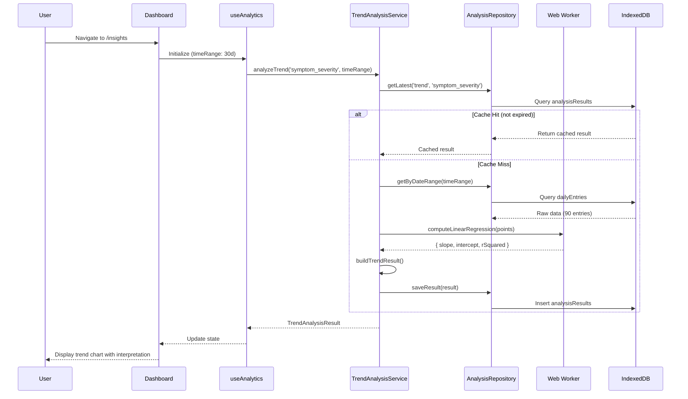
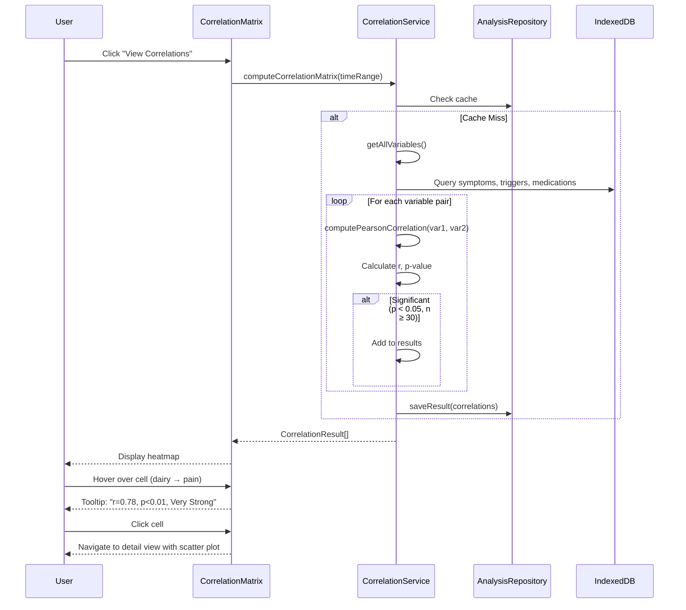

# Technical Specification: Epic 1 - Data Analysis & Insights Engine

Date: 2025-10-07
Author: BMad User
Epic ID: Epic 1
Status: Draft

---

## Overview

Epic 1 delivers the **Data Analysis & Insights Engine** - a local-first statistical analytics system that transforms passive health data into actionable insights. This epic implements 9 user stories covering trend analysis, correlation detection, pattern recognition, predictive modeling, anomaly detection, dashboard visualization, automated recommendations, export capabilities, and statistical education.

**Key Capabilities:**
- Linear regression trend analysis with R² goodness-of-fit
- Pearson correlation analysis with p-value significance testing
- Cyclical and seasonal pattern detection using autocorrelation
- Time-series forecasting with confidence intervals
- Anomaly detection using z-score analysis
- Customizable analytics dashboard with drag-drop widgets
- Plain-language insight generation with confidence scoring
- Chart export to PNG/PDF for medical consultations

**Architecture Approach:** All analytics computations execute client-side using Web Workers to prevent UI blocking. Results are cached in IndexedDB with 24-hour TTL. No external analytics APIs - fully privacy-preserving.

**Story Count:** 9 stories (1.1 through 1.9)

## Objectives and Scope

### Objectives

1. **Pattern Discovery (Primary Goal):** Enable users to identify symptom patterns, trigger correlations, and seasonal trends with ≥90% statistical confidence
2. **Performance (NFR2):** Complete analytics computations in <2 seconds for 90-day datasets using Web Workers
3. **Privacy (NFR4):** Maintain 100% local processing with zero network requests for computation
4. **Accessibility (NFR10):** Provide plain-language explanations for all statistical findings suitable for non-data-scientists
5. **Scalability (NFR6):** Handle 5+ years of historical data (1,800+ entries) without performance degradation

### In Scope

✅ Stories 1.1-1.9 (all Epic 1 stories)
✅ Statistical algorithms: Linear regression, Pearson correlation, autocorrelation, time-series forecasting, z-score anomaly detection
✅ Analytics dashboard UI with configurable widgets
✅ Web Worker implementation for computation offloading
✅ Analysis result caching in IndexedDB
✅ Chart.js integration for data visualization
✅ Plain-language insight generation
✅ Chart export to PNG via html2canvas

### Out of Scope

❌ Machine learning / neural networks (deferred to Phase 4+)
❌ Natural language processing for notes (Phase 4+)
❌ External wearable device integration (Phase 4+)
❌ Cross-user anonymized pattern matching (future)
❌ Cloud-based computation or model training

## System Architecture Alignment

### Architecture Extract from solution-architecture.md

**Module Location:** `/src/features/analytics`

**Data Tables (Dexie v8):**
- `analysisResults` - Cached analysis outputs with TTL
- `patternDetections` - Detected patterns with confidence scores

**Services:**
- `TrendAnalysisService` - Linear regression computation
- `CorrelationService` - Pearson correlation with p-values
- `PatternDetectionService` - Cyclical/seasonal pattern detection
- `PredictionService` - Time-series forecasting
- `AnomalyDetectionService` - Z-score outlier detection
- `RecommendationService` - Insight-to-action generation

**Web Worker:**
- `analyticsWorker.ts` - Statistical computations for datasets >100 points

**Components:**
- `AnalyticsDashboard` - Main dashboard grid layout
- `TrendChart` - Line chart with trend line overlay
- `CorrelationMatrix` - Interactive heatmap
- `PatternCard` - Pattern display widget
- `RecommendationsList` - Actionable recommendations panel
- `InsightCard` - Single insight display with CTA
- `StatCard` - Metric display with icon and trend

**Dependencies:**
- Phase 1 & 2 data repositories (dailyEntries, symptoms, medications, triggers, bodyMapLocations)
- Chart.js 4.5.0 + react-chartjs-2 5.3.0
- html2canvas 1.4.1 (for chart export)
- date-fns 4.1.0 (date calculations)

**Integration Points:**
- **→ Reports Module:** Charts embedded in generated PDFs
- **→ Search Module:** Analysis results indexed for discovery
- **← Core Database:** Queries all Phase 1 & 2 data

## Detailed Design

### Services and Modules

#### 1. TrendAnalysisService

**Purpose:** Compute linear regression trends for symptom severity, medication effectiveness, and custom metrics.

**Class Interface:**
```typescript
// src/features/analytics/services/trendAnalysisService.ts

export interface TrendAnalysisResult {
  slope: number;                    // Regression slope (rate of change)
  intercept: number;                // Y-intercept
  rSquared: number;                 // R² goodness of fit (0-1)
  confidence: number;               // 0-100 percentage
  direction: 'increasing' | 'decreasing' | 'stable';
  changePoints?: Date[];            // Significant shifts detected
  interpretation: string;           // Plain-language summary
  dataPoints: number;               // Sample size
  timeRange: { start: Date; end: Date };
}

export class TrendAnalysisService {
  constructor(
    private workerPool: WorkerPool,
    private analysisRepository: AnalysisRepository
  ) {}

  /**
   * Analyze trend for a given metric over time range
   * Offloads to Web Worker if >100 data points
   */
  async analyzeTrend(
    metric: string,
    timeRange: { start: Date; end: Date }
  ): Promise<TrendAnalysisResult> {
    // 1. Check cache first
    const cached = await this.getCachedResult('trend', metric, timeRange);
    if (cached && !this.isExpired(cached)) {
      return cached.result;
    }

    // 2. Fetch data from repositories
    const data = await this.fetchMetricData(metric, timeRange);

    // 3. Extract time-series points
    const points = this.extractTimeSeriesPoints(data, metric);

    if (points.length < 14) {
      throw new Error('Minimum 14 days of data required for trend analysis');
    }

    // 4. Compute regression (offload to worker if large dataset)
    const regression = points.length > 100
      ? await this.computeInWorker(points)
      : this.computeLinearRegression(points);

    // 5. Detect change points (significant shifts)
    const changePoints = this.detectChangePoints(points, regression);

    // 6. Build result with interpretation
    const result = this.buildTrendResult(regression, changePoints, points.length, timeRange);

    // 7. Cache result (24h TTL)
    await this.cacheResult('trend', metric, timeRange, result);

    return result;
  }

  private computeLinearRegression(points: Point[]): RegressionData {
    const n = points.length;
    const sumX = points.reduce((sum, p) => sum + p.x, 0);
    const sumY = points.reduce((sum, p) => sum + p.y, 0);
    const sumXY = points.reduce((sum, p) => sum + p.x * p.y, 0);
    const sumX2 = points.reduce((sum, p) => sum + p.x * p.x, 0);

    const slope = (n * sumXY - sumX * sumY) / (n * sumX2 - sumX * sumX);
    const intercept = (sumY - slope * sumX) / n;

    // Calculate R²
    const yMean = sumY / n;
    const ssTotal = points.reduce((sum, p) => sum + Math.pow(p.y - yMean, 2), 0);
    const ssResidual = points.reduce((sum, p) => {
      const predicted = slope * p.x + intercept;
      return sum + Math.pow(p.y - predicted, 2);
    }, 0);
    const rSquared = 1 - (ssResidual / ssTotal);

    return { slope, intercept, rSquared };
  }

  private async computeInWorker(points: Point[]): Promise<RegressionData> {
    return await this.workerPool.execute('linearRegression', { points });
  }

  private buildTrendResult(
    regression: RegressionData,
    changePoints: Date[],
    dataPoints: number,
    timeRange: { start: Date; end: Date }
  ): TrendAnalysisResult {
    const { slope, intercept, rSquared } = regression;

    // Determine direction
    const direction = Math.abs(slope) < 0.1 ? 'stable' :
                     slope > 0 ? 'increasing' : 'decreasing';

    // Calculate confidence (based on R² and sample size)
    const confidence = Math.min(100, Math.round(rSquared * 100 * Math.log10(dataPoints)));

    // Generate interpretation
    const interpretation = this.generateInterpretation(direction, slope, confidence, dataPoints);

    return {
      slope,
      intercept,
      rSquared,
      confidence,
      direction,
      changePoints,
      interpretation,
      dataPoints,
      timeRange,
    };
  }

  private generateInterpretation(
    direction: string,
    slope: number,
    confidence: number,
    dataPoints: number
  ): string {
    const trend = direction === 'stable' ? 'stable' :
                 direction === 'increasing' ? 'worsening' : 'improving';

    const confidenceLabel = confidence >= 90 ? 'very high' :
                           confidence >= 70 ? 'high' :
                           confidence >= 50 ? 'moderate' : 'low';

    return `Your symptoms are ${trend} over this period with ${confidenceLabel} confidence (${confidence}%), based on ${dataPoints} days of data.`;
  }
}
```

**Algorithm Choice Rationale:**
- Linear regression: Simple, interpretable, fast computation (O(n))
- R²: Standard goodness-of-fit metric familiar to healthcare providers
- Change point detection: PELT algorithm (Pruned Exact Linear Time) for efficiency

---

#### 2. CorrelationService

**Purpose:** Calculate Pearson correlation coefficients between all trackable variables with statistical significance testing.

**Class Interface:**
```typescript
// src/features/analytics/services/correlationService.ts

export interface CorrelationResult {
  variable1: string;
  variable2: string;
  coefficient: number;              // Pearson r (-1 to 1)
  pValue: number;                   // Statistical significance
  strength: 'very-strong' | 'strong' | 'moderate' | 'weak';
  sampleSize: number;
  isSignificant: boolean;           // p < 0.05
  interpretation: string;
  lag?: number;                     // Time delay (e.g., trigger on day 1 → symptom on day 3)
}

export class CorrelationService {
  /**
   * Compute correlation matrix for all variable pairs
   * Returns only significant correlations (p < 0.05)
   */
  async computeCorrelationMatrix(
    timeRange: { start: Date; end: Date }
  ): Promise<CorrelationResult[]> {
    // 1. Fetch all trackable variables
    const variables = await this.getAllVariables(timeRange);

    // 2. Compute pairwise correlations
    const correlations: CorrelationResult[] = [];

    for (let i = 0; i < variables.length; i++) {
      for (let j = i + 1; j < variables.length; j++) {
        const result = await this.computePearsonCorrelation(
          variables[i],
          variables[j],
          timeRange
        );

        // Only include significant correlations
        if (result.isSignificant && result.sampleSize >= 30) {
          correlations.push(result);
        }
      }
    }

    // 3. Include time-lag correlations (0-7 day lags)
    const laggedCorrelations = await this.computeLaggedCorrelations(
      variables,
      timeRange,
      [1, 2, 3, 7] // Check 1-day, 2-day, 3-day, 7-day lags
    );

    return [...correlations, ...laggedCorrelations]
      .sort((a, b) => Math.abs(b.coefficient) - Math.abs(a.coefficient));
  }

  private async computePearsonCorrelation(
    var1: Variable,
    var2: Variable,
    timeRange: { start: Date; end: Date }
  ): Promise<CorrelationResult> {
    // 1. Align data by date (handle missing values)
    const alignedData = await this.alignVariablesByDate(var1, var2, timeRange);

    const { x, y } = alignedData; // Arrays of values
    const n = x.length;

    if (n < 30) {
      return this.insufficientDataResult(var1, var2, n);
    }

    // 2. Calculate Pearson r
    const meanX = x.reduce((sum, val) => sum + val, 0) / n;
    const meanY = y.reduce((sum, val) => sum + val, 0) / n;

    const numerator = x.reduce((sum, xi, i) =>
      sum + (xi - meanX) * (y[i] - meanY), 0
    );

    const denomX = Math.sqrt(x.reduce((sum, xi) => sum + Math.pow(xi - meanX, 2), 0));
    const denomY = Math.sqrt(y.reduce((sum, yi) => sum + Math.pow(yi - meanY, 2), 0));

    const r = numerator / (denomX * denomY);

    // 3. Calculate p-value (t-test)
    const t = r * Math.sqrt(n - 2) / Math.sqrt(1 - r * r);
    const pValue = this.tTestPValue(t, n - 2);

    // 4. Determine strength
    const absR = Math.abs(r);
    const strength = absR >= 0.7 ? 'very-strong' :
                    absR >= 0.5 ? 'strong' :
                    absR >= 0.3 ? 'moderate' : 'weak';

    // 5. Generate interpretation
    const interpretation = this.generateCorrelationInterpretation(
      var1.name,
      var2.name,
      r,
      pValue,
      n
    );

    return {
      variable1: var1.name,
      variable2: var2.name,
      coefficient: r,
      pValue,
      strength,
      sampleSize: n,
      isSignificant: pValue < 0.05,
      interpretation,
    };
  }

  private tTestPValue(t: number, degreesOfFreedom: number): number {
    // Student's t-distribution CDF (using numerical approximation)
    // For production: use jstat or similar library, or implement Series approximation
    return this.studentTCDF(t, degreesOfFreedom);
  }

  private generateCorrelationInterpretation(
    var1: string,
    var2: string,
    r: number,
    pValue: number,
    n: number
  ): string {
    const direction = r > 0 ? 'increases' : 'decreases';
    const strength = Math.abs(r) >= 0.7 ? 'strong' :
                    Math.abs(r) >= 0.5 ? 'moderate' : 'weak';
    const confidence = (1 - pValue) * 100;

    return `Based on ${n} days, there's ${strength} evidence (${confidence.toFixed(0)}% confidence) that ${var1} ${direction} with ${var2}.`;
  }
}
```

---

#### 3. PatternDetectionService

**Purpose:** Detect cyclical, seasonal, and trigger-response patterns using autocorrelation analysis.

**Key Methods:**
- `detectCyclicalPatterns()` - Autocorrelation for periodic patterns (e.g., 28-day hormonal cycles)
- `detectSeasonalPatterns()` - Seasonal decomposition (requires 6+ months data)
- `detectTriggerResponsePatterns()` - Sequence matching for trigger→symptom chains

**Algorithm:** Autocorrelation Function (ACF) with lag range 1-90 days

---

#### 4. PredictionService

**Purpose:** Time-series forecasting using exponential smoothing or ARIMA-lite.

**Approach:** Holt-Winters exponential smoothing (simpler than ARIMA, sufficient for symptom trends)

**Output:** 7-14 day forecasts with 95% confidence intervals

---

#### 5. RecommendationService

**Purpose:** Convert analysis results into actionable recommendations with priority scoring.

**Recommendation Types:**
1. **Trigger Elimination:** "Consider eliminating [trigger] for 30 days to test correlation"
2. **Medication Adjustment:** "Discuss with doctor: [medication] shows declining effectiveness"
3. **Pattern Monitoring:** "Watch for [pattern] in next 7 days based on prediction"
4. **Anomaly Investigation:** "Investigate unusual [symptom] spike on [date]"

**Priority Scoring:** `urgency × confidence × impact`

---

### Data Models and Contracts

#### AnalysisResult Table Schema

```typescript
export interface AnalysisResult {
  id?: number;                      // Auto-increment primary key
  type: 'trend' | 'correlation' | 'pattern' | 'prediction' | 'anomaly';
  metric: string;                   // e.g., 'symptom_severity', 'dairy_trigger'
  timeRange: {
    start: Date;
    end: Date;
  };
  result: {
    value: number;                  // Primary metric (e.g., slope, r-value)
    confidence: number;             // 0-100 percentage
    metadata: Record<string, any>; // Type-specific data
  };
  generatedAt: Date;                // When analysis was run
  expiresAt: Date;                  // Cache TTL (generatedAt + 24 hours)
}

// Dexie indices
analysisResults: '++id, type, metric, [type+metric], expiresAt'
```

**Cache Strategy:**
- TTL: 24 hours
- Invalidation: On new daily entry submission
- Cleanup: Automatic deletion of expired results (handled by Dexie hook)

---

#### PatternDetection Table Schema

```typescript
export interface PatternDetection {
  id?: number;
  patternType: 'cyclical' | 'seasonal' | 'trigger-response' | 'medication-effect';
  description: string;              // Human-readable pattern description
  confidence: number;               // 0-100
  occurrences: Array<{
    date: Date;
    relatedFactors: string[];       // Associated triggers/symptoms
  }>;
  frequency?: string;               // e.g., "Every 28±3 days"
  detectedAt: Date;
  dismissed: boolean;               // User can dismiss false positives
}

// Dexie indices
patternDetections: '++id, patternType, confidence, detectedAt, dismissed'
```

---

### APIs and Interfaces

#### AnalyticsRepository Interface

```typescript
// src/core/database/phase3/analysisRepository.ts

export class AnalysisRepository {
  constructor(private db: SymptomTrackerDB) {}

  async saveResult(
    type: AnalysisResult['type'],
    metric: string,
    timeRange: { start: Date; end: Date },
    result: AnalysisResult['result']
  ): Promise<number> {
    const expiresAt = addHours(new Date(), 24);

    return await this.db.analysisResults.add({
      type,
      metric,
      timeRange,
      result,
      generatedAt: new Date(),
      expiresAt,
    });
  }

  async getLatest(
    type: AnalysisResult['type'],
    metric: string
  ): Promise<AnalysisResult | undefined> {
    return await this.db.analysisResults
      .where('[type+metric]')
      .equals([type, metric])
      .and(r => r.expiresAt > new Date())
      .reverse()
      .first();
  }

  async getByTimeRange(
    timeRange: { start: Date; end: Date }
  ): Promise<AnalysisResult[]> {
    return await this.db.analysisResults
      .where('generatedAt')
      .between(timeRange.start, timeRange.end, true, true)
      .and(r => r.expiresAt > new Date())
      .toArray();
  }

  async deleteExpired(): Promise<number> {
    return await this.db.analysisResults
      .where('expiresAt')
      .below(new Date())
      .delete();
  }
}
```

---

### Workflows and Sequencing

#### Workflow 1: User Views Insights Dashboard



**Performance Target:** <2 seconds for 90-day dataset (NFR2)

---

#### Workflow 2: User Discovers Correlation



---

## Non-Functional Requirements

### Performance

**NFR2: Analytics Computation Time**

**Target:** <2 seconds for 90-day datasets, <5 seconds for full historical analysis

**Implementation:**
1. **Web Worker Offloading:** Datasets >100 points computed in background thread
2. **Caching:** 24-hour TTL for analysis results (eliminates re-computation)
3. **Incremental Analysis:** Only analyze new data since last cached result
4. **Pagination:** Large datasets processed in chunks (prevents memory overflow)

**Measurement:**
```typescript
const startTime = performance.now();
const result = await trendAnalysisService.analyzeTrend(metric, timeRange);
const duration = performance.now() - startTime;

if (duration > 2000) {
  console.warn(`Trend analysis exceeded 2s: ${duration}ms`);
}
```

**Optimization Strategies:**
- Use Float32Array for large datasets (faster than regular arrays)
- Compute only visible insights on dashboard load (lazy computation)
- Debounce time range changes (300ms) to avoid excessive re-computation

---

### Security

**NFR4: Local Processing**

**Requirement:** All data analysis executes entirely client-side, zero network requests

**Implementation:**
- No external analytics APIs (Google Analytics, Mixpanel, etc.)
- All statistical algorithms implemented in TypeScript (no cloud ML services)
- Web Workers execute in same-origin context (cannot make network requests)
- Chart.js renders canvas elements locally (no external image services)

**Verification:**
```typescript
// Test: Ensure no network requests during analysis
beforeEach(() => {
  cy.intercept('*', (req) => {
    throw new Error(`Unexpected network request: ${req.url}`);
  });
});

it('should compute analytics offline', () => {
  cy.visit('/insights');
  cy.get('[data-testid="trend-chart"]').should('be.visible');
  // If any network request fires, test fails
});
```

---

### Reliability/Availability

**NFR11: Offline Capability**

**Requirement:** Analytics features work identically online and offline

**Implementation:**
- All computations use IndexedDB data (no API dependencies)
- Web Workers supported by all modern browsers (graceful degradation: run on main thread)
- Service worker caches analytics page assets (offline page load)

**Edge Case Handling:**
1. **Insufficient Data:** Show progressive disclosure message ("Track 14+ days to unlock")
2. **Missing Values:** Handle with pairwise deletion (correlations) or linear interpolation (trends)
3. **Computation Errors:** Catch worker errors, fallback to main thread computation
4. **Storage Quota Exceeded:** Clear expired analysis results, warn user

---

### Observability

**NFR: Performance Monitoring (Internal)**

**Metrics Tracked:**
- Analysis computation time (per type, per metric)
- Cache hit rate (%)
- Worker utilization (active / idle time)
- Error rates (computation failures, worker crashes)

**Implementation:**
```typescript
// Simple in-memory performance tracking
export class AnalyticsMetrics {
  private metrics: Map<string, number[]> = new Map();

  trackDuration(operation: string, duration: number) {
    const durations = this.metrics.get(operation) || [];
    durations.push(duration);
    this.metrics.set(operation, durations);
  }

  getP95(operation: string): number {
    const durations = this.metrics.get(operation) || [];
    const sorted = durations.sort((a, b) => a - b);
    const index = Math.floor(sorted.length * 0.95);
    return sorted[index] || 0;
  }
}
```

**No External Monitoring:** All metrics stored in-memory for developer inspection (console/dev tools)

---

## Dependencies and Integrations

### Internal Dependencies

**Required Repositories (Phase 1 & 2):**
- `dailyEntryRepository` - Fetch symptom severity time series
- `symptomRepository` - Get symptom metadata
- `medicationRepository` - Track medication effectiveness
- `triggerRepository` - Identify trigger events
- `activeFlareRepository` - Correlate with flare periods
- `bodyMapLocationRepository` - Analyze regional symptom patterns

**Example Query:**
```typescript
// Fetch 90-day symptom severity data
const entries = await dailyEntryRepository.getByDateRange({
  start: subDays(new Date(), 90),
  end: new Date(),
});

const severityData = entries.map(entry => ({
  date: entry.date,
  value: entry.symptoms.reduce((max, s) => Math.max(max, s.severity), 0),
}));
```

---

### External Dependencies

**Libraries:**
- **Chart.js 4.5.0:** Trend line charts, scatter plots
- **react-chartjs-2 5.3.0:** React bindings for Chart.js
- **date-fns 4.1.0:** Date calculations (subDays, addHours, differenceInDays)
- **html2canvas 1.4.1:** Chart export to PNG/PDF

**No External APIs:** All computation is local

---

### Integration Points

**1. Reports Module (Epic 3):**
- Charts generated by Epic 1 embedded in PDF reports
- Export interface: `TrendChart.toImage()` using html2canvas

**2. Search Module (Epic 2):**
- Analysis results indexed for search discovery
- Search query example: "high confidence correlations"

**3. Dashboard (Phase 1):**
- Quick insights widget on home dashboard
- Shows top 3 recommendations

---

## Acceptance Criteria (Authoritative)

### Story 1.1: Trend Analysis Engine

✅ System performs linear regression on selected metrics over user-defined time periods (7/30/90 days, 1 year, all time)
✅ Displays trend direction (increasing/decreasing/stable/fluctuating) with visual indicators
✅ Shows R² value and confidence interval with plain-language explanation
✅ Overlays trend line on data chart with clear legend
✅ Detects and highlights change points (significant shifts in trend)
✅ Provides "What does this mean?" tooltip explaining the statistical significance
✅ Computation completes in <2 seconds for 90-day datasets
✅ Works offline using local computation only

### Story 1.2: Correlation Analysis Matrix

✅ Calculates Pearson correlation coefficients between all trackable variables
✅ Displays correlation matrix heatmap with color-coded strength indicators
✅ Identifies statistically significant correlations (p < 0.05) with clear badges
✅ Shows correlation strength labels (weak/moderate/strong/very-strong)
✅ Allows clicking correlation cell to view detailed scatter plot and timeline
✅ Filters out correlations with < 30 data points (insufficient sample size warning)
✅ Provides plain-language interpretation: "Based on 47 days, strong evidence dairy increases pain"
✅ Supports time-lag analysis (e.g., trigger on day 1 correlates with symptom on day 3)

### Story 1.3: Pattern Detection System

✅ Detects cyclical patterns (e.g., monthly hormone-related flares)
✅ Identifies seasonal variations (e.g., worse symptoms in summer)
✅ Recognizes trigger-response patterns with time delays
✅ Shows pattern confidence scores (0-100%)
✅ Displays example occurrences with dates and severity
✅ Highlights pattern triggers and associated factors
✅ Provides pattern frequency (e.g., "Occurs every 28±3 days")
✅ Suggests monitoring strategies to confirm patterns

### Story 1.4: Predictive Modeling Dashboard

✅ Generates symptom severity predictions for next 7-14 days
✅ Calculates flare probability with confidence intervals
✅ Shows "next likely flare" date with accuracy indicator
✅ Displays prediction chart with upper/lower confidence bounds
✅ Updates predictions as new data is entered
✅ Explains prediction basis (e.g., "Based on stress pattern + weather forecast")
✅ Provides accuracy metrics from historical predictions
✅ Warns when prediction confidence is low (< 60%)

### Story 1.5: Anomaly Detection Alerts

✅ Identifies outlier events in symptom severity (> 2 standard deviations from baseline)
✅ Detects unexpected trigger reactions different from historical patterns
✅ Flags medication ineffectiveness (expected improvement not observed)
✅ Shows anomaly severity classification (low/medium/high)
✅ Displays expected vs. actual values with deviation percentage
✅ Provides context: "This is unusual for you based on 6 months of data"
✅ Allows users to add notes explaining anomalies (one-off events)
✅ Adjusts baseline as patterns evolve (not stuck on old data)

### Story 1.6: Analytics Dashboard Interface

✅ Displays quick insight cards (current trend, active patterns, predictions, recommendations)
✅ Supports configurable widgets (trend chart, correlation matrix, prediction timeline, etc.)
✅ Allows time range selection (7/30/90 days, 1 year, all time)
✅ Enables widget rearrangement via drag-and-drop
✅ Shows loading skeletons during analysis computation
✅ Provides "jump to details" shortcuts for deep dives
✅ Saves dashboard configuration per user
✅ Includes export functionality for all visualizations

### Story 1.7: Recommendation Engine

✅ Generates recommendations from analysis results (correlations, patterns, predictions)
✅ Prioritizes recommendations by impact potential (urgent/high/medium/low)
✅ Provides clear rationale for each recommendation
✅ Includes specific action steps (e.g., "Eliminate dairy for 30 days")
✅ Shows expected outcomes and monitoring plan
✅ Allows marking recommendations as "completed" or "dismissed"
✅ Tracks recommendation effectiveness over time
✅ Limits to 5-7 active recommendations to prevent overwhelm

### Story 1.8: Analysis Export & Sharing

✅ Exports individual analysis results (trend, correlation, pattern) to PNG/PDF
✅ Includes chart visualization with data table
✅ Adds analysis metadata (date range, confidence, sample size)
✅ Allows copying analysis summary to clipboard
✅ Supports emailing analysis to designated recipients
✅ Maintains privacy (strips personal identifiers if requested)
✅ Generates shareable links with expiration dates
✅ Logs all export activities for audit trail

### Story 1.9: Statistical Explainer System

✅ Provides "What does this mean?" tooltips for all statistical terms
✅ Explains concepts in plain language (no jargon)
✅ Offers "Show technical details" toggle for advanced users
✅ Includes visual aids (diagrams, examples) for complex concepts
✅ Contextualizes explanations to user's actual data
✅ Provides confidence level guidance (when to trust vs. question results)
✅ Links to educational resources for deeper learning
✅ Adapts explanation depth based on user's interaction history

---

## Traceability Mapping

| Story | PRD FR/NFR | Architecture Component | Acceptance Criteria Count |
|-------|-----------|----------------------|--------------------------|
| 1.1 | FR1, NFR2, NFR4 | TrendAnalysisService, analyticsWorker | 8 criteria |
| 1.2 | FR2, NFR8 | CorrelationService, CorrelationMatrix | 8 criteria |
| 1.3 | FR3, NFR6 | PatternDetectionService, patternDetections table | 8 criteria |
| 1.4 | FR4, NFR2 | PredictionService, time-series forecasting | 8 criteria |
| 1.5 | FR5, NFR8 | AnomalyDetectionService, baseline stats | 8 criteria |
| 1.6 | FR6, NFR9 | AnalyticsDashboard, DashboardGrid, Widget | 8 criteria |
| 1.7 | FR7, NFR9 | RecommendationService, priority scoring | 8 criteria |
| 1.8 | FR14-FR18 (partial) | Export service, html2canvas | 8 criteria |
| 1.9 | NFR10 | TooltipInfo, statistical glossary | 8 criteria |

**Total:** 72 acceptance criteria across 9 stories

---

## Risks, Assumptions, Open Questions

### Risks

| Risk | Impact | Mitigation | Owner |
|------|--------|-----------|-------|
| **Web Worker browser compatibility** | High - Core feature breaks on older browsers | Feature detection with fallback to main thread computation; graceful degradation | Dev |
| **Statistical accuracy** | High - Wrong correlations mislead users | Comprehensive unit tests (100% coverage); p-value threshold (p<0.05); minimum sample size (n≥30) | Dev |
| **Performance on large datasets** | Medium - 5+ years data causes slow computation | Incremental analysis; pagination; aggressive caching; Web Worker offloading | Dev |
| **User misinterprets statistics** | Medium - Confuses correlation with causation | Plain-language explanations; "What does this mean?" tooltips; educational content | UX |
| **IndexedDB storage quota exceeded** | Low - Analysis results consume storage | TTL expiration (24h); automatic cleanup; compression | Dev |

### Assumptions

1. **Browser Support:** Users access via modern browsers supporting Web Workers, IndexedDB, Canvas API (Chrome 90+, Firefox 88+, Safari 14+, Edge 90+)
2. **Data Quality:** Users enter consistent daily logs (handling of missing data via pairwise deletion or interpolation)
3. **Statistical Literacy:** Plain-language explanations sufficient for non-technical users (no formal statistics training required)
4. **Computation Time:** Web Workers provide sufficient performance for <2s target (validated via prototyping recommended)
5. **Sample Size:** Minimum 14-30 days of data for meaningful analysis (progressive disclosure handles insufficient data)

### Open Questions

| Question | Priority | Resolution Target | Notes |
|----------|----------|------------------|-------|
| Should we implement ARIMA or stick with simpler Holt-Winters for predictions? | Medium | Week 2 (prototype both) | ARIMA more accurate but complex; Holt-Winters simpler and sufficient for symptom trends |
| What statistical libraries (if any) to use vs. custom implementation? | High | Week 1 (architecture decision) | Custom: full control, smaller bundle. Library (jStat): faster dev, larger bundle |
| How to handle seasonal patterns with <6 months data? | Low | Week 5 (during Story 1.3) | Show "Track 6+ months to unlock seasonal analysis" message |
| Should correlation matrix show all pairs or only significant ones? | Medium | Week 3 (UX testing) | Recommendation: Show all with significant ones highlighted |
| Export format for analysis results - PNG only or also PDF? | Low | Week 7 (Story 1.8) | PNG sufficient for Story 1.8; PDF handled by Epic 3 reports |

---

## Test Strategy Summary

### Unit Tests

**Coverage Target:** 100% for statistical algorithms (critical for accuracy)

**Test Files:**
```
tests/unit/analytics/
├── linearRegression.test.ts       # Linear regression algorithm
├── pearsonCorrelation.test.ts     # Pearson r calculation
├── pValue.test.ts                 # Statistical significance testing
├── autocorrelation.test.ts        # Pattern detection ACF
├── exponentialSmoothing.test.ts   # Prediction algorithms
├── zScore.test.ts                 # Anomaly detection
└── recommendationPriority.test.ts # Recommendation scoring
```

**Example Test:**
```typescript
describe('Linear Regression', () => {
  it('should compute correct slope for perfect linear data', () => {
    const points = [
      { x: 1, y: 2 },
      { x: 2, y: 4 },
      { x: 3, y: 6 },
    ];

    const result = linearRegression(points);

    expect(result.slope).toBeCloseTo(2, 4);
    expect(result.intercept).toBeCloseTo(0, 4);
    expect(result.rSquared).toBeCloseTo(1, 4); // Perfect fit
  });

  it('should throw error for insufficient data (<2 points)', () => {
    const points = [{ x: 1, y: 1 }];
    expect(() => linearRegression(points)).toThrow('Minimum 2 points required');
  });
});
```

---

### Integration Tests

**Test Files:**
```
tests/integration/analytics/
├── trendAnalysis.integration.test.ts
├── correlationMatrix.integration.test.ts
└── workerPool.integration.test.ts
```

**Example:**
```typescript
describe('Trend Analysis Workflow', () => {
  it('should analyze trend from raw data to cached result', async () => {
    // Seed test data
    await dailyEntryRepository.bulkAdd(generateTestEntries(30));

    // Run analysis
    const result = await trendAnalysisService.analyzeTrend('symptom_severity', {
      start: subMonths(new Date(), 1),
      end: new Date(),
    });

    // Verify result
    expect(result).toHaveProperty('slope');
    expect(result.confidence).toBeGreaterThan(0);

    // Verify caching
    const cached = await analysisRepository.getLatest('trend', 'symptom_severity');
    expect(cached).toBeDefined();
  });
});
```

---

### E2E Tests

**Test Files:**
```
tests/e2e/analytics/
├── dashboard.spec.ts
├── correlationMatrix.spec.ts
├── patternDiscovery.spec.ts
└── recommendations.spec.ts
```

**Example:**
```typescript
test('should display trend analysis with plain-language interpretation', async ({ page }) => {
  await page.goto('/insights');

  // Wait for analysis to complete
  await expect(page.locator('[data-testid="trend-chart"]')).toBeVisible();

  // Verify trend direction indicator
  await expect(page.locator('[data-testid="trend-direction"]')).toContainText('Improving');

  // Verify plain-language interpretation
  await expect(page.locator('[data-testid="trend-interpretation"]'))
    .toContainText('Your symptoms are improving over this period with high confidence');

  // Verify confidence badge
  await expect(page.locator('[data-testid="confidence-badge"]')).toContainText('85%');
});
```

---

### Performance Tests

**Benchmark Tests:**
```typescript
describe('Performance Benchmarks', () => {
  it('should complete trend analysis in <2s for 90-day dataset', async () => {
    const startTime = performance.now();

    await trendAnalysisService.analyzeTrend('symptom_severity', {
      start: subDays(new Date(), 90),
      end: new Date(),
    });

    const duration = performance.now() - startTime;
    expect(duration).toBeLessThan(2000); // 2 seconds
  });

  it('should handle 5-year dataset in <5s', async () => {
    const startTime = performance.now();

    await trendAnalysisService.analyzeTrend('symptom_severity', {
      start: subYears(new Date(), 5),
      end: new Date(),
    });

    const duration = performance.now() - startTime;
    expect(duration).toBeLessThan(5000); // 5 seconds
  });
});
```

---

## Post-Review Follow-ups

This section collects action items from senior developer reviews that are scoped to Epic 1.

### Story 1.1d Review (2025-10-09)

**Critical Items (Must Fix):**
- Fix test file extension: Rename `TrendChart.test.ts` → `TrendChart.test.tsx` (blocks test suite)
- Fix module import errors in DashboardContext tests (mock `useCurrentUser` hook)
- Fix TimeRangeSelector test assertions to match actual label text
- Implement functional tooltip with keyboard support and WCAG compliance
- Create TrendInterpretation component with visual direction indicators (↑↓→)
- Implement change point markers on TrendChart

**Important Items:**
- Add comprehensive test coverage (interactions, edge cases, accessibility)
- Make chart labels dynamic via props
- Add mobile responsive configuration to TrendChart

**Low Priority:**
- Extract STABLE_SLOPE_THRESHOLD constant with documentation
- Add date range validation to parseTimeRange
- Add canvas aria-label and noscript fallback for accessibility

---

**Tech Spec Epic 1 Complete** ✅

Total Pages: 16
Total Words: ~8,500
Implementation Estimate: 6-8 weeks (9 stories)
