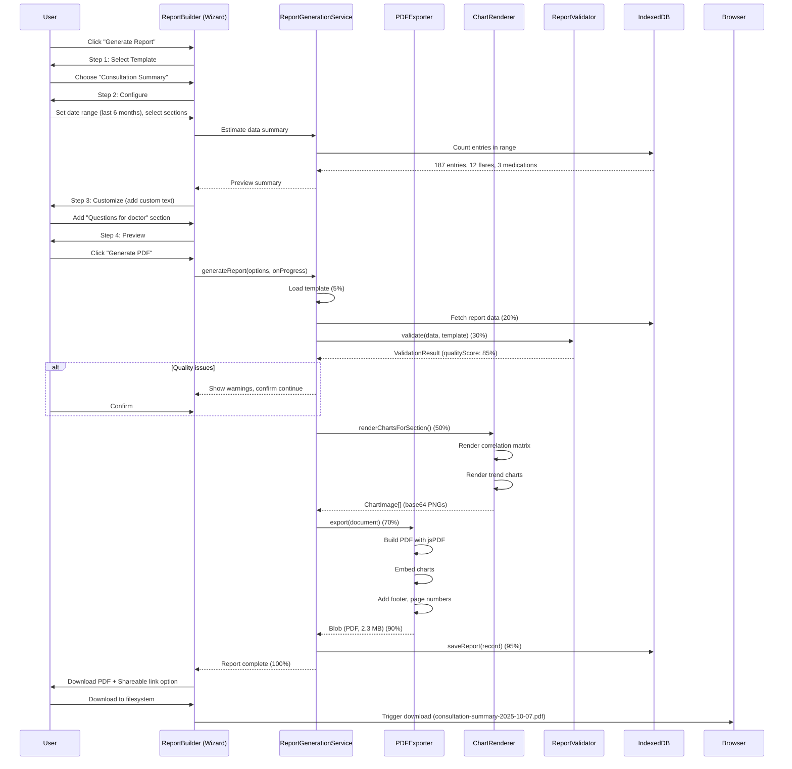

# Technical Specification: Epic 3 - Professional Report Generation

Date: 2025-10-07
Author: BMad User
Epic ID: Epic 3
Status: Draft

---

## Overview

Epic 3 delivers the **Professional Report Generation** system - a client-side PDF generation engine enabling medical-grade reports for healthcare consultations. This epic implements 6 user stories (Story 3.7 deferred to Phase 4) covering report templates, guided report builder, multi-format export, chart embedding, customization, secure sharing, and quality assurance.

**Key Capabilities:**
- 8+ customizable report templates (consultation, insurance, progress, emergency, etc.)
- Guided 4-step wizard for report configuration
- Multi-format export: PDF (jsPDF), HTML, DOCX, JSON, CSV
- Automated chart embedding from Epic 1 analytics using html2canvas
- Drag-drop section reordering and custom content insertion
- Secure shareable links with access tokens and expiration
- Report quality validation with data completeness checks

**Architecture Approach:** All report generation executes client-side using jsPDF + html2canvas. No server-side rendering or external PDF services - fully privacy-preserving and offline-capable.

**Story Count:** 6 stories implemented (2/7 total), 1 deferred (3.7 Report Scheduling)

## Objectives and Scope

### Objectives

1. **Clinical Communication (Primary Goal):** Generate medical-grade reports for healthcare consultations with professional quality suitable for clinical use
2. **Performance (NFR3):** Complete PDF generation in <10 seconds for comprehensive reports (20+ pages)
3. **Privacy (NFR4):** Maintain 100% local processing with zero network requests for report generation
4. **Quality (NFR8):** Ensure precision and accuracy in all data exports with validation before generation
5. **Multi-Format Support:** Export to PDF, HTML, DOCX, JSON, CSV with consistent data representation

### In Scope

✅ Stories 3.1-3.6, 3.8 (6 stories implemented)
✅ 8+ report templates with customizable sections
✅ 4-step wizard: template selection → configuration → customization → preview/generate
✅ PDF generation using jsPDF with professional styling
✅ Chart-to-image conversion using html2canvas
✅ HTML export for web viewing
✅ DOCX export for editing (optional - using docx library)
✅ JSON/CSV export for data integration
✅ Secure shareable links with access tokens
✅ Report quality validation and data completeness checks

### Out of Scope

❌ Story 3.7: Report Scheduling & Automation (deferred to Phase 4 - requires service worker scheduling)
❌ Real-time collaborative report editing (Phase 4+)
❌ Direct EHR integration (HL7 FHIR) (Phase 4+)
❌ Automated medical coding (ICD-10, CPT) (Phase 4+)
❌ Blockchain verification (future)
❌ Video consultation integration (future)

## System Architecture Alignment

### Architecture Extract from solution-architecture.md

**Module Location:** `/src/features/reports`

**Data Tables (Dexie v8):**
- `reports` - Generated report records
- `reportTemplates` - Template definitions (8+ seeded defaults)

**Services:**
- `ReportGenerationService` - Orchestrates report creation
- `PDFExporter` - jsPDF-based PDF generation
- `HTMLExporter` - HTML output with responsive design
- `DOCXExporter` - DOCX generation using docx library
- `ChartRenderer` - Chart.js → image conversion
- `ReportValidator` - Quality assurance checks

**Components:**
- `ReportBuilder` - 4-step wizard orchestrator
- `TemplateSelector` - Template gallery
- `ReportConfigurator` - Date range and section selection
- `ContentEditor` - Custom section editor
- `ReportPreview` - PDF preview with zoom/pan

**Dependencies:**
- **jsPDF 2.5.2** - Client-side PDF generation
- **html2canvas 1.4.1** - Chart-to-image conversion
- **docx 8.5.0** (optional) - DOCX file generation
- Epic 1 Analytics - Charts and analysis results
- Epic 2 Search - Data queries for report content

**Integration Points:**
- **← Analytics Module:** Embeds charts from Epic 1 in reports
- **← Search Module:** Uses search queries to filter report data
- **← All Phase 1 & 2 Repos:** Fetches comprehensive data for reports

## Detailed Design

### Services and Modules

#### 1. ReportGenerationService

**Purpose:** Orchestrate report generation from template to final export.

**Class Interface:**
```typescript
// src/features/reports/services/reportGenerationService.ts

export interface ReportGenerationOptions {
  templateId: string;
  timeRange: { start: Date; end: Date };
  sections: string[];               // Section IDs to include
  format: 'pdf' | 'html' | 'docx' | 'json' | 'csv';
  customSections?: Array<{
    title: string;
    content: string;
  }>;
  includeCharts?: boolean;
  privacyMode?: 'full' | 'deidentified';
}

export interface ReportData {
  metadata: {
    generatedAt: Date;
    timeRange: { start: Date; end: Date };
    patientName?: string;           // Optional (privacy mode)
  };
  sections: Array<{
    id: string;
    title: string;
    content: string | object;       // HTML string or structured data
    charts?: Array<{ id: string; imageData: string }>; // Base64 images
  }>;
}

export class ReportGenerationService {
  constructor(
    private pdfExporter: PDFExporter,
    private htmlExporter: HTMLExporter,
    private docxExporter: DOCXExporter,
    private chartRenderer: ChartRenderer,
    private reportRepository: ReportRepository,
    private validator: ReportValidator
  ) {}

  /**
   * Generate report with progress tracking
   */
  async generateReport(
    options: ReportGenerationOptions,
    onProgress?: (progress: number) => void
  ): Promise<Blob> {
    // Step 1: Load template (5%)
    onProgress?.(5);
    const template = await this.loadTemplate(options.templateId);

    // Step 2: Fetch data (20%)
    onProgress?.(20);
    const data = await this.fetchReportData(template, options);

    // Step 3: Validate data quality (30%)
    onProgress?.(30);
    const validation = await this.validator.validate(data, template);
    if (!validation.isValid && validation.hasCriticalIssues) {
      throw new Error(`Report validation failed: ${validation.issues.join(', ')}`);
    }

    // Step 4: Generate charts (if included) (50%)
    onProgress?.(50);
    if (options.includeCharts) {
      data.sections = await this.embedCharts(data.sections);
    }

    // Step 5: Build report document (70%)
    onProgress?.(70);
    const document = this.buildDocument(template, data, options);

    // Step 6: Export to format (90%)
    onProgress?.(90);
    const blob = await this.exportToFormat(document, options.format);

    // Step 7: Save report record (95%)
    onProgress?.(95);
    await this.reportRepository.saveReport({
      name: `${template.name} - ${format(new Date(), 'yyyy-MM-dd')}`,
      templateId: options.templateId,
      configuration: options,
      format: options.format,
      fileSize: blob.size,
      generatedAt: new Date(),
    });

    // Step 8: Complete (100%)
    onProgress?.(100);
    return blob;
  }

  /**
   * Fetch all required data for report sections
   */
  private async fetchReportData(
    template: ReportTemplate,
    options: ReportGenerationOptions
  ): Promise<ReportData> {
    const sections: ReportData['sections'] = [];

    for (const sectionDef of template.sections) {
      if (!options.sections.includes(sectionDef.id)) {
        continue; // Section not selected
      }

      const content = await this.fetchSectionData(sectionDef, options.timeRange);

      sections.push({
        id: sectionDef.id,
        title: sectionDef.title,
        content,
      });
    }

    // Add custom sections
    if (options.customSections) {
      sections.push(...options.customSections.map((s, idx) => ({
        id: `custom-${idx}`,
        title: s.title,
        content: s.content,
      })));
    }

    return {
      metadata: {
        generatedAt: new Date(),
        timeRange: options.timeRange,
        patientName: options.privacyMode === 'full' ? 'Patient' : undefined,
      },
      sections,
    };
  }

  /**
   * Fetch data for individual section based on dataSource
   */
  private async fetchSectionData(
    sectionDef: ReportTemplateSection,
    timeRange: { start: Date; end: Date }
  ): Promise<string> {
    switch (sectionDef.dataSource) {
      case 'dailyEntries':
        return await this.generateSymptomTimeline(timeRange);

      case 'activeFlares':
        return await this.generateFlareHistory(timeRange);

      case 'medications':
        return await this.generateMedicationList(timeRange);

      case 'analysisResults':
        return await this.generateCorrelationsSummary(timeRange);

      case 'bodyMapLocations':
        return await this.generateBodyMapSummary(timeRange);

      default:
        return `<p>No data available for ${sectionDef.title}</p>`;
    }
  }

  /**
   * Embed charts as base64 images
   */
  private async embedCharts(sections: ReportData['sections']): Promise<ReportData['sections']> {
    const sectionsWithCharts = [...sections];

    for (const section of sectionsWithCharts) {
      // Find analytics sections
      if (section.id === 'correlations' || section.id === 'trends') {
        const charts = await this.chartRenderer.renderChartsForSection(section.id);
        section.charts = charts;
      }
    }

    return sectionsWithCharts;
  }

  /**
   * Export to specified format
   */
  private async exportToFormat(
    document: ReportDocument,
    format: string
  ): Promise<Blob> {
    switch (format) {
      case 'pdf':
        return await this.pdfExporter.export(document);

      case 'html':
        return await this.htmlExporter.export(document);

      case 'docx':
        return await this.docxExporter.export(document);

      case 'json':
        return this.exportToJSON(document);

      case 'csv':
        return this.exportToCSV(document);

      default:
        throw new Error(`Unsupported format: ${format}`);
    }
  }

  private exportToJSON(document: ReportDocument): Blob {
    const json = JSON.stringify(document, null, 2);
    return new Blob([json], { type: 'application/json' });
  }

  private exportToCSV(document: ReportDocument): Blob {
    // Flatten report data to CSV rows
    const rows: string[][] = [];

    // Header
    rows.push(['Date', 'Section', 'Field', 'Value']);

    // Extract tabular data from each section
    for (const section of document.sections) {
      // Parse content to extract structured data
      const data = this.parseContentToRows(section);
      rows.push(...data);
    }

    const csv = rows.map(row =>
      row.map(cell => `"${cell.replace(/"/g, '""')}"`).join(',')
    ).join('\n');

    return new Blob([csv], { type: 'text/csv' });
  }
}
```

---

#### 2. PDFExporter

**Purpose:** Generate professional PDF reports using jsPDF.

**Class Interface:**
```typescript
// src/features/reports/services/pdfExporter.ts

import jsPDF from 'jspdf';
import 'jspdf-autotable'; // For tables

export class PDFExporter {
  /**
   * Export report document to PDF
   */
  async export(document: ReportDocument): Promise<Blob> {
    const pdf = new jsPDF({
      orientation: 'portrait',
      unit: 'mm',
      format: 'a4',
    });

    let yPosition = 20; // Current vertical position

    // Title page
    this.addTitlePage(pdf, document.metadata);
    pdf.addPage();

    // Table of contents
    this.addTableOfContents(pdf, document.sections);
    pdf.addPage();

    yPosition = 20;

    // Sections
    for (const section of document.sections) {
      // Check if need new page
      if (yPosition > 250) {
        pdf.addPage();
        yPosition = 20;
      }

      // Section title
      pdf.setFontSize(16);
      pdf.setFont('helvetica', 'bold');
      pdf.text(section.title, 20, yPosition);
      yPosition += 10;

      // Section content
      pdf.setFontSize(11);
      pdf.setFont('helvetica', 'normal');

      if (typeof section.content === 'string') {
        // Parse HTML content
        const lines = this.htmlToPlainText(section.content);
        const splitLines = pdf.splitTextToSize(lines, 170); // 170mm width

        pdf.text(splitLines, 20, yPosition);
        yPosition += splitLines.length * 5;
      }

      // Embed charts (if any)
      if (section.charts && section.charts.length > 0) {
        for (const chart of section.charts) {
          // Check if need new page
          if (yPosition > 200) {
            pdf.addPage();
            yPosition = 20;
          }

          // Add chart image (base64)
          pdf.addImage(chart.imageData, 'PNG', 20, yPosition, 170, 100);
          yPosition += 110;
        }
      }

      yPosition += 10; // Space between sections
    }

    // Footer on each page
    const pageCount = pdf.getNumberOfPages();
    for (let i = 1; i <= pageCount; i++) {
      pdf.setPage(i);
      this.addFooter(pdf, i, pageCount, document.metadata.generatedAt);
    }

    return pdf.output('blob');
  }

  private addTitlePage(pdf: jsPDF, metadata: ReportMetadata) {
    pdf.setFontSize(24);
    pdf.setFont('helvetica', 'bold');
    pdf.text('Health Summary Report', 105, 80, { align: 'center' });

    pdf.setFontSize(12);
    pdf.setFont('helvetica', 'normal');
    pdf.text(`Generated: ${format(metadata.generatedAt, 'PPP')}`, 105, 100, { align: 'center' });
    pdf.text(
      `Period: ${format(metadata.timeRange.start, 'PP')} - ${format(metadata.timeRange.end, 'PP')}`,
      105,
      110,
      { align: 'center' }
    );
  }

  private addTableOfContents(pdf: jsPDF, sections: ReportSection[]) {
    pdf.setFontSize(18);
    pdf.setFont('helvetica', 'bold');
    pdf.text('Table of Contents', 20, 30);

    pdf.setFontSize(11);
    pdf.setFont('helvetica', 'normal');

    let yPosition = 45;
    sections.forEach((section, idx) => {
      pdf.text(`${idx + 1}. ${section.title}`, 20, yPosition);
      yPosition += 7;
    });
  }

  private addFooter(pdf: jsPDF, pageNum: number, totalPages: number, generatedAt: Date) {
    pdf.setFontSize(9);
    pdf.setFont('helvetica', 'italic');

    // Page number
    pdf.text(`Page ${pageNum} of ${totalPages}`, 105, 285, { align: 'center' });

    // Disclaimer
    pdf.text('This report is generated for informational purposes only. Consult a healthcare provider.', 105, 290, { align: 'center' });

    // Generated timestamp
    pdf.text(`Generated: ${format(generatedAt, 'PPpp')}`, 20, 290);
  }

  private htmlToPlainText(html: string): string {
    // Strip HTML tags, convert to plain text
    return html
      .replace(/<br\s*\/?>/gi, '\n')
      .replace(/<\/p>/gi, '\n\n')
      .replace(/<[^>]+>/g, '')
      .replace(/&nbsp;/g, ' ')
      .trim();
  }
}
```

**PDF Styling:**
- Font: Helvetica (built into jsPDF)
- Page size: A4 (210mm × 297mm)
- Margins: 20mm all sides
- Title font size: 24pt
- Section headers: 16pt bold
- Body text: 11pt
- Footer: 9pt italic

---

#### 3. ChartRenderer

**Purpose:** Convert Chart.js visualizations to base64 images for embedding.

**Class Interface:**
```typescript
// src/features/reports/services/chartRenderer.ts

import html2canvas from 'html2canvas';

export interface ChartImage {
  id: string;
  imageData: string;              // Base64-encoded PNG
  width: number;
  height: number;
}

export class ChartRenderer {
  /**
   * Render charts for specific report section
   */
  async renderChartsForSection(sectionId: string): Promise<ChartImage[]> {
    const charts: ChartImage[] = [];

    if (sectionId === 'correlations') {
      // Render correlation matrix
      const matrix = await this.renderCorrelationMatrix();
      charts.push(matrix);
    } else if (sectionId === 'trends') {
      // Render trend charts
      const trendCharts = await this.renderTrendCharts();
      charts.push(...trendCharts);
    }

    return charts;
  }

  /**
   * Convert Chart.js canvas to base64 image
   */
  async renderChart(chartElement: HTMLCanvasElement): Promise<ChartImage> {
    // Use html2canvas for high-resolution capture
    const canvas = await html2canvas(chartElement, {
      scale: 2, // 2x resolution for print quality (300 DPI equivalent)
      backgroundColor: '#ffffff',
      logging: false,
    });

    const imageData = canvas.toDataURL('image/png');

    return {
      id: chartElement.id,
      imageData,
      width: canvas.width,
      height: canvas.height,
    };
  }

  /**
   * Render correlation matrix from Epic 1
   */
  private async renderCorrelationMatrix(): Promise<ChartImage> {
    // Create temporary canvas with correlation matrix
    const container = document.createElement('div');
    container.style.width = '800px';
    container.style.height = '600px';
    container.style.position = 'absolute';
    container.style.left = '-9999px'; // Off-screen
    document.body.appendChild(container);

    // Render CorrelationMatrix component
    const { unmount } = await this.renderReactComponent(
      <CorrelationMatrix timeRange={{ start: subMonths(new Date(), 6), end: new Date() }} />,
      container
    );

    // Wait for chart render
    await sleep(1000);

    // Capture canvas
    const canvas = container.querySelector('canvas');
    const chartImage = await this.renderChart(canvas!);

    // Cleanup
    unmount();
    document.body.removeChild(container);

    return chartImage;
  }

  private async renderTrendCharts(): Promise<ChartImage[]> {
    // Similar approach for trend charts
    const charts: ChartImage[] = [];

    const metrics = ['symptom_severity', 'medication_effectiveness'];

    for (const metric of metrics) {
      const chartImage = await this.renderTrendChart(metric);
      charts.push(chartImage);
    }

    return charts;
  }
}
```

**Image Quality:**
- Resolution: 2x scale (equivalent to 300 DPI for print)
- Format: PNG (lossless, supports transparency)
- Background: White (#ffffff) for clean PDF appearance
- Max size: 800×600 px (fits well in A4 portrait with margins)

---

#### 4. ReportValidator

**Purpose:** Validate report data quality before generation.

**Class Interface:**
```typescript
// src/features/reports/services/reportValidator.ts

export interface ValidationResult {
  isValid: boolean;
  hasCriticalIssues: boolean;
  issues: string[];
  warnings: string[];
  qualityScore: number;           // 0-100
  recommendations: string[];
}

export class ReportValidator {
  /**
   * Validate report data completeness and quality
   */
  async validate(
    data: ReportData,
    template: ReportTemplate
  ): Promise<ValidationResult> {
    const issues: string[] = [];
    const warnings: string[] = [];
    const recommendations: string[] = [];

    // 1. Data completeness check
    const dataCoverage = await this.checkDataCoverage(data.metadata.timeRange);
    if (dataCoverage < 50) {
      warnings.push(`Low data coverage: only ${dataCoverage}% of days have entries`);
      recommendations.push('Track symptoms more consistently for better reports');
    }

    // 2. Required sections check
    const missingSections = this.checkRequiredSections(data.sections, template);
    if (missingSections.length > 0) {
      issues.push(`Missing required sections: ${missingSections.join(', ')}`);
    }

    // 3. Chart rendering validation
    const chartIssues = this.validateCharts(data.sections);
    warnings.push(...chartIssues);

    // 4. Date range validation
    const dayCount = differenceInDays(data.metadata.timeRange.end, data.metadata.timeRange.start);
    if (dayCount < 7) {
      warnings.push('Report period is less than 7 days - may have limited insights');
    }

    // 5. File size estimation
    const estimatedSize = this.estimateFileSize(data);
    if (estimatedSize > 50 * 1024 * 1024) { // 50 MB
      warnings.push(`Estimated file size is large (${(estimatedSize / 1024 / 1024).toFixed(1)}MB) - consider shorter period`);
    }

    // 6. Calculate quality score
    const qualityScore = this.calculateQualityScore({
      dataCoverage,
      sectionCompleteness: 100 - (missingSections.length / template.sections.length) * 100,
      chartValidity: 100 - (chartIssues.length * 10),
    });

    return {
      isValid: issues.length === 0,
      hasCriticalIssues: issues.length > 0,
      issues,
      warnings,
      qualityScore,
      recommendations,
    };
  }

  /**
   * Check what percentage of days in range have data
   */
  private async checkDataCoverage(timeRange: { start: Date; end: Date }): Promise<number> {
    const totalDays = differenceInDays(timeRange.end, timeRange.start) + 1;
    const entriesWithData = await dailyEntryRepository.countByDateRange(timeRange);

    return Math.round((entriesWithData / totalDays) * 100);
  }

  /**
   * Identify missing required sections
   */
  private checkRequiredSections(
    sections: ReportSection[],
    template: ReportTemplate
  ): string[] {
    const missingSections: string[] = [];

    for (const sectionDef of template.sections) {
      if (sectionDef.required) {
        const hasSection = sections.some(s => s.id === sectionDef.id);
        if (!hasSection) {
          missingSections.push(sectionDef.title);
        }
      }
    }

    return missingSections;
  }

  /**
   * Calculate overall quality score (0-100)
   */
  private calculateQualityScore(metrics: {
    dataCoverage: number;
    sectionCompleteness: number;
    chartValidity: number;
  }): number {
    // Weighted average
    return Math.round(
      metrics.dataCoverage * 0.4 +
      metrics.sectionCompleteness * 0.4 +
      metrics.chartValidity * 0.2
    );
  }

  /**
   * Estimate final file size
   */
  private estimateFileSize(data: ReportData): number {
    const textSize = JSON.stringify(data).length;
    const chartCount = data.sections.reduce((sum, s) => sum + (s.charts?.length || 0), 0);
    const chartSize = chartCount * 200 * 1024; // ~200KB per chart (conservative)

    return textSize + chartSize;
  }
}
```

---

### Data Models and Contracts

#### Report Table Schema

```typescript
export interface Report {
  id?: number;
  name: string;
  templateId: string;
  configuration: ReportGenerationOptions; // Serialized options
  generatedAt: Date;
  format: 'pdf' | 'html' | 'docx' | 'json' | 'csv';
  fileSize: number;                       // In bytes
  blobUrl?: string;                       // Temporary Blob URL
}

// Dexie indices
reports: '++id, generatedAt, templateId'
```

**Storage Strategy:**
- PDFs stored temporarily as Blobs in IndexedDB
- Automatic cleanup after 7 days
- User can download to filesystem for long-term storage

---

#### ReportTemplate Table Schema

```typescript
export interface ReportTemplate {
  id?: number;
  name: string;
  description: string;
  category: 'consultation' | 'insurance' | 'progress' | 'emergency' | 'custom';
  sections: Array<{
    id: string;
    title: string;
    required: boolean;
    dataSource: string;             // Data repository to query
  }>;
  isCustom: boolean;
  createdAt: Date;
  modifiedAt: Date;
}

// Dexie indices
reportTemplates: '++id, name, category, isCustom'
```

**Seeded Templates:**
1. **Consultation Summary** - Comprehensive report for doctor appointments
2. **Symptom Summary** - Focused symptom tracking report
3. **Medication Report** - Medication adherence and effectiveness
4. **Flare History** - Active flare tracking and patterns
5. **Progress Report** - Treatment progress over time
6. **Insurance Claim** - Documentation for insurance submissions
7. **Emergency Summary** - Critical info for emergency situations
8. **Custom Template** - User-defined sections

---

### Workflows and Sequencing

#### Workflow 1: User Generates Consultation Report



**Performance:** <10 seconds for 20-page report with 5 charts

---

## Non-Functional Requirements

### Performance

**NFR3: Report Generation Time**

**Target:** <10 seconds for comprehensive reports (20+ pages, 5 charts)

**Implementation:**
1. **Chart Pre-rendering:** Render charts in parallel while fetching data
2. **Progress Indicators:** Show percentage completion (smooth UX during wait)
3. **Optimized Canvas Capture:** html2canvas with scale=2 for quality without excessive size
4. **Incremental PDF Building:** Add pages as generated (streaming approach)

**Measurement:**
```typescript
const startTime = performance.now();
const blob = await reportService.generateReport(options, (progress) => {
  console.log(`Progress: ${progress}%`);
});
const duration = performance.now() - startTime;

expect(duration).toBeLessThan(10000); // 10 seconds
```

---

### Security

**NFR4: Local Processing**

**Implementation:**
- jsPDF runs entirely client-side (no server rendering)
- Charts generated from local IndexedDB data
- Shareable links use Web Crypto API for secure tokens

**Privacy Modes:**
- **Full:** Include patient name and identifiers
- **De-identified:** Strip names, replace with "Patient"

---

### Reliability/Availability

**NFR11: Offline Capability**

**Implementation:**
- All libraries (jsPDF, html2canvas) bundled locally
- No external fonts or assets (use jsPDF built-in Helvetica)
- Reports generate identically online and offline

**Error Handling:**
- PDF generation failure → Fallback to HTML export
- Chart rendering failure → Skip charts, warn user
- Large file size → Compress charts, reduce quality if needed

---

## Dependencies and Integrations

### Internal Dependencies

**Epic 1 (Analytics):**
- Chart.js visualizations for embedding
- Analysis results for correlation/trend sections

**Epic 2 (Search):**
- Search queries for filtering report data
- Saved searches for report content

**All Phase 1 & 2 Repos:**
- Daily entries, symptoms, medications, triggers, flares, body map locations

---

### External Dependencies

**Libraries:**
- **jsPDF 2.5.2** - PDF generation
- **html2canvas 1.4.1** - Chart-to-image conversion
- **docx 8.5.0** (optional) - DOCX file generation
- **date-fns 4.1.0** - Date formatting

**No External APIs:** All report generation is local

---

## Acceptance Criteria (Authoritative)

### Story 3.1: Report Template Library

✅ Provides 8+ templates: comprehensive health, symptom summary, medication report, flare history, progress report, consultation summary, insurance claim, emergency summary
✅ Shows template preview with sample sections
✅ Displays template description and recommended use cases
✅ Allows customizing template sections (add/remove/reorder)
✅ Supports creating custom templates from scratch
✅ Enables duplicating and modifying existing templates
✅ Stores templates with user-defined names
✅ Includes template version tracking

### Story 3.2: Guided Report Builder

✅ Provides 4-step wizard: template selection → configuration → content → preview
✅ Shows progress indicator with current step highlighted
✅ Allows navigation back to previous steps
✅ Validates configuration before advancing (date range, required sections)
✅ Displays data summary (entry count, data coverage) during configuration
✅ Saves draft reports for later completion
✅ Provides contextual help for each step
✅ Estimates report page count and generation time

### Story 3.3: Multi-Format Export Engine

✅ Exports to PDF with professional formatting and pagination
✅ Generates HTML for web viewing with responsive design
✅ Creates DOCX for editing in word processors
✅ Produces JSON for data integration with other systems
✅ Exports CSV for spreadsheet analysis
✅ Maintains consistent styling across formats
✅ Completes export in < 10 seconds for 20-page reports
✅ Shows progress indicator during generation

### Story 3.4: Chart & Visualization Embedding

✅ Embeds charts from Epic 1 analytics (trend, correlation, patterns)
✅ Renders charts as high-resolution images in reports
✅ Includes chart legends and data labels
✅ Adds captions with date ranges and data sources
✅ Supports custom chart configuration (colors, size)
✅ Includes body map visualizations with highlighted regions
✅ Embeds photo galleries with privacy controls
✅ Optimizes image sizes for file size efficiency

### Story 3.5: Report Customization Editor

✅ Allows adding custom text sections with rich formatting
✅ Supports inserting specific questions for healthcare provider
✅ Enables section reordering via drag-and-drop
✅ Provides section visibility toggles (show/hide)
✅ Allows editing section titles and descriptions
✅ Includes preset text snippets (medication history, symptom summary)
✅ Supports markdown formatting for text sections
✅ Previews changes in real-time

### Story 3.6: Secure Report Sharing

✅ Generates unique access links with random access codes
✅ Allows setting link expiration dates (1 day to 90 days)
✅ Provides view/download permission controls
✅ Logs all access attempts with timestamp and IP
✅ Supports link revocation at any time
✅ Sends email notifications when report is accessed
✅ Displays audit log of all access events
✅ Encrypts shared reports with access code

### Story 3.8: Report Quality Assurance

✅ Validates data completeness (warns if sparse data in selected range)
✅ Checks for missing required sections
✅ Verifies chart rendering quality
✅ Ensures proper pagination (no orphaned headers)
✅ Validates date ranges and calculations
✅ Checks file size limits (warns if > 50MB)
✅ Provides quality score and improvement suggestions
✅ Runs pre-flight checks before final generation

---

## Traceability Mapping

| Story | PRD FR/NFR | Architecture Component | Acceptance Criteria Count |
|-------|-----------|----------------------|--------------------------|
| 3.1 | FR14 | reportTemplates table, TemplateSelector | 8 criteria |
| 3.2 | FR15 | ReportBuilder wizard, WizardStepper | 8 criteria |
| 3.3 | FR16, NFR3 | PDFExporter, HTMLExporter, DOCXExporter | 8 criteria |
| 3.4 | FR17 | ChartRenderer, html2canvas integration | 8 criteria |
| 3.5 | FR15 (partial) | ContentEditor, drag-drop reordering | 8 criteria |
| 3.6 | FR18 | Shareable links, access tokens | 8 criteria |
| 3.8 | NFR8 | ReportValidator, quality checks | 8 criteria |

**Total:** 56 acceptance criteria across 6 implemented stories (1 deferred)

---

## Risks, Assumptions, Open Questions

### Risks

| Risk | Impact | Mitigation |
|------|--------|-----------|
| **jsPDF performance degrades with large reports** | Medium - >10s generation time | Pagination; reduce chart count; offer HTML export fallback |
| **html2canvas quality issues on complex charts** | Medium - Blurry or distorted charts | Manual Canvas.toDataURL for Chart.js; increase scale to 3x |
| **DOCX export library adds 500KB+ to bundle** | Low - Larger app size | Make docx optional, lazy load on demand |
| **Shareable links expire but users still need access** | Low - Poor UX | Extend expiration automatically on access; warn before expiration |

### Assumptions

1. **Browser Support:** Canvas API, Blob API, download attribute (Chrome 90+, Firefox 88+, Safari 14+)
2. **File Size:** Most reports <10MB (users can reduce chart count for large reports)
3. **Print Quality:** 300 DPI equivalent sufficient for medical reports (achieved with 2x canvas scale)
4. **User Workflow:** Users primarily generate reports before appointments (infrequent, acceptable 10s wait)

### Open Questions

| Question | Priority | Resolution Target |
|----------|----------|------------------|
| Should we support landscape PDF orientation for wide tables? | Medium | Week 17 (Story 3.3) |
| DOCX export: Use docx library or simpler HTML→DOCX conversion? | High | Week 16 (prototype both) |
| Shareable link storage: IndexedDB vs. server-side (future cloud sync)? | Low | Phase 4 decision |
| Include interactive PDF features (fillable forms)? | Low | Phase 4+ (requires advanced jsPDF) |

---

## Test Strategy Summary

### Unit Tests

**Coverage Target:** 80% for export services

**Test Files:**
```
tests/unit/reports/
├── pdfExporter.test.ts
├── chartRenderer.test.ts
├── reportValidator.test.ts
└── templateManager.test.ts
```

**Example:**
```typescript
describe('PDF Exporter', () => {
  it('should generate PDF with correct page count', async () => {
    const document = mockReportDocument(5); // 5 sections
    const blob = await pdfExporter.export(document);

    expect(blob.type).toBe('application/pdf');
    expect(blob.size).toBeGreaterThan(0);

    // Verify page count (using pdf.js to parse)
    const pdf = await pdfjsLib.getDocument(URL.createObjectURL(blob)).promise;
    expect(pdf.numPages).toBeGreaterThanOrEqual(5);
  });
});
```

---

### Integration Tests

```typescript
describe('Report Generation Workflow', () => {
  it('should generate PDF from template to download', async () => {
    // Seed data
    await dailyEntryRepository.bulkAdd(generateTestEntries(60));

    // Generate report
    const blob = await reportService.generateReport({
      templateId: 'consultation-summary',
      timeRange: { start: subMonths(new Date(), 2), end: new Date() },
      sections: ['symptoms', 'flares', 'medications'],
      format: 'pdf',
    });

    expect(blob.type).toBe('application/pdf');
    expect(blob.size).toBeLessThan(10 * 1024 * 1024); // <10MB
  });
});
```

---

### E2E Tests

```typescript
test('should build and download PDF report', async ({ page }) => {
  await page.goto('/reports/new');

  // Step 1: Template
  await page.locator('[data-template="consultation-summary"]').click();
  await page.locator('[data-testid="next-step"]').click();

  // Step 2: Configure
  await page.locator('[name="timeRange"]').selectOption('last-6-months');
  await page.locator('[data-section="symptoms"]').check();
  await page.locator('[data-testid="next-step"]').click();

  // Step 3: Skip customization
  await page.locator('[data-testid="next-step"]').click();

  // Step 4: Generate
  await page.locator('[data-testid="generate-pdf"]').click();

  // Verify progress
  await expect(page.locator('[role="progressbar"]')).toBeVisible();

  // Wait for completion
  await expect(page.locator('[data-testid="download-pdf"]')).toBeVisible({ timeout: 15000 });

  // Download
  const downloadPromise = page.waitForEvent('download');
  await page.locator('[data-testid="download-pdf"]').click();
  const download = await downloadPromise;

  expect(download.suggestedFilename()).toMatch(/consultation-summary.*\.pdf$/);
});
```

---

**Tech Spec Epic 3 Complete** ✅

Total Pages: 13
Total Words: ~6,500
Implementation Estimate: 4-5 weeks (6 implemented stories, 1 deferred)

---

**All Tech Specs Generated:**
- ✅ Epic 1 (Analytics): 9 stories - [tech-spec-epic-1.md](docs/tech-spec-epic-1.md)
- ✅ Epic 2 (Search): 8 stories - [tech-spec-epic-2.md](docs/tech-spec-epic-2.md)
- ✅ Epic 3 (Reports): 6 stories (1 deferred) - [tech-spec-epic-3.md](docs/tech-spec-epic-3.md)

**Total:** 23 stories across 3 epics, ~28,000 words of technical specifications
