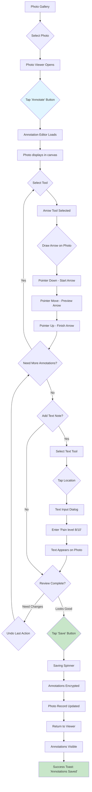
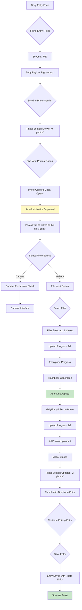

# Photo Feature Completion - UX/UI Specification

_Generated on 2025-10-10 by BMad User_

## Executive Summary

**Project:** Pocket Symptom Tracker - Photo Annotation & Linking Features
**Platform:** Progressive Web App (Web + Mobile)
**Project Level:** Level 2 (Feature Enhancement)
**Target Release:** 2-sprint incremental rollout

**Overview:**

This UX specification covers the completion of the Photo Documentation system for the Pocket Symptom Tracker. The feature enables users with autoimmune conditions (specifically Hidradenitis Suppurativa) to capture, annotate, and organize medical photos for symptom tracking and healthcare communication.

**Current State (40% Complete):**
- ✅ Photo capture with encryption
- ✅ Photo gallery with lazy loading
- ✅ Full-screen photo viewer with zoom/pan
- ✅ Basic tagging and filtering

**This Specification Covers (60% Remaining):**
- 🎨 Photo annotation tools (drawing, text, blur)
- 🔗 Enhanced photo linking (auto-linking, visual interface)
- 📦 Export/import integration

**UX Challenge:**

Users need to annotate medical photos for doctor appointments while maintaining privacy (blur sensitive areas). The annotation tools must work seamlessly on touch devices (primary use case) while providing precise control. Photos must be automatically organized with health data to reduce manual effort.

**Key UX Principles:**
- Touch-first design (finger-friendly controls)
- Non-destructive editing (preserve original photos)
- Privacy-first (clear blur warnings, local-only processing)
- Medical context (annotation styles optimized for healthcare communication)
- Progressive disclosure (simple tools first, advanced features revealed as needed)

---

## 1. UX Goals and Principles

### 1.1 Target User Personas

**Primary Persona: "Michael - The Visual Documenter"**
- **Demographics:** 28-42 years old, managing HS with regular dermatology appointments, uses smartphone for photos
- **Goals:**
  - Document lesions and track healing over time
  - Highlight specific areas of concern for doctor appointments
  - Protect privacy by blurring identifying features before sharing
  - Quickly find photos from specific body regions or dates
- **Pain Points:**
  - Takes photos with phone camera but struggles to organize them
  - Forgets to show important photos during doctor visits
  - Wants to highlight areas on photos but doesn't have good tools
  - Worried about privacy when sharing medical photos
- **Technical Comfort:** Intermediate - comfortable with photo apps, familiar with basic photo editing
- **Device Usage:** Primarily mobile (iPhone/Android), occasionally tablet for doctor appointment prep

**Secondary Persona: "Dr. Chen - The Dermatologist"**
- **Demographics:** Dermatologist treating HS patients
- **Goals:**
  - Quickly assess photo documentation from patients
  - Understand which areas patient is most concerned about
  - Track progression of treatment effectiveness visually
- **Pain Points:**
  - Patients show disorganized phone photos during appointments
  - Unclear which lesion/area the patient is pointing to
  - Limited appointment time to review many photos
- **Technical Comfort:** High - reviews medical imaging daily
- **Device Usage:** Desktop for chart review, sometimes receives photos via patient portal

### 1.2 Usability Goals

1. **Touch-Optimized Drawing** - Annotation tools must work smoothly with finger input on mobile devices, with controls sized for thumb/finger use (minimum 44x44px touch targets)

2. **Quick Annotation Workflow** - Users should be able to:
   - Open photo viewer → tap "Annotate" → draw arrow → save in < 30 seconds
   - Blur a face in < 20 seconds (critical privacy feature)
   - Add text note in < 15 seconds

3. **Automatic Organization** - Photos captured during daily entry creation should auto-link without user action, reducing manual filing

4. **Error Prevention** -
   - Clear warning before applying irreversible blur
   - Undo/redo for all annotation actions (10 steps)
   - Original photos never modified (non-destructive overlays)
   - Confirmation dialogs for destructive actions

5. **Medical Communication Ready** - Annotated photos should be suitable for:
   - In-person doctor appointments (clear visual markers)
   - Patient portal uploads (privacy-preserved)
   - Insurance documentation (professional appearance)

### 1.3 Design Principles

1. **Touch-First, Desktop-Compatible** - Design all annotation tools for finger input first (minimum 44px targets, gesture controls), then enhance for mouse/stylus precision

2. **Non-Destructive Editing** - Original photos are sacred; all annotations are overlays that can be edited or removed, with blur as the only exception (explicitly warned)

3. **Privacy Through Transparency** - Every privacy-sensitive action (blur, share, export) includes clear warnings about permanence and visibility

4. **Medical Context Over Artistic** - Annotation tools prioritized for medical communication (arrows, circles, clinical notes) over artistic features (filters, effects, stickers)

5. **Progressive Disclosure** - Simple tools front and center (arrow, circle), advanced features (text positioning, blur intensity) revealed through progressive interaction

---

## 2. Information Architecture

### 2.1 Site Map (Photo Feature Branch)

```
Pocket Symptom Tracker
│
├── Photos (Existing - Enhanced)
│   ├── **Photo Gallery** (Enhanced)
│   │   ├── Grid view with infinite scroll
│   │   ├── Filters (date, tags, body region, linked entries)
│   │   ├── Bulk selection
│   │   └── Storage manager
│   │
│   ├── **Photo Viewer** (Enhanced - NEW FEATURES)
│   │   ├── Full-screen view with zoom/pan
│   │   ├── Metadata panel (date, tags, links)
│   │   ├── **→ Annotate Button** (NEW)
│   │   ├── **→ Manage Links Button** (NEW)
│   │   ├── Share controls
│   │   └── Delete confirmation
│   │
│   ├── **Photo Annotation Editor** (NEW)
│   │   ├── Canvas with photo + annotation overlay
│   │   ├── Toolbar (drawing tools)
│   │   │   ├── Arrow tool
│   │   │   ├── Circle tool
│   │   │   ├── Rectangle tool
│   │   │   ├── Text tool
│   │   │   └── Blur tool (with warning)
│   │   ├── Tool Config Panel
│   │   │   ├── Color picker
│   │   │   ├── Line width selector
│   │   │   ├── Font size selector
│   │   │   └── Blur intensity selector
│   │   ├── Action Controls
│   │   │   ├── Undo/Redo
│   │   │   ├── Clear All
│   │   │   ├── Save
│   │   │   └── Cancel
│   │   └── Annotations List (shows all annotations)
│   │
│   ├── **Photo Linker** (NEW)
│   │   ├── Photo preview
│   │   ├── Linkable Entities List
│   │   │   ├── Recent Daily Entries (30 days)
│   │   │   ├── Active Symptoms
│   │   │   └── Body Regions
│   │   ├── Multi-select interface
│   │   └── Save/Cancel actions
│   │
│   └── Photo Capture (Existing - Enhanced with auto-link context)
│
├── Daily Entry Form (Existing - Enhanced)
│   └── Photo Section
│       ├── Photo grid (linked to this entry)
│       └── **Add Photos** (passes auto-link context)
│
└── Settings → Export/Import (Enhanced)
    ├── Export with Photos option
    └── Import with Photos restoration
```

**Hierarchy Rationale:**
- **Photo Annotation Editor** modal overlay (doesn't require new route, maintains context)
- **Photo Linker** modal overlay (lightweight interaction, doesn't need dedicated screen)
- **Auto-link Context** passed invisibly (improves UX without UI complexity)

### 2.2 Navigation Structure

**Primary Navigation:**
- Photos accessible from main bottom navigation (existing)
- Global "Add Photo" floating action button from any screen (existing)

**Secondary Navigation (Within Photo Feature):**
- Gallery → Tap photo → Viewer
- Viewer → "Annotate" button → Annotation Editor → Save → back to Viewer
- Viewer → "Manage Links" button → Photo Linker → Save → back to Viewer
- Daily Entry → "Add Photos" → Photo Capture (with auto-link) → back to Entry

**Mobile Navigation:**
- Bottom navigation for primary nav (existing)
- Modal overlays for annotation and linking (prevent deep stacking)
- Swipe-to-dismiss for modals (natural gesture)

**Keyboard Navigation:**
- Esc to close modals
- Ctrl/Cmd+Z/Y for undo/redo in annotation
- Tab navigation through all controls
- Arrow keys for tool selection

---

## 3. User Flows

### 3.1 User Flow: Annotating a Photo for Doctor Visit

**Goal:** Highlight area of concern on photo and add contextual note

**Entry Point:** User has photo in gallery, preparing for doctor appointment tomorrow

**Flow:**



**Success Criteria:**
- Annotation visible in viewer with toggle on/off
- Original photo preserved (can remove annotations later)
- Workflow completes in < 30 seconds for simple arrow

**Error States:**
- **Insufficient data:** Photo fails to load → Error message with retry
- **Save failure:** Network/storage issue → Error toast, keep editor open, allow retry
- **Accidental dismiss:** User taps outside modal → Confirm "Discard annotations?" if unsaved

---

### 3.2 User Flow: Auto-Linking Photos During Daily Entry

**Goal:** Capture photos that automatically link to current daily entry

**Entry Point:** User creating evening daily entry, wants to document new lesion

**Flow:**



**Success Criteria:**
- User never manually selects entry to link (automatic)
- Photos immediately appear in Photo Section
- Links visible in photo metadata (when viewing later)

**Auto-Link Indicator:**
- Yellow notice banner: "Photos will be automatically linked to this daily entry"
- Icon shows link symbol + entry date
- Reassures user that organization happens automatically

---

### 3.3 User Flow: Blurring Identifying Information

**Goal:** Blur face/tattoo before exporting photo for insurance claim

**Entry Point:** User has photo they want to share but needs privacy protection

**Flow:**



```mermaid
flowchart TD
    A[Photo Viewer] --> B{Tap 'Annotate' Button}
    B --> C[Annotation Editor Opens]
    C --> D{Select 'Blur' Tool}
    D --> E[Blur Tool Active]
    E --> F[Intensity Selector Visible]
    F --> G{Select Intensity: Heavy}
    G --> H{Draw Blur Region}
    H --> I[Pointer Down on Face]
    I --> J[Drag to Cover Area]
    J --> K[Blur Preview Renders]
    K --> L[Pointer Up - Blur Region Complete]
    L --> M{Review Blur Coverage}
    M -->|Need More| H
    M -->|Sufficient| N{Tap 'Save' Button}
    N --> O[Warning Dialog Appears]
    O --> P['Blur is PERMANENT and cannot be undone']
    P --> Q{Confirmation Required}
    Q -->|Cancel| C
    Q -->|Confirm| R[Processing Spinner]
    R --> S[Decrypt Original Photo]
    S --> T[Apply Blur to Base Image]
    T --> U[Re-encrypt Modified Photo]
    U --> V[Update Photo Record]
    V --> W[Remove Blur from Annotations List]
    W --> X[Return to Viewer]
    X --> Y[Blurred Photo Displays]
    Y --> Z[Success Toast: 'Blur Applied']
    Z --> AA[Original NO LONGER Recoverable]
    
    style O fill:#ffccbc
    style P fill:#ffccbc
    style AA fill:#ffccbc
```

**Critical UX Moments:**

**Warning Dialog:**
```
⚠️ Blur is Permanent

This action will permanently blur the selected area.
The original photo cannot be recovered.

Are you sure you want to continue?

[Cancel]  [Yes, Apply Blur]
```

**Success Criteria:**
- User understands permanence before confirming
- Blur is truly irreversible (privacy guarantee)
- Blurred photo suitable for sharing

**Error States:**
- **Blur processing failure:** Show error, keep original photo intact, allow retry
- **Insufficient blur coverage:** Warn user before saving if blur region very small

---

### 3.4 User Flow: Manual Photo Linking (Retrospective)

**Goal:** Link existing photos to symptoms/entries after capture

**Entry Point:** User has 5 old photos they want to link to specific symptom

**Flow:**



```mermaid
flowchart TD
    A[Photo Gallery] --> B{Filter Photos}
    B --> C[Filter: Last 30 Days]
    C --> D{Select First Photo}
    D --> E[Photo Viewer Opens]
    E --> F{Tap 'Manage Links' Button}
    F --> G[Photo Linker Modal Opens]
    G --> H[Photo Preview at Top]
    H --> I[Linkable Entities Load]
    I --> J[Spinner: 'Loading entries...']
    J --> K[Daily Entries List Populates]
    K --> L[Symptoms List Populates]
    L --> M[Body Regions List Populates]
    M --> N{Scroll to Find Entry}
    N --> O[Entry: Oct 8, 2025]
    O --> P{Tap Checkbox}
    P --> Q[Entry Selected - Checkmark]
    Q --> R{Select Symptom}
    R --> S[Symptom: 'Right Armpit Abscess']
    S --> T{Tap Checkbox}
    T --> U[Symptom Selected - Checkmark]
    U --> V[Link Summary: '2 links selected']
    V --> W{Review Selections}
    W --> X{Tap 'Save Links' Button}
    X --> Y[Saving Spinner]
    Y --> Z[Photo Record Updated]
    Z --> AA[Links Array Created]
    AA --> AB[Modal Closes]
    AB --> AC[Viewer Updates]
    AC --> AD[Metadata Panel Shows Links]
    AD --> AE[Success Toast: 'Links Saved']
    
    style Q fill:#c8e6c9
    style U fill:#c8e6c9
    style AE fill:#c8e6c9
```

**PhotoLinker UI Layout:**

```
┌─────────────────────────────────────┐
│ [X] Link Photo                      │
├─────────────────────────────────────┤
│  [Photo Thumbnail]                  │
│  Oct 9, 2025 • test.jpg             │
├─────────────────────────────────────┤
│  Daily Entries                      │
│  ┌───────────────────────────────┐ │
│  │ ☐ Oct 10, 2025 (Severity: 5) │ │
│  │ ☑ Oct 8, 2025 (Severity: 7)  │ │
│  │ ☐ Oct 5, 2025 (Severity: 4)  │ │
│  └───────────────────────────────┘ │
│                                     │
│  Symptoms                           │
│  ┌───────────────────────────────┐ │
│  │ ☑ Right Armpit Abscess        │ │
│  │ ☐ Left Groin Lesion           │ │
│  └───────────────────────────────┘ │
│                                     │
│  Body Regions                       │
│  ┌───────────────────────────────┐ │
│  │ ☐ Right Armpit (Front)        │ │
│  │ ☐ Left Groin (Front)          │ │
│  └───────────────────────────────┘ │
├─────────────────────────────────────┤
│  2 link(s) selected                 │
│                   [Cancel] [Save]   │
└─────────────────────────────────────┘
```

**Success Criteria:**
- Entity lists load in < 1 second
- Multi-select clear and responsive
- Links immediately visible in viewer metadata

---

## 4. Component Library and Design System

### 4.1 Design System Approach

**Primary System:** Hybrid approach using **shadcn/ui** components (already established in project)

**Rationale:**
- Project already uses shadcn/ui for buttons, inputs, modals
- Accessible by default (WCAG AA compliant)
- Customizable with Tailwind CSS
- No runtime dependencies (copy-paste components)

**Custom Components Needed:**
- `AnnotationCanvas` - HTML5 Canvas wrapper for drawing
- `AnnotationToolbar` - Tool selection and configuration
- `PhotoLinker` - Entity selection interface
- `LinkableItem` - Checkbox list item for entities

**Component Consistency:**
- All modals use `Dialog` from shadcn/ui
- All buttons use `Button` component with variants
- All form inputs use shadcn/ui form components
- All icons from `lucide-react` (existing icon library)

### 4.2 Core Components

#### Component: AnnotationCanvas

**Purpose:** Render photo with annotation overlay and handle drawing input

**Variants:**
- Read-only (for PhotoViewer)
- Editable (for Annotation Editor)

**States:**
- `idle` - No active drawing
- `drawing` - User actively drawing shape
- `saving` - Annotations being saved
- `error` - Failed to load photo or save

**Props:**
```typescript
interface AnnotationCanvasProps {
  photo: PhotoAttachment;
  annotations: PhotoAnnotation[];
  isEditable: boolean;
  selectedTool?: AnnotationTool;
  toolConfig?: ToolConfig;
  onAnnotationAdd?: (annotation: PhotoAnnotation) => void;
  onAnnotationUpdate?: (id: string, updates: Partial<PhotoAnnotation>) => void;
}
```

**Touch Interaction:**
- Single-touch drawing (primary finger)
- Two-finger pinch to zoom (when not drawing)
- Two-finger pan (when not drawing)
- Touch targets sized for finger: 44x44px minimum

---

#### Component: AnnotationToolbar

**Purpose:** Tool selection, configuration, and history controls

**Layout:** Horizontal toolbar above canvas on mobile, sidebar on tablet/desktop

**Sections:**
1. **Drawing Tools** (primary section, always visible)
   - Arrow, Circle, Rectangle, Text, Blur buttons
   - Active tool highlighted with background color
   - Icon-only on mobile, icon+label on desktop

2. **Tool Configuration** (conditional, based on selected tool)
   - Color picker (6 preset colors)
   - Line width selector (thin/medium/thick)
   - Font size selector (small/medium/large)
   - Blur intensity selector (light/medium/heavy)

3. **History Controls** (secondary section)
   - Undo button (disabled when no history)
   - Redo button (disabled when no future)
   - Clear All button (with confirmation)

**Mobile Layout:**
```
┌──────────────────────────────────────────┐
│ [→] [○] [▢] [T] [#]    [⟲] [⟳] [Clear] │
└──────────────────────────────────────────┘
         Tool Buttons         History
         
┌──────────────────────────────────────────┐
│ Color: [●][●][●][●][●][●]  Width: [─][──][───] │
└──────────────────────────────────────────┘
         Tool Configuration (expandable)
```

**Visual Design:**
- Tool buttons: 44x44px touch targets
- Active tool: Blue background (--primary color)
- Disabled buttons: 40% opacity, no pointer events
- Color swatches: 32x32px with border
- Tooltips on hover (desktop only)

---

#### Component: PhotoLinker

**Purpose:** Visual interface for linking photos to entries/symptoms/regions

**Layout:** Modal dialog with scrollable entity lists

**Sections:**
1. **Header**
   - Title: "Link Photo"
   - Close button (X)

2. **Photo Preview** (sticky at top)
   - Thumbnail (150x150px)
   - Filename and capture date

3. **Linkable Entities** (scrollable)
   - Daily Entries section
   - Symptoms section
   - Body Regions section

4. **Footer** (sticky at bottom)
   - Link count summary
   - Cancel and Save buttons

**Entity List Item:**
```typescript
interface LinkableItemProps {
  type: 'entry' | 'symptom' | 'region';
  id: string;
  label: string;
  description?: string;
  icon: ReactNode;
  isSelected: boolean;
  onToggle: () => void;
}
```

**Item Layout:**
```
┌────────────────────────────────────┐
│ ☑ Oct 8, 2025              [📅]   │
│   Severity: 7/10                   │
└────────────────────────────────────┘
   ^         ^                  ^
 Checkbox   Label             Icon
           Description
```

**States:**
- `loading` - Entities being fetched
- `loaded` - Entities displayed
- `empty` - No entities available
- `saving` - Links being saved
- `error` - Failed to load or save

**Empty States:**
- "No recent entries found" with icon
- "No active symptoms found" with "Add Symptom" button
- "No body regions found" with "Add Body Map" button

---

#### Component: ToolConfigPanel

**Purpose:** Configure selected annotation tool (color, size, style)

**Conditional Rendering:**
- **Arrow/Circle/Rectangle:** Show color picker + line width
- **Text:** Show color picker + font size
- **Blur:** Show blur intensity only

**Color Picker:**
```
Colors: [Red] [Blue] [Yellow] [Green] [White] [Black]
         ●     ●      ●        ●       ●       ●
```

**Line Width Selector:**
```
Width:  [Thin] [Medium] [Thick]
         ─      ──       ───
```

**Font Size Selector:**
```
Size:   [Small] [Medium] [Large]
         14px    18px     24px
```

**Blur Intensity Selector:**
```
Intensity: [Light] [Medium] [Heavy]
            5px     10px     20px
```

**Visual Feedback:**
- Active option: Blue background + white text
- Inactive options: Gray background + dark text
- Hover: Slight background change

---

## 5. Visual Design Foundation

### 5.1 Color Palette

**Primary Colors (Existing from App):**
```css
--primary: 222.2 47.4% 11.2%;        /* Dark blue-gray */
--primary-foreground: 210 40% 98%;   /* Off-white */

--secondary: 210 40% 96.1%;          /* Light gray */
--secondary-foreground: 222.2 47.4% 11.2%; /* Dark text */

--accent: 210 40% 96.1%;             /* Accent blue */
--accent-foreground: 222.2 47.4% 11.2%;
```

**Annotation-Specific Colors:**
```css
/* Medical annotation defaults */
--annotation-red: 0 84% 60%;         /* #E53E3E - Primary attention */
--annotation-blue: 221 83% 53%;      /* #3B82F6 - Secondary marker */
--annotation-yellow: 45 93% 47%;     /* #EAB308 - Warning/highlight */
--annotation-green: 142 71% 45%;     /* #22C55E - Positive/healing */
--annotation-white: 0 0% 100%;       /* #FFFFFF - Contrast on dark */
--annotation-black: 0 0% 0%;         /* #000000 - Contrast on light */

/* UI state colors */
--blur-warning: 0 84% 60%;           /* Red for blur warnings */
--auto-link-notice: 45 93% 47%;      /* Yellow for auto-link notices */
--success: 142 71% 45%;              /* Green for success */
--error: 0 84% 60%;                  /* Red for errors */
```

**Semantic Color Usage:**
- **Red annotations:** Primary areas of concern, active inflammation
- **Blue annotations:** Secondary markers, progression tracking
- **Yellow annotations:** Warnings, areas to monitor
- **Green annotations:** Healing progress, positive changes
- **Blur tool:** Always shows red/warning color in UI

### 5.2 Typography

**Font Families:**
```css
--font-sans: system-ui, -apple-system, BlinkMacSystemFont, "Segoe UI", Roboto, sans-serif;
--font-mono: "Fira Code", "Courier New", monospace;
```

**Type Scale:**
```css
/* Annotation Editor */
--text-annotation-sm: 0.875rem;   /* 14px - Small annotations */
--text-annotation-md: 1.125rem;   /* 18px - Default annotations */
--text-annotation-lg: 1.5rem;     /* 24px - Large annotations */

/* UI Elements */
--text-xs: 0.75rem;     /* 12px - Captions, hints */
--text-sm: 0.875rem;    /* 14px - Body small */
--text-base: 1rem;      /* 16px - Body text */
--text-lg: 1.125rem;    /* 18px - Subheadings */
--text-xl: 1.25rem;     /* 20px - Headings */
--text-2xl: 1.5rem;     /* 24px - Large headings */
```

**Line Heights:**
- Body text: 1.5
- Headings: 1.2
- Annotation text: 1.4 (better readability on photos)

### 5.3 Spacing and Layout

**Spacing Scale (Tailwind-based):**
```css
--space-1: 0.25rem;   /* 4px */
--space-2: 0.5rem;    /* 8px */
--space-3: 0.75rem;   /* 12px */
--space-4: 1rem;      /* 16px */
--space-6: 1.5rem;    /* 24px */
--space-8: 2rem;      /* 32px */
--space-12: 3rem;     /* 48px */
```

**Touch Target Sizes:**
- Minimum: 44x44px (WCAG AAA)
- Preferred: 48x48px
- Icon buttons: 44x44px
- Text buttons: min 44px height, auto width with padding

**Modal Layouts:**
```css
/* PhotoLinker Modal */
--modal-width-mobile: 100vw;
--modal-width-tablet: 600px;
--modal-width-desktop: 700px;
--modal-max-height: 90vh;

/* Annotation Editor (fullscreen) */
--editor-width: 100vw;
--editor-height: 100vh;
--toolbar-height: 64px;
--footer-height: 72px;
```

**Grid System:**
- Photo grid: CSS Grid with auto-fill, minmax(150px, 1fr)
- Entity lists: Flex column with gap-2 (8px)
- Toolbar: Flex row with gap-2 (8px)

---

## 6. Responsive Design

### 6.1 Breakpoints

```css
/* Mobile First Approach */
--breakpoint-sm: 640px;   /* Small tablets */
--breakpoint-md: 768px;   /* Tablets */
--breakpoint-lg: 1024px;  /* Small desktops */
--breakpoint-xl: 1280px;  /* Large desktops */
```

**Primary Target:** Mobile (375px - 428px) - 80% of usage

### 6.2 Adaptation Patterns

#### PhotoAnnotation Editor

**Mobile (< 768px):**
```
┌────────────────────────────┐
│  [X] Annotate              │ ← Header (fixed)
├────────────────────────────┤
│ [→][○][▢][T][#] [⟲][⟳][x] │ ← Toolbar (fixed)
├────────────────────────────┤
│                            │
│      [Photo Canvas]        │
│    (fullscreen height)     │
│                            │
├────────────────────────────┤
│ Color: [●][●][●]           │ ← Config (expandable)
├────────────────────────────┤
│          [Save] [Cancel]   │ ← Footer (fixed)
└────────────────────────────┘
```

**Tablet/Desktop (≥ 768px):**
```
┌────────────┬─────────────────────────┐
│   Tools    │  [X] Annotate           │ ← Header
│            ├─────────────────────────┤
│   [→]      │                         │
│   [○]      │                         │
│   [▢]      │      [Photo Canvas]     │
│   [T]      │    (expanded view)      │
│   [#]      │                         │
│            │                         │
│ ────────── ├─────────────────────────┤
│   [⟲]      │         [Save] [Cancel] │
│   [⟳]      └─────────────────────────┘
│   [x]      
│            
│ Config     
│ [Colors]   
│ [Width]    
└────────────┘
```

#### PhotoLinker Modal

**Mobile (< 640px):**
- Full screen modal
- Scrollable entity lists
- Sticky header and footer
- Checkbox touch targets: 44x44px

**Tablet (≥ 640px):**
- Centered modal (600px width)
- Same scrolling behavior
- More breathing room

**Desktop (≥ 1024px):**
- Centered modal (700px width)
- Hover states on entity items
- Keyboard navigation emphasized

#### Canvas Gestures

**Mobile (Touch):**
- Single finger: Draw annotation
- Two fingers: Pinch to zoom
- Two fingers: Pan photo
- Touch targets: Minimum 44x44px

**Desktop (Mouse):**
- Left click: Draw annotation
- Scroll wheel: Zoom
- Middle mouse + drag: Pan
- Hover previews on toolbar

**Tablet (Stylus):**
- Stylus: Precise drawing
- Finger: UI interaction
- Pressure sensitivity: Optional line width variation

---

## 7. Accessibility

### 7.1 Compliance Target

**WCAG 2.1 AA Compliance** (minimum)

**Critical Requirements:**
- Color contrast: 4.5:1 for text, 3:1 for UI components
- Keyboard navigation: All interactive elements focusable and operable
- Screen reader support: Meaningful labels and ARIA attributes
- Touch targets: Minimum 44x44px (WCAG AAA)

### 7.2 Key Requirements

#### Keyboard Navigation

**PhotoAnnotation Editor:**
```
Tab       - Navigate through toolbar buttons
Shift+Tab - Navigate backwards
Enter     - Activate tool/button
Escape    - Close editor (with unsaved changes warning)
Ctrl+Z    - Undo
Ctrl+Y    - Redo
1-5       - Quick tool selection (Arrow, Circle, Rect, Text, Blur)
```

**PhotoLinker:**
```
Tab       - Navigate through entity checkboxes
Space     - Toggle checkbox selection
Escape    - Close modal
Enter     - Save links (when focused on Save button)
```

**Canvas Drawing (Keyboard Alternative):**
- Arrow keys to move cursor
- Space to place annotation at cursor position
- Not primary method but provides alternative

#### Screen Reader Support

**Annotation Tools:**
```html
<button
  role="button"
  aria-label="Arrow tool - Draw directional arrows"
  aria-pressed={selectedTool === 'arrow'}
>
  <ArrowRightIcon aria-hidden="true" />
</button>
```

**Canvas Annotations:**
```html
<canvas
  role="img"
  aria-label="Medical photo with 3 annotations: 
    1 arrow pointing to inflamed area, 
    1 circle highlighting lesion, 
    1 text note saying 'Pain level 8/10'"
>
  <!-- Canvas content -->
</canvas>
```

**PhotoLinker Entities:**
```html
<div role="listitem">
  <input
    type="checkbox"
    id="entry-123"
    checked={isSelected}
    aria-labelledby="entry-123-label"
  />
  <label id="entry-123-label">
    Daily entry from October 8, 2025. Severity: 7 out of 10.
  </label>
</div>
```

#### Visual Accessibility

**Color Contrast:**
- All annotation colors tested against photo backgrounds
- Fallback: Semi-transparent white background behind annotations
- High contrast mode: Increase annotation line width, add background

**Focus Indicators:**
- Visible focus ring: 2px solid blue
- Focus ring offset: 2px
- Never remove focus indicators

**Text Alternatives:**
- All icons have accessible labels
- Canvas has descriptive aria-label
- Blur warning has role="alert"

#### Motion Sensitivity

**Reduced Motion:**
```css
@media (prefers-reduced-motion: reduce) {
  * {
    animation-duration: 0.01ms !important;
    animation-iteration-count: 1 !important;
    transition-duration: 0.01ms !important;
  }
}
```

**No Auto-Play:**
- No automatic canvas animations
- User-initiated drawing only
- Loading spinners only when necessary

---

## 8. Interaction and Motion

### 8.1 Motion Principles

1. **Purposeful Motion** - Animation only when it communicates state or provides feedback, never decorative

2. **Responsive Feel** - Drawing feels real-time (<16ms frame rate), button presses have immediate visual feedback

3. **Smooth Transitions** - Modal open/close, tool switching use easing functions (ease-out for entrances, ease-in for exits)

4. **Respect User Preferences** - Honor prefers-reduced-motion, provide instant alternatives

### 8.2 Key Animations

#### Modal Animations

**PhotoLinker Open/Close:**
```css
/* Enter */
.modal-enter {
  opacity: 0;
  transform: scale(0.95);
}
.modal-enter-active {
  opacity: 1;
  transform: scale(1);
  transition: opacity 200ms ease-out, transform 200ms ease-out;
}

/* Exit */
.modal-exit {
  opacity: 1;
  transform: scale(1);
}
.modal-exit-active {
  opacity: 0;
  transform: scale(0.95);
  transition: opacity 150ms ease-in, transform 150ms ease-in;
}
```

**Annotation Editor (Fullscreen):**
```css
/* Slide up from bottom (mobile) */
.editor-enter {
  transform: translateY(100%);
}
.editor-enter-active {
  transform: translateY(0);
  transition: transform 300ms ease-out;
}
```

#### Drawing Feedback

**Tool Selection:**
- Instant highlight (no transition)
- Scale up 1.05x on press, return on release
- Haptic feedback on mobile (if available)

**Annotation Drawing:**
- Real-time preview while dragging
- No animation (performance critical)
- Snap to completion on pointer up

**Undo/Redo:**
- Fade out annotation (150ms)
- Remove from DOM
- No complex animations (performance)

#### Success/Error Feedback

**Save Success:**
```css
/* Checkmark animation */
.success-icon {
  animation: checkmark 400ms ease-out;
}

@keyframes checkmark {
  0% { transform: scale(0); opacity: 0; }
  50% { transform: scale(1.1); }
  100% { transform: scale(1); opacity: 1; }
}
```

**Error Shake:**
```css
/* Shake animation for errors */
.error-shake {
  animation: shake 400ms ease-in-out;
}

@keyframes shake {
  0%, 100% { transform: translateX(0); }
  25% { transform: translateX(-8px); }
  75% { transform: translateX(8px); }
}
```

#### Loading States

**Spinner (Button Loading):**
```css
.spinner {
  animation: spin 1s linear infinite;
}

@keyframes spin {
  from { transform: rotate(0deg); }
  to { transform: rotate(360deg); }
}
```

**Skeleton Loading (Entity List):**
- Gray background with shimmer effect
- Pulse animation while loading
- Replace with content once loaded

---

## 9. Design Files and Wireframes

### 9.1 Design Files

**Design System:** Existing shadcn/ui theme with custom photo annotation components

**Figma File Structure (to be created):**
```
Photo Feature Completion
├── 📄 Cover
├── 🎨 Design System Reference
│   ├── Colors (annotations)
│   ├── Typography (annotation text)
│   ├── Icons (tool icons)
│   └── Components (from shadcn/ui)
├── 📱 Mobile Screens
│   ├── PhotoAnnotation Editor
│   ├── PhotoLinker Modal
│   ├── PhotoViewer (enhanced)
│   └── Auto-Link Flow
├── 💻 Desktop Screens
│   ├── PhotoAnnotation Editor (sidebar layout)
│   └── PhotoLinker Modal (centered)
└── 🔄 Interactions
    ├── Drawing Gestures
    ├── Blur Warning
    └── Link Selection
```

**Design File Location:** `designs/photo-feature-completion.fig` (to be created)

**Component Library:** Shared with main app Figma file

### 9.2 Key Screen Layouts

#### Screen: PhotoAnnotation Editor (Mobile)

**Layout Description:**

```
┌─────────────────────────────────────┐
│ ← Annotate                      [X] │ ← Header (64px)
├─────────────────────────────────────┤
│ [→] [○] [▢] [T] [#]  [⟲] [⟳] [🗑️] │ ← Toolbar (64px)
├─────────────────────────────────────┤
│                                     │
│                                     │
│         [Photo with Canvas]         │
│          (Interactive Area)         │
│                                     │
│         ┌─────────────────┐         │
│         │   [Arrow drawn  │         │
│         │    on photo]    │         │
│         │   [Circle drawn]│         │
│         │   [Text: "Pain"]│         │
│         └─────────────────┘         │
│                                     │
├─────────────────────────────────────┤
│ ▼ Tool Config                       │ ← Expandable panel
│   Color: [●][●][●][●][●][●]         │
│   Width: [─] [──] [───]             │
├─────────────────────────────────────┤
│ Annotations (3)                     │ ← Annotations list
│  1. Arrow                      [×]  │
│  2. Circle                     [×]  │
│  3. Text: "Pain level 8/10"    [×]  │
├─────────────────────────────────────┤
│              [Cancel] [Save]        │ ← Footer (72px)
└─────────────────────────────────────┘
```

**Key Elements:**
- **Header:** Back button, title, close button
- **Toolbar:** All drawing tools in single row, history controls
- **Canvas:** Full-width, max height (calc(100vh - 200px))
- **Config Panel:** Collapsible, expands based on selected tool
- **Annotations List:** Scrollable list of all annotations with delete
- **Footer:** Sticky footer with action buttons

**Interaction Notes:**
- Tap tool to select (highlight with blue background)
- Tap color to change (immediate feedback)
- Drag on canvas to draw
- Tap annotation in list to highlight on canvas
- Tap X on annotation to delete (with undo available)

---

#### Screen: PhotoLinker Modal (Mobile)

**Layout Description:**

```
┌─────────────────────────────────────┐
│ Link Photo                      [X] │ ← Header
├─────────────────────────────────────┤
│  ┌─────────┐                        │ ← Photo preview
│  │ [Photo] │  Oct 9, 2025            │
│  └─────────┘  test.jpg              │
├─────────────────────────────────────┤
│ Daily Entries                       │ ← Scrollable area
│ ┌─────────────────────────────────┐ │
│ │ ☐ Oct 10, 2025          📅     │ │
│ │   Severity: 5/10                │ │
│ ├─────────────────────────────────┤ │
│ │ ☑ Oct 8, 2025           📅     │ │ ← Selected
│ │   Severity: 7/10                │ │
│ ├─────────────────────────────────┤ │
│ │ ☐ Oct 5, 2025           📅     │ │
│ │   Severity: 4/10                │ │
│ └─────────────────────────────────┘ │
│                                     │
│ Symptoms                            │
│ ┌─────────────────────────────────┐ │
│ │ ☑ Right Armpit Abscess  ❤️‍🩹     │ │ ← Selected
│ │   Type: Abscess                 │ │
│ ├─────────────────────────────────┤ │
│ │ ☐ Left Groin Lesion     ❤️‍🩹     │ │
│ │   Type: Lesion                  │ │
│ └─────────────────────────────────┘ │
│                                     │
│ Body Regions                        │
│ ┌─────────────────────────────────┐ │
│ │ ☐ Right Armpit (Front)  👤     │ │
│ └─────────────────────────────────┘ │
├─────────────────────────────────────┤
│ 2 link(s) selected                  │ ← Footer (sticky)
│                  [Cancel] [Save]    │
└─────────────────────────────────────┘
```

**Key Elements:**
- **Header:** Title and close button
- **Photo Preview:** Small thumbnail with metadata (sticky)
- **Entity Lists:** Three sections with checkboxes
- **List Items:** Checkbox, label, description, icon
- **Footer:** Link count summary and action buttons (sticky)

**Interaction Notes:**
- Tap anywhere on list item to toggle checkbox
- Selected items show blue background + checkmark
- Scroll to see all entities
- Footer remains visible while scrolling
- Link count updates in real-time

---

#### Screen: Blur Warning Dialog

**Layout Description:**

```
┌─────────────────────────────────────┐
│                                     │
│              ⚠️                      │
│                                     │
│      Blur is Permanent              │
│                                     │
│  This action will permanently blur  │
│  the selected area. The original    │
│  photo cannot be recovered.         │
│                                     │
│  Are you sure you want to           │
│  continue?                          │
│                                     │
│  ☑ I understand this is permanent   │
│                                     │
│         [Cancel] [Yes, Apply Blur]  │
│                                     │
└─────────────────────────────────────┘
```

**Key Elements:**
- **Warning Icon:** Large, prominent (48x48px)
- **Title:** Bold, red color
- **Message:** Clear explanation of permanence
- **Confirmation Checkbox:** Required before enabling Apply button
- **Buttons:** Cancel (secondary) and Apply (destructive/red)

**Interaction Notes:**
- Apply button disabled until checkbox checked
- Clicking Cancel returns to editor without changes
- Clicking Apply processes blur (irreversible)

---

## 10. Next Steps

### 10.1 Immediate Actions

**Phase 1: Design Finalization (1 day)**
1. Create Figma mockups for PhotoAnnotation Editor (mobile + desktop)
2. Create Figma mockups for PhotoLinker modal
3. Define exact color values for annotation palette
4. Create icon set for drawing tools (if not in lucide-react)

**Phase 2: Development Setup (0.5 days)**
1. Create component files in `src/components/photos/`
2. Set up TypeScript interfaces for new components
3. Configure Canvas API utilities

**Phase 3: Implementation (2 weeks)**
- **Sprint 1 (Week 1):** Epic 1 - Photo Annotation System
  - Days 1-2: PhotoAnnotation component + basic shapes
  - Days 3-4: Text and blur tools
  - Day 5: Undo/redo and save

- **Sprint 2 (Week 2):** Epic 2 - Linking & Export
  - Days 1-2: Auto-linking and PhotoLinker
  - Days 3-4: Export/import integration
  - Day 5: Testing and polish

**Phase 4: Testing & Refinement (3 days)**
1. Cross-browser testing (Chrome, Firefox, Safari, Edge)
2. Mobile device testing (iOS Safari, Chrome Android)
3. Accessibility audit (keyboard, screen reader)
4. Performance testing (100+ photos)

### 10.2 Design Handoff Checklist

**Pre-Development:**
- [x] User personas defined
- [x] User flows documented with Mermaid diagrams
- [x] Component specifications complete
- [x] Color palette defined (annotations + UI)
- [x] Typography scale defined
- [x] Spacing and layout grid defined
- [x] Responsive breakpoints and patterns defined
- [x] Accessibility requirements documented
- [ ] Figma mockups created (high-fidelity)
- [ ] Design QA with stakeholders

**Development Ready:**
- [x] All component props interfaces defined
- [x] All interaction states documented
- [x] All error states defined
- [x] Motion/animation specs provided
- [x] Touch gesture specs provided
- [ ] Design tokens exported (colors, spacing)
- [ ] Icon assets exported (if custom)

**Post-Development:**
- [ ] Visual QA on staging environment
- [ ] Responsive testing on real devices
- [ ] Accessibility testing with screen reader
- [ ] Performance benchmarking (Canvas FPS)
- [ ] User acceptance testing

---

## Appendix

### Related Documents

- **PRD:** `docs/photos-feature-completion-prd.md`
- **Epics:** `docs/photos-feature-epics.md`
- **Tech Spec Epic 1:** `docs/tech-spec-photo-epic-1.md`
- **Tech Spec Epic 2:** `docs/tech-spec-photo-epic-2.md`
- **Planning Summary:** `docs/photo-feature-planning-summary.md`

### Design References

**Similar Medical Photo Annotation Tools:**
- Apple Health app photo annotations
- DermEngine (dermatology app)
- Custo med (wound care app)
- Simple draw apps (but medical context)

**Touch Drawing Libraries (for reference):**
- react-canvas-draw
- react-sketch-canvas
- Excalidraw (inspiration for UI)

### Accessibility Resources

- WCAG 2.1 Guidelines: https://www.w3.org/WAI/WCAG21/quickref/
- Canvas Accessibility: https://www.w3.org/WAI/tutorials/canvas/
- Touch Target Sizes: https://www.w3.org/WAI/WCAG21/Understanding/target-size.html

### Version History

| Date       | Version | Changes                              | Author    |
| ---------- | ------- | ------------------------------------ | --------- |
| 2025-10-10 | 1.0     | Initial UX specification             | BMad User |

---

**Status:** ✅ UX Specification Complete - Ready for Design and Development

**Next Immediate Step:** Create Figma mockups or proceed directly to implementation with wireframe-level fidelity.
